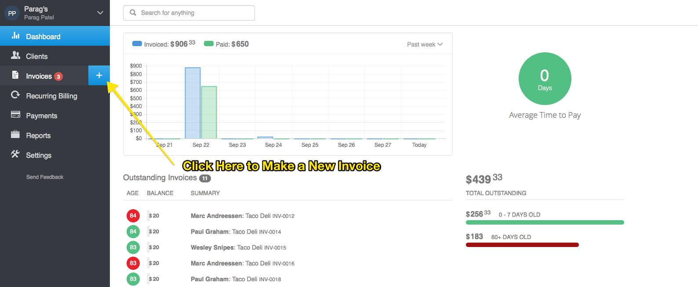
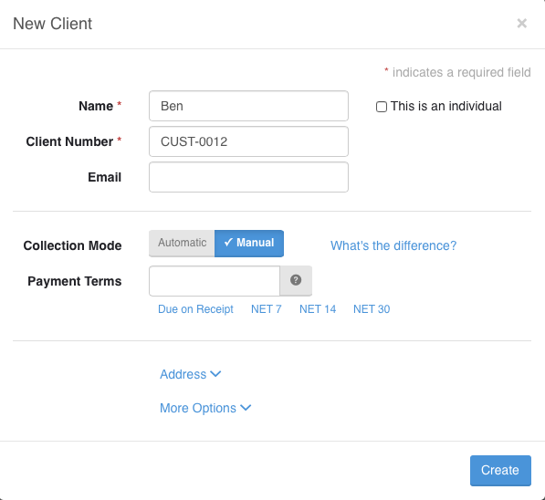
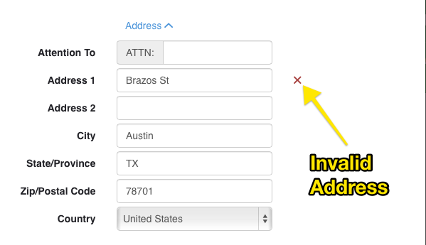
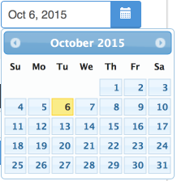
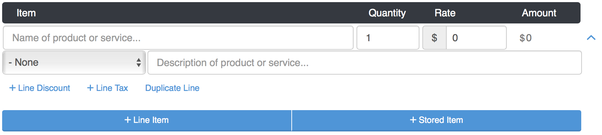
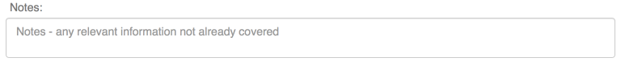
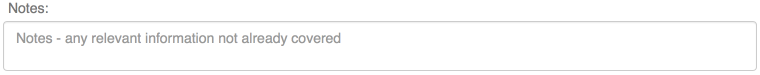
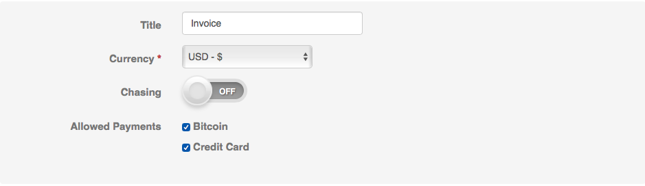
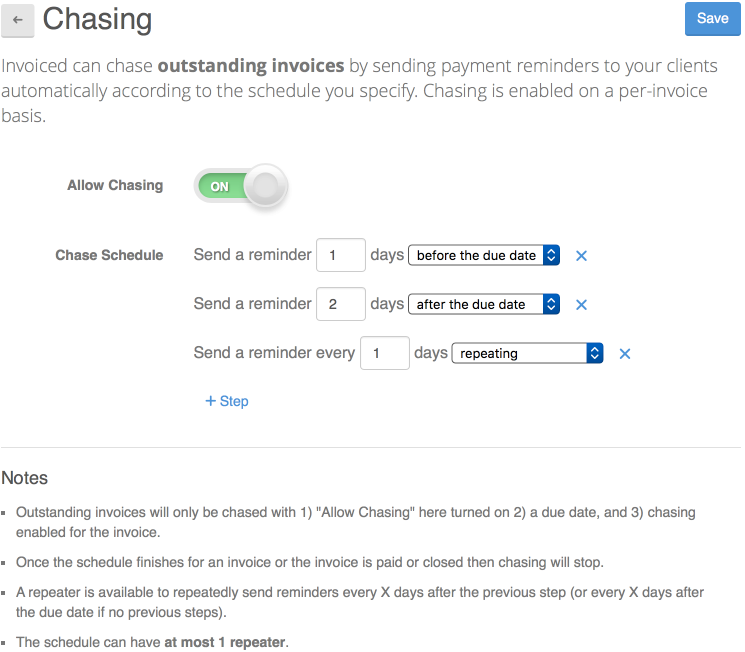

# Guides

<!-- Start creating guide and go over each and every feature
-->
* [Invoicing Guide](#invoice-guide)
   * [Creating and sending your first invoice](#create-send-invoice) 
      * [Fields](#invoice-fields)
        * [Bill To](#invoice-field-bill-to)
          * [Filling in Client Information](#fill-in-client-information)
        * [Number](#invoice-field-number)
        * [Date](#invoice-field-date)
        * [Line Items](#invoice-field-line-items)
        * [Notes](#invoice-field-notes)
        * [Terms](#invoice-field-terms)
        * [File Attachments](#invoice-field-file-attachments)
    * [Options] (#invoice-options)
    * [Notifications](#invoice-notifications)
    * [View](#invoice-view)
      * [Filtering](#invoice-view-filtering)
      * [Legend](#invoice-view-legend)
    * [Searching](#invoice-searching)
    * [Importing](#invoice-importing)
* [Recurring Billing Guide](#recurring-billing-guide)
  * [Plans]
    * [Subscriptions]
  * [Views]
    *  [Filtering]
  * [Advanced]
* [Advanced Customizations And Settings](#advanced-customizations-settings)
   * [Changing Invoice Numbers](#invoice-numbers)
   * [Changing Look And Feel of Invoices](#invoice-template-customization)
   * [Online Payments](#online-payments)
   * [Invoice Chasing](#invoice-chasing)
   * 

### Invoicing Guide

####Creating and sending your first invoice
After you signed up, Invoiced lets you create invoices in a simple manner. From the Dashboard view simply click on the `+` symbol next to Invoices.  

This will create an empty invoice where you can fill out the values.

---
#####Invoice Fields

`Bill To:` field.  This field will let you assign a existing client or create a new client.

In the context above lets add a client name **Ben Bitdiddle**.  We first search for Ben and if he cannot be found the system gives us an option to add him.

Since Ben is not in the system we simply click on `Add Ben as a new client`.  The below modal should popup in the app. 

---
#####Filling in Client Information

**Description of Client Fields**

The `Name` field you want to make sure you enter your client's full name in correctly.  

`Client Number` is a auto-incremented field and you do not need to do anything to it unless you want a custom client numbering system.

`Email` field is an important field used by the system to send the invoice; please make sure it is entered correctly as well.

`Collection Mode` lets you pick between `Automatic` and `Manual`.  Basically you are specifying whether to automatically collect payment or manually collect payment.  Note: You will only see the collection mode option is you have online payments enabled, else the system will default to `Manual`.  

`Manual` is the default behaviour and it now becomes up to your customer to pay you online.

`Automatic` lets you enter a payment source, generally your customer's credit card information.  

**Adding a payment source**

To enter a payment source simply check the `Add Card` and than add your client's relevant credit card information.

With `Automatic` set you are now ready to automatically collect money when you invoice them or subscripe them to a subscription (recurring billing).

`Payment Terms` are the terms that specifiy when the payment on the invoice is due.  `NET 7` means that payment should be due within 7 days of receipt. For `NET 14` means that payment should be due within 14 days of receipt. `NET 30` means that payment should be due within 30 days of receipt.  You can define any custom term by directly inputing it into the input box.

`Address` lets you enter the address of your client.

Invoiced validates your clients address so you can know if the address you entered is valid or not.  Usually green check mark against Address 1, City, State, Zip, County will indicate if the address is valid.  

The below is a valid address. 

The following 2 are both invalid addresses with a `?` or `x` next to address 1.  Any part of the address including Address 1/2, City, State, Zip, County could cause it to be invalid.

`More options` lets you enter your client's phone number, website, and notes.

`Notes` lets you enter any additional information about your client

---
####Continuing on with the invoice fields

---
`Invoice Number` this field tells you the identifier for the invoice.  You can optionally edit it, however the system assigns automatically assigns a number for every new invoice.

To edit the automatic generation of the `Invoice Number`, see [Changing Invoice Numbers](#invoice-numbers).

---
`Date` The date that the invoice is issued

---
`Line Items` these are at the heart of the invoice.  They specificy the product/service (`Item`), quantity (`Quantity`), rate (`Rate`), and calculated amount (`Amount`) you are invoicing for.  You can also specify the `Line Discount`, `Line Tax`, and Detailed Descriptoin for the line item.

`Line Descripton` lets you specify in more detail the line
`Line Discount` lets you add a discount to the line

`Line Tax` lets you add a tax to the line.

---
`Notes`: Any notes that you have regarding your invoice

---
`Terms`: which are just ways to specify any terms that you have on your invoice.

---
`Attachments`: allow you attach a file from you local computer, Dropbox, Box, Google Drive, Gmail, OneDrive, Amazon Cloud Drive, CloudApp, Link(URL)

---
#####Invoice Options

Invoice `Options` allows you to change invoice specific settings.  It is applicable only towards the invoice.  

**Invoice Option Fields**

`Title` lets you change the title of the invoice.

`Currency` lets you change the currency the invoice is denoted in.

`Chasing` enables invoice chasing for the invoice.  To learn more about chasing please and how to enable a schedule for it please go [here](#invoice-chasing).

`Allowed Payments` lets you disable any payments for this invoice only.  
---

* Invoicing conventions

* Invoice emails 
Emailing your invoices has never been simplier.  In fact emailing has been built in Invoiced since day one.

* Invoice status
Status tells what the status on your invoice is.  Sent, Viewed, Paid.   

* Searching for Invoices - Invoiced Power Search
 Invoiced has a universal search bar that lets you search for anything whether it be payments, invoices, clients etc.  It it a powerful feature that lets you find things in an easy and convient manner.

* Filtering Invoices 
 You can quickly and effectively search for the invoice by the invoice status.

* Knowing if you got paid - It is pretty easy to check if you got paid on Invoiced.

* Attaching a File 
Sometime you may want to attach a document to your invoice.  Invoice lets you do that in an easy manner.  Invoiced implements attaching a file in a powerful manner.  You can not only attach files directly from your computer but you can attach files from a mutitude of different cloud providers such as dropbox.
    
    
* Knowing if your client viewed your invoice.  Invoiced lets you view if your client has viewed your invoice.  
    
    * Setting up to get paid online - You can accept all the credit cards supported 
    * Customizing the invoice  - Invoiced allows you to customize the look and feel of your invoice.  For those power users who need the utmost customization we offer the ability 
    * Understanding Credits - With Invoiced Credits you never have to worry about what to do if your customer over pays you.  Invoiced lets you handle over payments in which ever way that you want.
    * 
    * Chasing payments - Invoiced lets you remind clients if their invoice is overdue. 
    * Invoice portal - file attachments and comments.  Invoiced Portal lets your clients view past invoices.  Your customer can also communicate with your through comments.

    Commenting are natural and progressive way to communicate with your clients without losing context.

    * Manually recording payments
        - Splitting payments amongst invoices - Sometimes you would like to apply a payment to more than 1 invoice.  We let you do that.  

###Recurring Billing Guide
* Introduction to plans and subscriptions and why you need them
    * Creating your first plan and subscription
        - Understanding Subscriptions
    * Collection Mode -> Automatic vs Manual - Which cards do you want 
    * Subscription best practices
    * Canceling subscriptions
    * Automated vs Manual Subscriptions
        - Client Collection modes

###Advanced Customizations And Settings

---
####Changing Automatic Invoice and Client Numbers

Invoiced automatically increments and assigns an invoice, as well as client numbers.  A `Invoice Number` (identifier for invoice) or `Client Number` (identifier for client) is comprised of a `Prefix` along with a numeric `Next Number`.  

The system increments `Next Number`  to  `Next Number`+ 1 on every new invoice or client (note: `Invoice Number` and `Client Number` increment independently and do not share the `Next Number`, they both have their own copies).

You can change both the `Prefix`, `Next Number` in `Invoice Number` and `Client Number`

These settings can be found in  **Settings->Business Profile under the section Automatic Numbering**.

---
####Invoice Chasing
Invoiced can chase outstanding invoices by sending reminders to your clients automatically according to the schedule you specify. *Chasing is enabled on a per-invoice basis*.

**Chase Schedules**

You must specify the schedule that you want your invoices to be chased with. We will stop chasing an invoice once the schedule is finished or when the invoice is paid or closed.

Schedules are defined as a series of steps each specifying the number of days relative to the invoice due date when a reminder should be sent. Chase schedules can also have a repeater at the end that sends reminders every X days until the invoice is paid/closed.

We only chase invoices that meet the following criteria:

Allow Chasing in Settings > Chasing is on
Chasing is enabled for the invoice
The invoice has a due date
 
Steps to set up invoice chasing:

1. Sign in to the web app at invoiced.com.

2. Go to the Settings section in the left sidebar of the app.

3. Click on Chasing in the Invoicing section.

4. Enable chasing by flipping the Allow Chasing toggle to on

5. Set up your chasing schedule by adding steps for chasing invoices. You can remove existing steps or add new ones easily. We will automatically sort the schedule for you.

6. Click Save. Chasing is now enabled for your account but you still need to enable chasing for individual invoices.

7. Open the invoice you want to chase and click Enable where it says "Chase: No" under the Invoice Details section. Your invoice will now be chased according to the schedule you set up. The next chase date will be shown in the Invoice Details section.

Note: if you want chasing enabled by default when drafting new invoices then you can create a Template, turn on chasing for that template, and make it the default.

