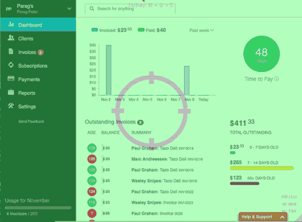

# Guides

<!-- Start creating guide and go over each and every feature
-->
* [Invoicing Guide](#invoice-guide)
   * [Sending Automatic Reminders to your client](#invoice-automatic-reminders)
      * [Turning on Invoice Chasing](#invoice-automatic-reminders)
      * [Enabling Chase](#invoice-automatic-reminders)
        * [Setting a schedule](#invoice-automatic-reminders)]

   * [Enabling Online Payments On Your Invoices](#invoice-enable-online)
      * [Accepting Credit Cards](#invoice-subscriptions) 

   * [Getting Paid Automatically Through Subscriptions](#invoice-paid-automatically)
     * [Subscriptions](#invoice-subscriptions) 
     * [Plans](#invoice-plans)
     * [Collections Mode](#invoice-collections-mode)

   

### Invoicing Guide

####Sending Automatic Reminders For Sent Invoices

Invoiced lets you send automatic reminders to your client.  This can help you close the gap on the time you get paid, by reminding them that payment is due.

We call this feature *chasing*.  
Invoice Chasing is typically enabled per invoice.  So you will have to explictly turn it on per invoice.  You will also have to enable it in the settings and set a reminding schedule first.

#####Getting Started With Invoicing Chasing

First you will need to enable chasing in the settings and set a schedule.

It is pretty important to set the chase schedule correctly.  The chase schedule determines when and how often your client receives the reminders.

The chase schedule has 3 schedule templates you can choose from.

1. Send a reminder X days after the due date
2. Send a reminder X days before the due date
3. Send a reminder X days repeating

Schedule 1 means your client will get a 1 time reminder x days after the due date.

Example:
We set our schedule to

Send a reminder 5 days after the due date. 

If our Invoice is due on September 10th.  Than our client will get a reminder 5 days after on September 15th.

Schedule 2 means your client will get a 1 time reminder x days before the due date.

Example:
We set our schedule to

Send a reminder 5 days before the due date. 

If our Invoice is due on September 10th.  Than our client will get a reminder 5 days before on September 5th.

Schedule 3 means your client will get a continual reminder either x days after the due date if schedule 1 or 2 has not been sett.  If schedule 1 or 2 have been set, schedule 3 will repeat x days from the date that the client receives the reminder from schedule 1 or 2.

Once the invoice is paid the reminders will automatically stop.  

**Best Practices**
Although we allow you add as many steps as you like, we generally recommend to keep the schedule simple (no more than 2 steps).   Adding a combination of many step can make it hard for you to predict precisely every time your client gets a reminder. 

####Sending Automatic Reminders For Sent Invoices

####Getting paid automatically through subscriptions
Invoiced offers business a way to automatically collect money through a feature called subscriptions.

####Subscriptions

Subscriptions allow businesses to either automatically collect payment or automatically invoice the customer on a recurring basis.

This is great if find yourself frequently invoicing your customer every month.  Using subscriptions allows you to automatically invoice & collect money from them, saving you and your customer valuable time and offering convience.

