# Guides

<!-- Start creating guide and go over each and every feature
-->
* [Invoicing Guide](#invoice-guide)
   * [Creating your first invoice](#invoice-create) 
        * [Bill To](#invoice-field-bill-to)
          * [Creating a New Client](#invoice-create-new-client)
          * [Example: Filling in Client Information](#invoice-create-new-client-example)
        * [Number](#invoice-number)
        * [Date](#invoice-date)
        * [Line Items](#invoice-field-line-items)
            * [Item Name](#invoice-line-items-item-name)
            * [Quantity](#invoice-line-items-quantity)
            * [Rate](#invoice-line-items-rate)
            * [Amount](#invoice-line-items-amount)
          * [Catalog Items](#invoice-line-items-stored-items)
          * [Discount](#invoice-line-items-discount)
          * [Tax](#invoice-line-items-tax)
        * [Notes](#invoice-notes)
        * [Terms](#invoice-terms)
        * [File Attachments](#invoice-file-attachments)
        * [Discounts](#invoice-field-discounts)
        * [Options](#invoice-options)
        * [Internationalization](#invoice-internationalizations)
        * [Enabling BCC](#invoice-bcc)
        * [Taxes](#invoice-field-taxes)
        * [Customizing the look](#invoice-themes)
        * [Enabling Additional Fields](#invoice-enable-additional-fields)
        * [Example: Filling in Invoice Information](#invoice-create-example)
    * [Sending your first invoice](#invoice-send)
      * [Failure Notification](#invoice-send-failure)
      * [Incorrect E-mail](#invoice-send-incorrect-email)
    * [Tracking your invoice](#invoice-tracking)
      * [Status](#invoice-status)
      * [Dashboard](#invoice-dashboard)
      * [History](#invoice-history)
      * [Comments](#invoice-comments)
    * [Getting Paid]
    * [Adding Payments](#invoice-add-payments)
      * [Split Payment] 
      * [Expect Payment Date](#expect-payment-date)
      * [Credits](#invoice-credits)
      * [Importing Payments]
    * [Going through your invoices](#invoice-overview)
      * [Searching](#invoice-searching)
       * [Notifications](#invoice-notifications)
        * [Filtering](#invoice-view-filtering)
        * [Legend](#invoice-view-legend)
        * [Client View](#invoice-client-view)
        * [Invoice Detail View](#invoice-detail-view)
       * [Download as PDF](#invoice-download-pdf)
   * [Creating more invoices](#invoice-create-more)
      * [Duplicating Invoices](#invoice-duplicate)
      * [Importing](#invoice-importing)
   * [Exporting Your Data](#invoice-export)
         * [Batch Downloading](#invoice-batch-downloading)   
   * [Viewing Metrics On Your Invoices](#invoice-metrics)
      * [Usage](#invoice-metrics-usage)
      * [Reports](#invoice-metrics)
   

* [Recurring Billing Guide](#recurring-billing-guide)
  * [Plans](#recurring-billing-plan)
      * [Amount](#recurring-billing-field-amount)
      * [Recurring](#recurring-billing-field-recurs)
      * [Description](#recurring-billing-field-description)
    * [Subscriptions](#recurring-billing-field-subscriptions)
      * [Fields](#recurring-billing-field-subscriptions-field)
        * [Client](#recurring-billing-field-subscriptions-field-client)
        * [Start Date](#recurring-billing-field-subscriptions-field-start-date)
        * [Billing Cycle](#recurring-billing-field-subscriptions-field-start-date)
        * [Quantity](#recurring-billing-field-subscriptions-field-quantity)
  * [Views](#recurring-billing-views)
    *  [Filtering](recurring-billing-views-filtering)
  * [Advanced](recurring-billing-advanced)
* [Dashboard](#dashboard-guide)
* [Payments guide](#payments-guide)

    * [Received On](#payments-guide-field-received-on)
    * [Method](#payments-guide-field-method)
    * [Amount](#payments-guide-field-amount)
      * [Split Payment](#payments-guide-field-amount-split-payment)
    * [Invoice](#payments-guide-field-invoice)
    * [Notes](#payments-guide-field-invoice)

* [Recurring Billing Guide](#invoice-recurring-billing)
  * [Introduction](#invoice-recurring-introduction)
    * [Creating your first plan](#invoice-recurring-plan)
        * [Understanding Subscriptions](#invoice-recurring-understanding-subscriptions)
    * [Collection Mode](#invoice-recurring-collection-mode)
    * [Setting up Automatic Collections](#invoice-recurring-collection-mode)
    * [Best Practices](#invoice-recurring-plan-best-practices)
    * [Canceling subscriptions](#invoice-recurring-canceling-subp)

* [Advanced Customizations And Settings](#advanced-customizations-settings)
   * [Changing Invoice Numbers](#advanced-invoice-numbers)
   * [Changing Look And Feel of Invoices](#advancedinvoice-template-customization)
   * [Online Payments](#advanced-online-payments)
     *  [Stripe](advanced-online-payments-stripe)
     *  [Paypal](advanced-online-payments-paypal)
   * [Invoice Chasing](#advanced-invoice-chasing)
   * [Notifications](#advanced-invoice-notifications)
   * [Payment Source](#advanced-payment-source)

### Invoicing Guide

####Creating and sending your first invoice
After you signed up, Invoiced lets you create invoices in a simple manner. From the Dashboard view simply click on the `+` symbol next to Invoices.  

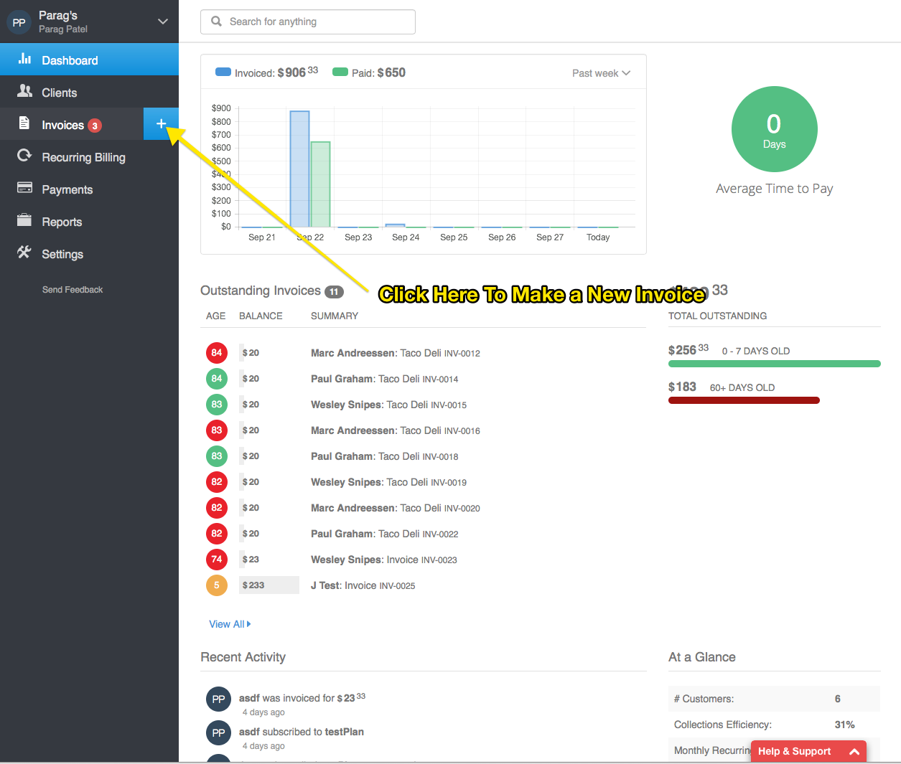

This will create an empty invoice where you can fill out the values.

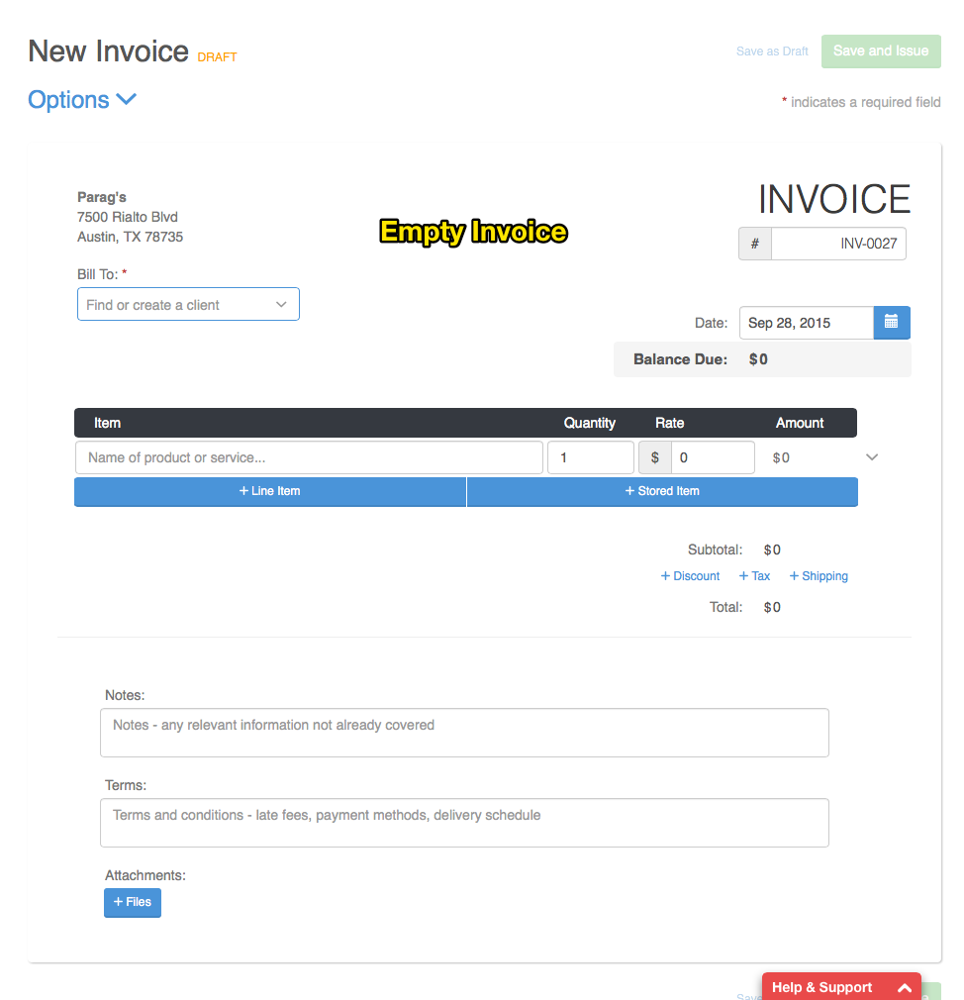

---
#####Invoice Fields

`Bill To:` field.  This field will let you assign a existing client or create a new client.

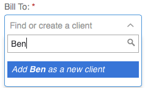

In the context above lets add a client named **Ben Bitdiddle**.  We first search for Ben and if he cannot be found the system gives us an option to add him.

Since Ben is not in the system we simply click on `Add Ben as a new client`.  The below modal should popup in the app. 

---
#####Creating a new client

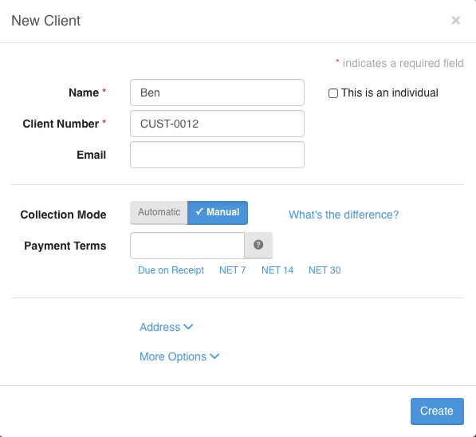

**Description of Client Fields**

The `Name` field you want to make sure you enter your client's full name in correctly.  

`Client Number` is a auto-incremented field and you do not need to do anything to it unless you want a custom client numbering system.  Go here to learn more about the customization of this field.

`Email` field is an important field used by the system to send the invoice; please make sure it is entered correctly as well.

`Collection Mode` lets you pick between `Automatic` and `Manual`.  Basically you are specifying whether to automatically collect payment or manually collect payment.  Note: You will only see the collection mode option is you have online payments enabled, else the system will default to `Manual`.  

`Manual` is the default behaviour and it now becomes up to your customer to pay you online.

`Automatic` lets you enter a payment source, generally your customer's credit card information.  

**Adding a payment source**
  
To enter a payment source simply check the `Add Card` and than add your client's relevant credit card information.

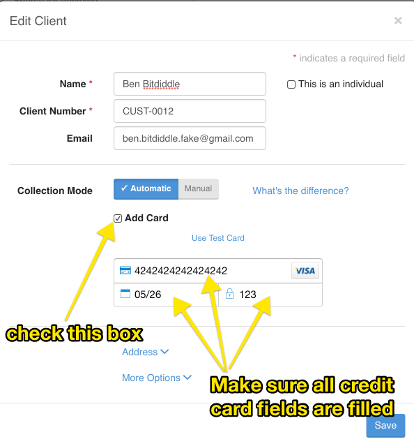

With `Automatic` set you are now ready to automatically collect money when you invoice them or subscripe them to a subscription (recurring billing).

`Payment Terms` are the terms that specifiy when the payment on the invoice is due.  `NET 7` means that payment should be due within 7 days of receipt. For `NET 14` means that payment should be due within 14 days of receipt. `NET 30` means that payment should be due within 30 days of receipt.  You can define any custom term by directly inputing it into the input box.

We want our payment 7 days after `Ben` gets the invoice.  So let use `NET 7`

`Address` lets you enter the address of your client.

Invoiced validates your clients address so you can know if the address you entered is valid or not.  Usually green check mark against Address 1, City, State, Zip, County will indicate if the address is valid.  

The below is a valid address. 

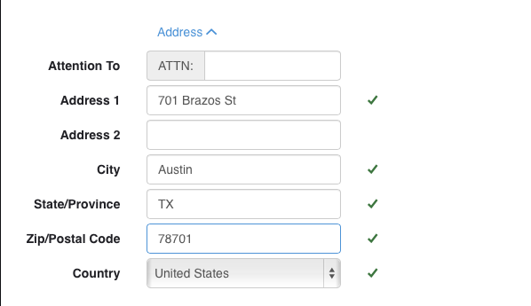

The following 2 are both invalid addresses with a `?` or `x` next to address 1.  Any part of the address including Address 1/2, City, State, Zip, County could cause it to be invalid.

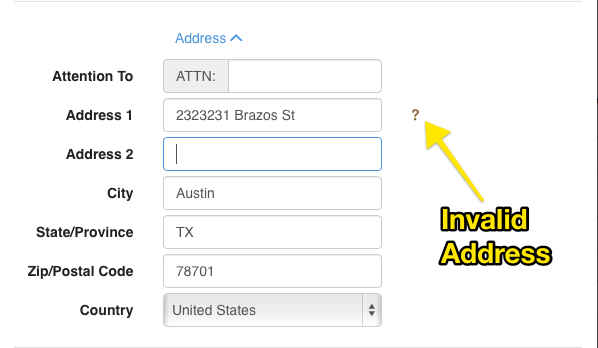

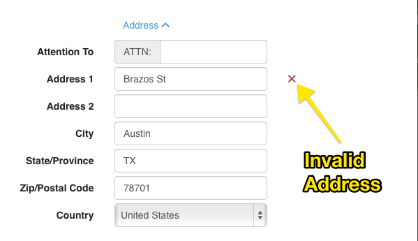

`More options` lets you enter your client's `Phone`, `Other Phone`, `Website`, and `Notes`

`Notes` lets you enter any additional information about your client

---
#####Example: Filling in Client Information
Now that we have explained the various fields in the client information.  Let us fill out the information for our client `Ben Bitdiddle`

We entered **Ben Bitdiddle** for the `name`.  

`Client Number` we can leave alone since we do not need anything custom.

`Email` we enter **ben.bitdiddle.fake@gmail.com**

`Collection Mode` we can keep as `Manual` since we have not entered yet received permission or a credit card number from Ben.  This also means that we do not yet need to add a new payment source.

`Payment Terms` we want to get paid 7 days after Ben received the invoice.  So we will enter `NET 7`

`Address` we enter `1 Infinite Loop, Cupertino, CA 95014`.  The system indicates tells us this address is correct.

Since Ben has given his phone number we enter `555-555-5555` for `Phone` 

Notes we enter `Likes to eat at Taco Deli`, since Ben told us that is his favorite taco place.

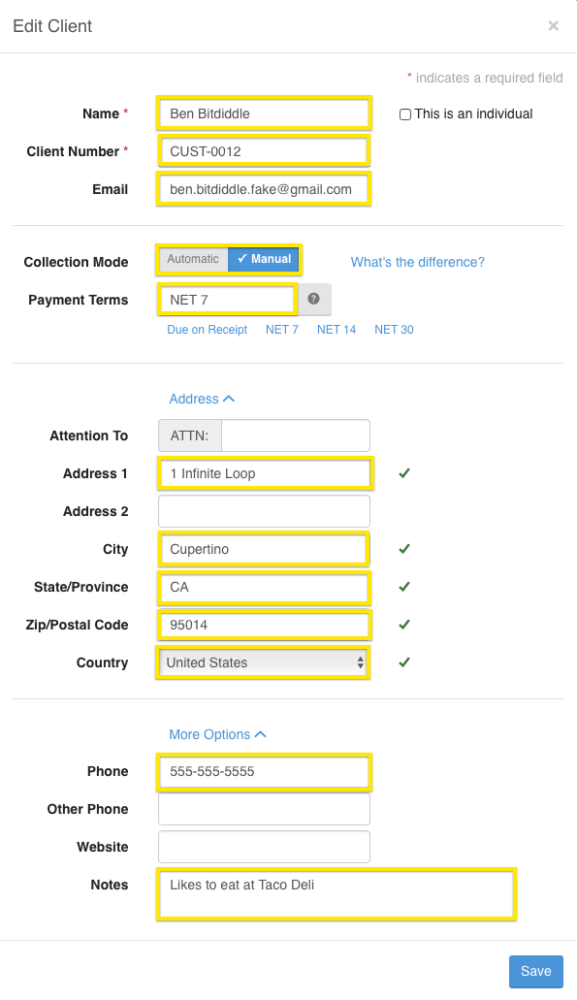

---
####Continuing on with the invoice fields

---
`Invoice Number` this field tells you the identifier for the invoice.  You can optionally edit it, however the system assigns automatically assigns a number for every new invoice.

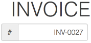

To edit the automatic generation of the `Invoice Number`, see [Changing Invoice Numbers](#invoice-numbers).

---
`Date` The date that the invoice is issued

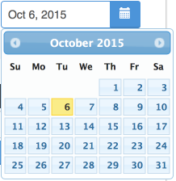

---
`Line Items` these are at the heart of the invoice.  They specificy the product/service (`Item`), quantity (`Quantity`), rate (`Rate`), and calculated amount (`Amount`) you are invoicing for.  You can also specify the `Line Discount`, `Line Tax`, and Detailed Descriptoin for the line item.

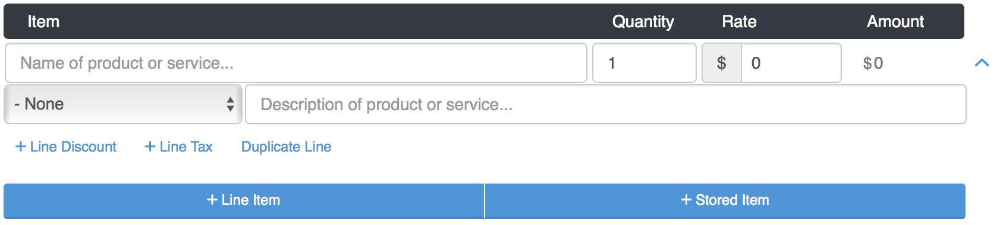

`Line Descripton` lets you specify in more detail the line

`Line Discount` lets you add a discount to the line

`Line Tax` lets you add a tax to the line.

---
`Notes`: Any notes that you have regarding your invoice

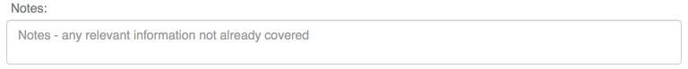

---
`Terms`: which are just ways to specify any terms that you have on your invoice.

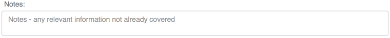

---
`Attachments`: allow you attach a file from you local computer, Dropbox, Box, Google Drive, Gmail, OneDrive, Amazon Cloud Drive, CloudApp, Link(URL).  Sometime you may want to attach a document to your invoice.  Invoice lets you do that in an easy manner.  Invoiced implements attaching a file in a powerful manner.  You can not only attach files directly from your computer but you can attach files from a mutitude of different cloud providers such as dropbox.

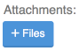

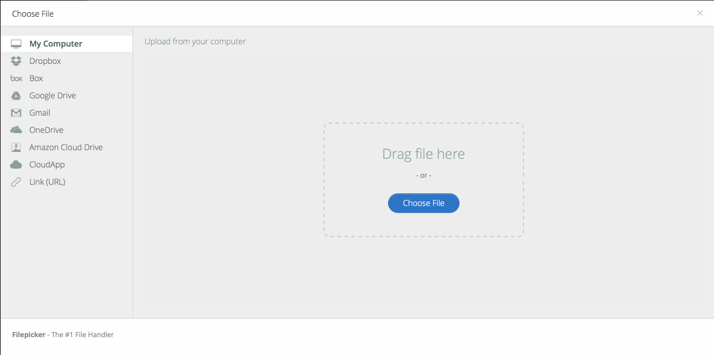

---
#####Example: Filling In Invoice Fields

---
####Sending our first invoice
Emailing your invoices has never been simplier.  In fact emailing has been built in Invoiced since day one. 

Now that we have created our first invoice it is time to send it now to Ben.  We can also view the status of where it is here.  <!-- show invoice status here -->

We setup Ben for manual collection, however it just as easy to edit his client profile and change his collection to automatic.

With manual Ben will have the option of paying depending on the default accepted payments we setup.

---
####Checking our invoice status
At any point it is easy to check the status of our invoice to Ben, Invoiced makes that super easy for us to do.

---
#####Invoice Options

Invoice `Options` allows you to change invoice specific settings.  It is applicable only towards the invoice.  

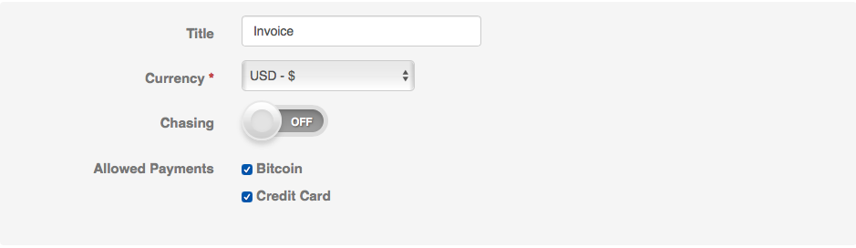

**Invoice Option Fields**

`Title` lets you change the title of the invoice.

`Currency` lets you change the currency the invoice is denoted in.

`Chasing` enables invoice chasing for the invoice.  To learn more about chasing please and how to enable a schedule for it please go [here](#invoice-chasing).

`Allowed Payments` lets you disable any payments for this invoice only.  
---

---
####Invoice Notifications
These iPhone type notifications let you know how many invoices are overdue.

---
####Tracking Your Invoice
Once your invoice has been created and issued you can track the status of the invoice.  

An invoice has 4 status `ISSUED`, `SENT`, `VIEWED`, `PAID`

`ISSUED` - When the invoice has been issued, meaning it created in the system and not just drafted.

`SENT` - When the invoice has been sent to client via Invoiced.

`VIEWED` - When the client has clicked the link to view the Invoice

`PAID` - When the Client has paid the invoice, through the client portal or have been automatically charged through a subscription, or we have added a manual payment.

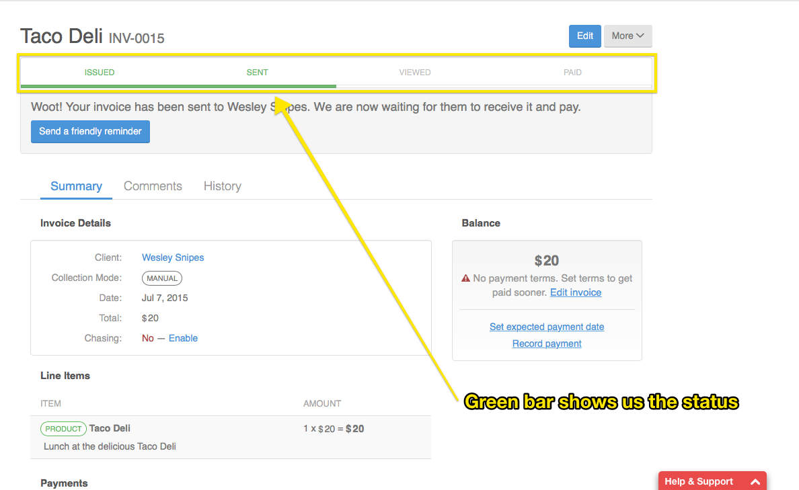

---
####Invoice View
This is the main view once your click on the invoices button from the side bar. It will show you all the invoices, and you can filter the invoices you want to see.

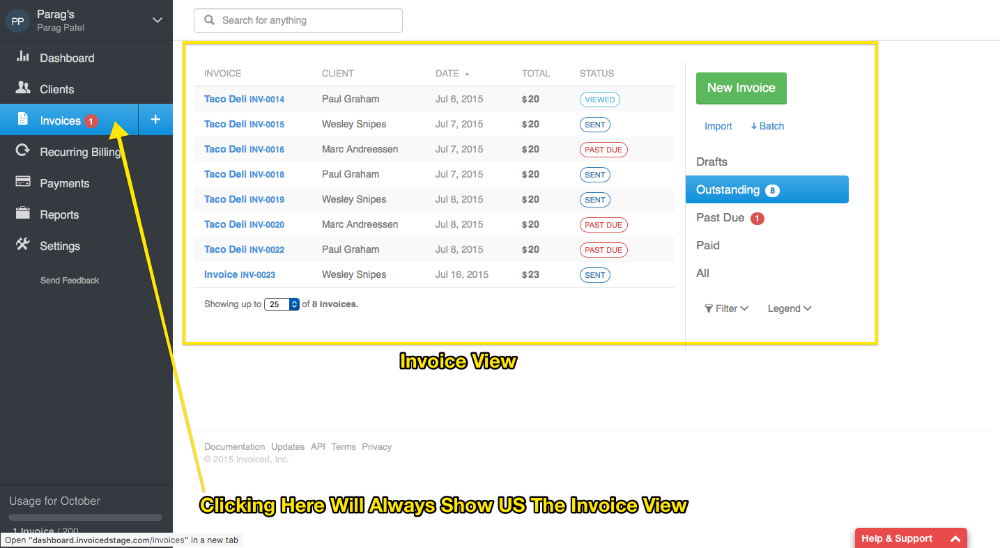

In the invoices view you can take one of 5 actions by simply hovering over the invoice.

---
####Client View
Client view shows you the online view that a client will see when they view your invoice.  Client Portal lets your clients view past invoices.  Your customer can also communicate with your through comments.

---
####History
History shows you your invoice history.
---
####Batch Downloading
You can download all of your invoices in batches.

---
####Comments
Allow you to communicate with the client through Invoiced.  This helps keep the conversation about the invoice between you and your client all in one place.

---
####Downloading The Invoice
Sometimes you may want to download

---
####Searching the invoice
Sometimes you may want to download

---
####Adding Payment Source
Adding payment source allows you add different type of payments like a credit card, bitcoin.

---
####Duplicate the Invoice
Sometimes you may want to duplicate a invoice rather than entering the information yourself. 

---
####Importing invoice
Invoiced lets you import an invoice to save you time.

---
####Credits With Invoiced Credits you never have to worry about what to do if your customer over pays you.  Invoiced lets you handle over payments in which ever way that you want.

---
####Invoice usage

You can look at your invoice usage from anywhere in your application.  Simply glance invoice usage summary at the bottom left.

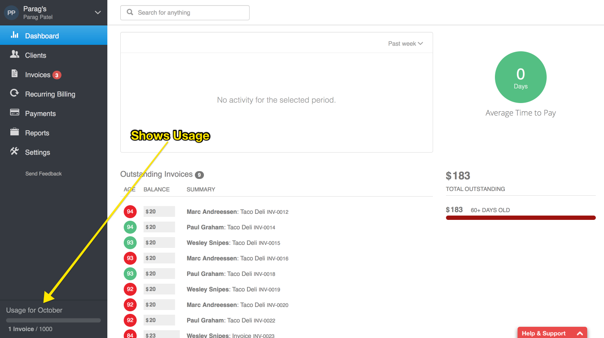

To see a more detailed view simply click on the usage summary.  

### Recurring Billing Guide
  * [Introduction](#invoice-recurring-introduction) 
    Recurring Billing you invoice and/or automatically collect money from clients in a recurring fashion.  You can create a `plan` that specifices how much money to charge against a time period.

    For example you can create a Monthly Cleaning Plan that invoices or automatically charges the client $100 every month.

    You can also create a Quarter Cleaning Plan that might charge the client $450 every quarterly.

    * [Creating your first plan](#invoice-recurring-plan)
    
      To create your first plan do the following <!--TODO -->
        * [Understanding Subscriptions](#invoice-recurring-understanding-subscriptions).  Subscriptons tie a plan and client together to actually invoice/collect money from the client in a recurring fashion.  You can add as many subscriptions to a plan as you want.  
    * [Collection Mode](#-invoice-recurring-collection-mode) 
     You must specify how to collect the subscription.  With manual the payment up to your client and automatic leaves it up your 
    * [Best Practices](#invoice-recurring-plan-best-practices)
    * [Canceling subscriptions](#invoice-recurring-canceling-subp)

###Advanced Customizations And Settings

---
####Changing Automatic Invoice and Client Numbers

Invoiced automatically increments and assigns an invoice, as well as client numbers.  A `Invoice Number` (identifier for invoice) or `Client Number` (identifier for client) is comprised of a `Prefix` along with a numeric `Next Number`.  

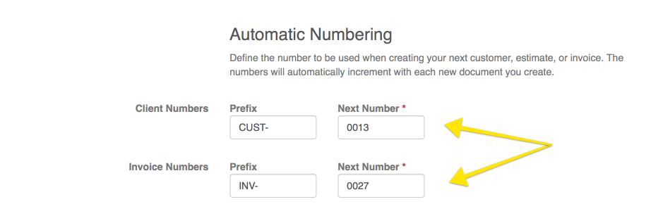

The system increments `Next Number`  to  `Next Number`+ 1 on every new invoice or client (note: `Invoice Number` and `Client Number` increment independently and do not share the `Next Number`, they both have their own copies).

You can change both the `Prefix`, `Next Number` in `Invoice Number` and `Client Number`

These settings can be found in  **Settings->Business Profile under the section Automatic Numbering**.

---
####Invoice Chasing
Invoiced can chase outstanding invoices by sending reminders to your clients automatically according to the schedule you specify. *Chasing is enabled on a per-invoice basis*.

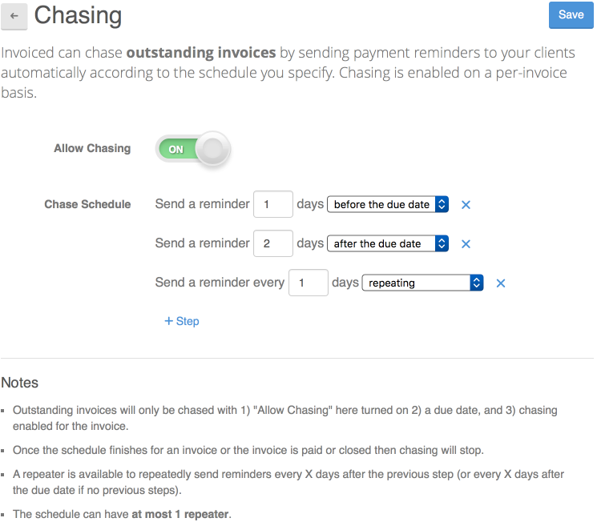

**Chase Schedules**

You must specify the schedule that you want your invoices to be chased with. We will stop chasing an invoice once the schedule is finished or when the invoice is paid or closed.

Schedules are defined as a series of steps each specifying the number of days relative to the invoice due date when a reminder should be sent. Chase schedules can also have a repeater at the end that sends reminders every X days until the invoice is paid/closed.

We only chase invoices that meet the following criteria:

Allow Chasing in Settings > Chasing is on
Chasing is enabled for the invoice
The invoice has a due date
 
Steps to set up invoice chasing:

1. Sign in to the web app at invoiced.com.

2. Go to the Settings section in the left sidebar of the app.

3. Click on Chasing in the Invoicing section.

4. Enable chasing by flipping the Allow Chasing toggle to on

5. Set up your chasing schedule by adding steps for chasing invoices. You can remove existing steps or add new ones easily. We will automatically sort the schedule for you.

6. Click Save. Chasing is now enabled for your account but you still need to enable chasing for individual invoices.

7. Open the invoice you want to chase and click Enable where it says "Chase: No" under the Invoice Details section. Your invoice will now be chased according to the schedule you set up. The next chase date will be shown in the Invoice Details section.

Note: if you want chasing enabled by default when drafting new invoices then you can create a Template, turn on chasing for that template, and make it the default.

---
####Notifications
Invoice notification settings lets you change the e-mail notifications that you get.

