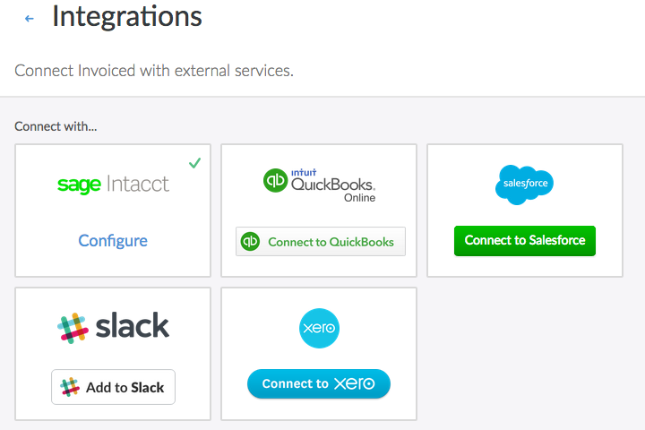
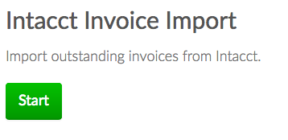

# Sage Intacct

Invoiced integrates with Sage Intacct out of the box, a best-in-class cloud ERP. This document outlines how to setup and use the Intacct integration.

## Overview

The Intacct integration ships with the following capabilities:

- Importing outstanding invoices from Intacct
- Importing customers from Intacct
- Writing invoices generated on Invoiced to Intacct
- Reconciling payments received on Invoiced to Intacct

## Setup

In order to set up the Intacct integration you first need these pieces of information:
- Intacct Company ID
- Web services user

Below we will show you how to connect Intacct with Invoiced, step-by-step.

### Finding Your Intacct Company ID

Your Intacct company ID is required in order to connect the integration. You can obtain your company ID from Intacct with these steps:

1. Within the Intacct application, hover over the **Company** tab and click **Company Info**.

2. You should see an *ID* field. This is the company ID that you will use in the connection steps below.

### Setting Up a Web Services User

The next step is to set up a web services user for Invoiced on Intacct. It is recommended that you use a dedicated web services user for Invoiced in order to ensure it has the correct permissions. We also recommend against using a non-web services user because any password changes would break the integration.

1. You need to ensure that your company has web services enabled in **Company** > **Subscriptions** in the Intacct application.

2. Within the Intacct application, hover over the **Company** tab and click the **+** button next to *Users*.

3. You will want to set up a user similar to the screenshot below with the following settings:

   - User ID: "invoiced"
   - First Name / Last Name: "Invoiced"
   - Email address: your shared accounting team email
   - User type: "Business"
   - Admin privileges: "Full"
   - Status: "Active"
   - Keep password until admin resets it: check this box
   - Restrict user access to web services only: check this box
   
   

4. Next you need to configure permissions for the Invoiced user. On the subscriptions page check the **Accounts Receivable** module.

   

5. Click on the **Permissions** button next to the Accounts Receivable module. Select the **All** radio in the top right. Click **Save**.

   

6. Click **Save** on the subscriptions page. You should have received an email with the username and password information.

### Connecting Intacct on Invoiced

1. Go to **Settings** > **Integrations** in the Invoiced dashboard.

   

2. Click on **Connect** on the Intacct integration.

   

3. Enter in the Intacct company ID, username, and password for your Invoiced web services user created earlier.

4. Click **Save**. Intacct is now connected! Next you will likely want to configure the integration before using it.

   

### Configuring the Accounting Sync

Now you can configure the accounting sync in order to tell Invoiced how to map the data into your general ledger.

1. Click on **Configure** on the Intacct integration from the integrations page.

   

2. Enter in the item account label from your G/L on Intacct. This is the default account where new line items are mapped.

3. Enter in the undeposited funds account label from your G/L on Intacct. This is where payments received through Invoiced will be mapped.

4. You can optionally enter in a location ID and/or department ID if you are operating a multi-entity Intacct company.
5. Click **Save**.

## Usage

In this section you will learn how to use the Intacct integration.

### Enabling Auto-Sync

Auto-sync will run accounting syncs automatically for you on an ongoing basis. Once auto-sync is enabled, accounting syncs will happen approximately once per hour. Here's how you can enable auto-sync:

1. Go to **Settings** > **Accounting Sync**.

   

2. Click **Enable Auto-Sync** next to the Intacct integration. You can periodically check back here to see activity in the *Recent Syncs* table.

   

### Running Syncs Manually

If you want control over when your books are synced then you can manually trigger accounting syncs. You can run an accounting sync by following these steps:

1. Go to **Settings** > **Accounting Sync**.

   

2. Click **Sync Now** underneath *Intacct* any time you want to run an accounting sync. When the job is finished you will see it in the *Recent Syncs* table.

   

### Manual Invoice Imports

You can import outstanding invoices from Intacct as a one-time import. If you are using accounting sync then that will continually bring in outstanding invoices and a manual import is not needed.

Instructions:

1. Go to the **Invoices** tab in the Invoiced dashboard. Click on the **Import** button in the top-right.

   

2. Select **Intacct**.

   

3. Click **Start**.

   

4. The importer will begin working. You are free to leave the page once the import starts. If you leave you will get an email afterwards with the result.

   

5. Once the import is finished you will see the newly imported invoices on the **Invoices** page.

   

### Manual Customer Imports

You can import customers from Intacct into Invoiced as a one-time import. Why might you use this? The accounting sync will only import customers that have invoices, whereas a manual import will bring in your entire A/R customer list.

Instructions:

1. Go to the **Customers** tab in the Invoiced dashboard. Click on the **Import** button in the top-right.

   

2. Select **Intacct**.

   

3. Click **Start**.

   

4. The importer will begin working. You are free to leave the page once the import starts. If you leave you will get an email afterwards with the result.

   

5. Once the import is finished you will see the newly imported invoices on the **Customers** page.

   

## Troubleshooting

When a sync fails you will be able to see the error message in the *Recent Syncs* section in **Settings** > **Accounting Sync**. Normally the error message will include the invoice # that failed and a detailed reason why it could not be synced. Oftentimes there is a manual action required on your end.

Below we have documented commonly encountered errors and recommended resolutions. If you are still unable to get your books synced then please contact [support@invoiced.com](mailto:support@invoiced.com) for further assistance.

### 401 Error

> non-200 status code: 401

We could not connect to Intacct using the credentials you provided. Please make sure the Intacct company ID, username, and password are correct.

### Numbering collision

> A transaction with the number 'XXX' already exists.

If you see this error message then there is already a different invoice with the same number on Intacct. It is recommended that you choose a unique invoice # for the invoice that is being synced.