# NetSuite

Invoiced integrates with NetSuite out of the box, a cloud-based ERP system. This document outlines how to setup and use the NetSuite integration.

## Overview

The NetSuite integration ships with the following capabilities:

- Importing outstanding invoices from NetSuite
- Importing customers from NetSuite
- Writing invoices generated on Invoiced to NetSuite
- Reconciling payments received on Invoiced to NetSuite
- Syncing payments recorded on NetSuite to Invoiced

[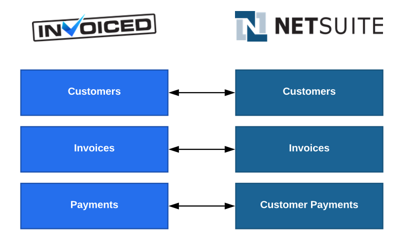](../img/netsuite-object-mapping.png)

## Setup

In order to set up the NetSuite integration you first need these pieces of information:
- NetSuite Account ID
- OAuth Access Token

Below we will show you how to connect NetSuite with Invoiced, step-by-step.

### Obtaining Your NetSuite Account ID

1. On NetSuite, go to **Setup** &rarr; **Company** &rarr; **Company Information**.

   [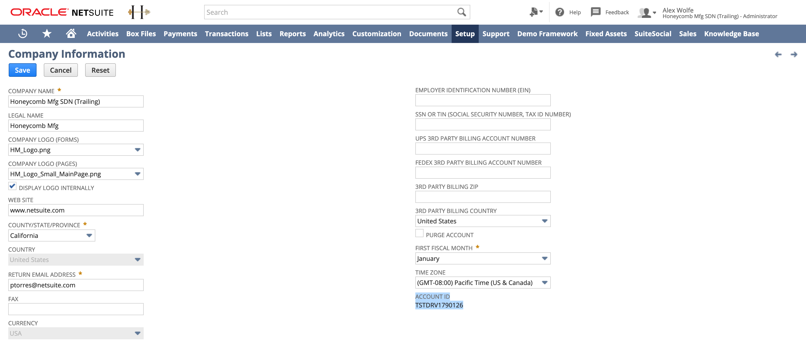](../img/netsuite-account-id.png)
   
2. Copy-paste your account ID into a text editor.

### Setting Up an OAuth Access Token

The next step is to create an OAuth Access Token for Invoiced on NetSuite. To do that there are few steps you need to follow.

#### Install The Invoiced SuiteBundle
First we need to install the Invoiced SuiteBundle, which will install an **INVOICED** integration and a **Webservices-Invoiced** role.

1. On NetSuite, go to **Customization** &rarr; **SuiteBundler** &rarr; **Search & Install Bundles**.

   

2. In the keyword box, type in *Invoiced* and click **Search**.  Select the bundle with a bundle ID of *265184*.
 
   [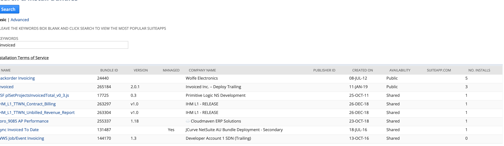](../img/netsuite-choose-invoiced.png)

3. Click **Install** to install the bundle.

   [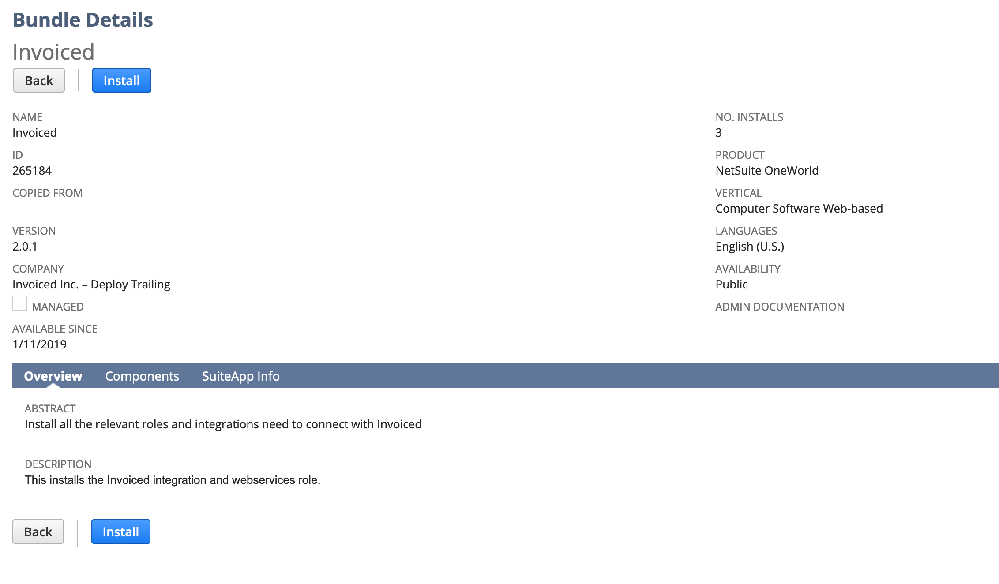](../img/netsuite-bundle-install.png)

#### Assign the Webservices-Invoiced role to a user

You will need to pick a user that will that the access token will be based on and assign the **Webservices-Invoiced** role to that user.

1. Go to **Setup** &rarr; **Users/Roles** &rarr; **Manage Users**.

   [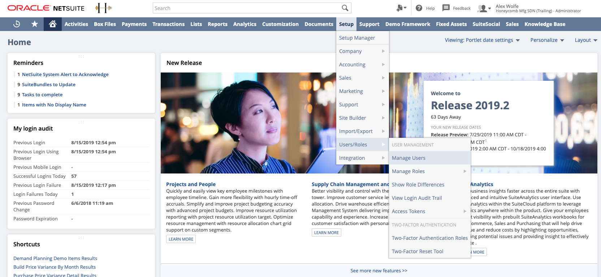](../img/netsuite-manage-users.png)

2.  Select the user you plan to use for the integration and add the **Webservices-Invoiced** role to that user.

   [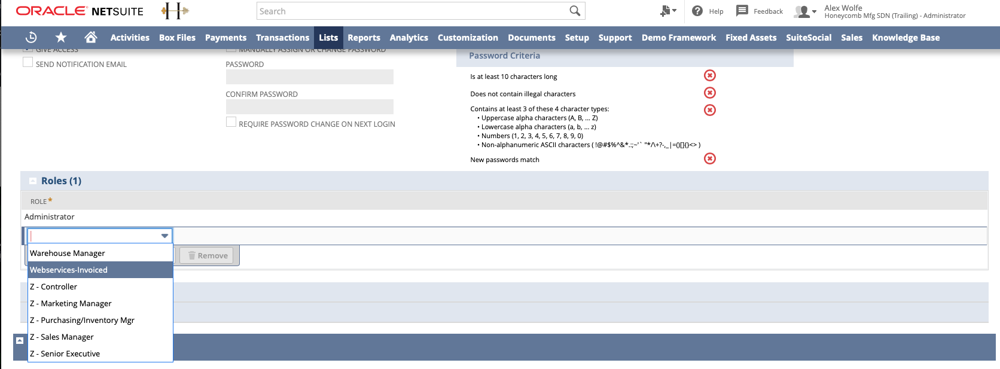](../img/netsuite-user-add-webservices.png)

#### Create the access token

1. Go to **Setup** &rarr; **Users/Roles** &rarr; **Access Tokens** &rarr; **New**

   [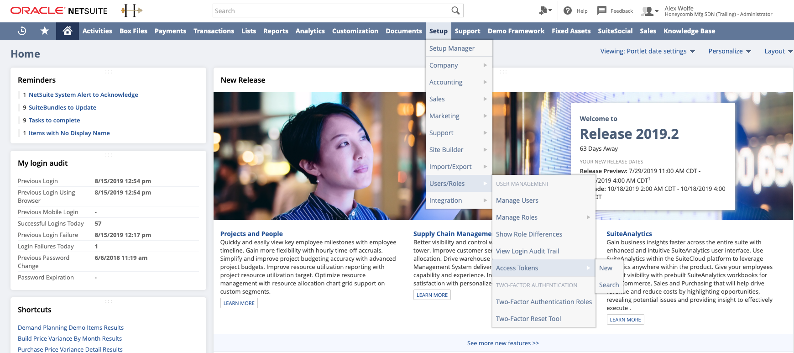](../img/netsuite-create-accesstoken.png)

2. Select *INVOICED* as the application name, the user from the previous step as the user, and *Webservices-Invoiced* as the role.

   [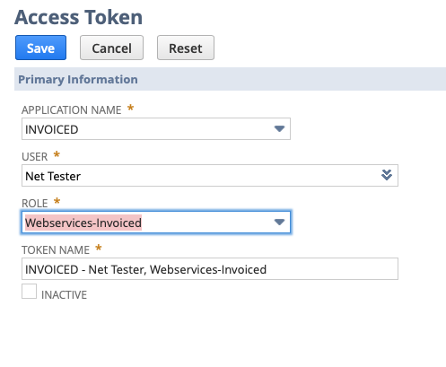](../img/netsuite-add-access-token.png)

3. Copy-paste the token ID and token secret values into a text editor. NetSuite will not display this information again.

### Connecting NetSuite on Invoiced

1. On Invoiced, go to **Settings** &rarr; **Integrations** in the Invoiced dashboard.

   

2. Click on **Connect** on the NetSuite integration.

   [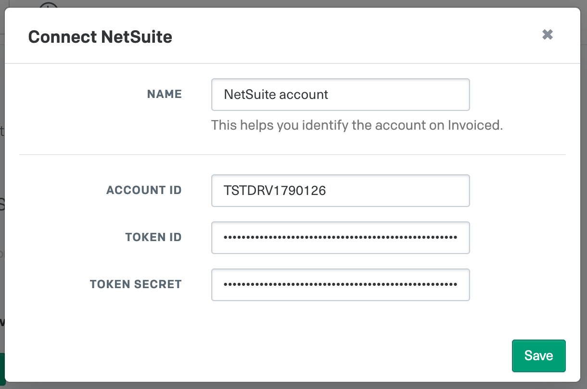](../img/connect-netsuite.png)

3. Enter in the NetSuite account ID, token, and token secret for the Invoiced integration created earlier.

4. Click **Save**. NetSuite is now connected! Next you will want to configure the integration before using it.

   [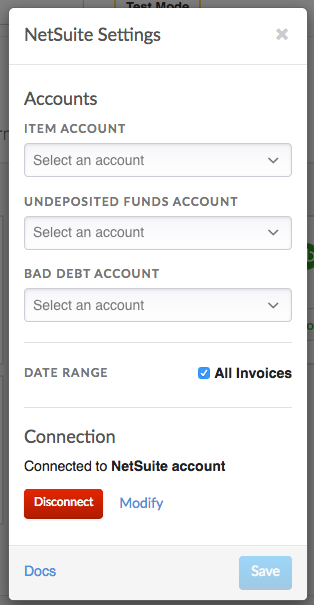](../img/netsuite-integration-settings.png)

5. You can customize the integration, including enabling automatic reconciliation. Click **Save** to finish setting up the NetSuite integration.

## Usage

In this section you will learn how to use the NetSuite integration.

### Enabling Auto-Sync

Auto-sync will run accounting syncs automatically for you on an ongoing basis. Once auto-sync is enabled, accounting syncs will happen approximately once per hour. Here's how you can enable auto-sync:

1. Go to **Settings** &rarr; **Accounting Sync**. Click **Configure** on the NetSuite integration.

   [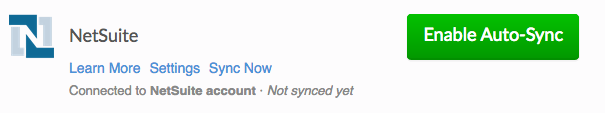](../img/netsuite-accounting-sync-connected.png)

2. Enable the *Reconcile to NetSuite* option.

   [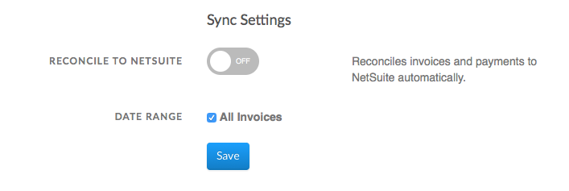](../img/netsuite-integration-settings-enable-auto-sync.png)

3. Click **Save**. You can periodically check back here to see when the next sync run is scheduled or see past activity in the *Recent Syncs* table.

   [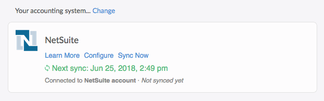](../img/netsuite-auto-sync-enabled.png)

### Running Syncs Manually

If you want control over when your books are synced then you can manually trigger accounting syncs. You can run an accounting sync by following these steps:

1. Go to **Settings** &rarr; **Accounting Sync**.

   

2. Click **Sync Now** underneath *NetSuite* any time you want to run an accounting sync. When the job is finished you will see it in the *Recent Syncs* table.

   [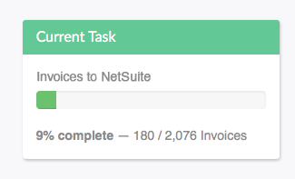](../img/netsuite-accounting-sync.png)

### Manual Invoice Imports

You can import outstanding invoices from NetSuite using the invoice importer.

Instructions:

1. Go to the **Invoices** tab in the Invoiced dashboard. Click on the **Import** button in the top-right.

   

2. Select **NetSuite**.

   

3. When ready to import, click **Start**.

   [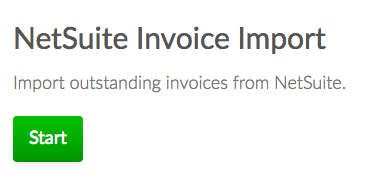](../img/netsuite-invoice-importer-options.png)

4. The importer will begin working. You are free to leave the page once the import starts. If you leave you will get an email afterwards with the result.

   [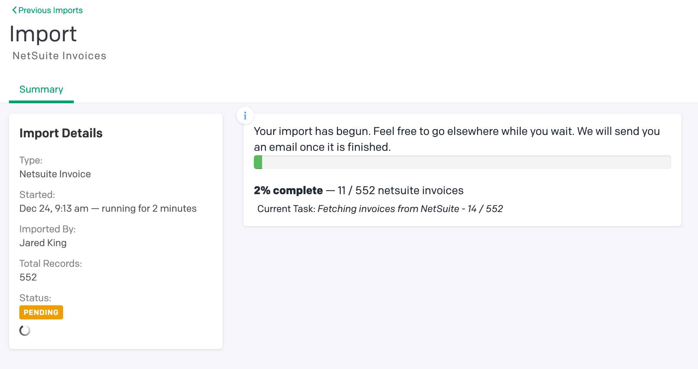](../img/netsuite-invoice-importer-pending.png)

5. Once the import is finished you will see the newly imported invoices on the **Invoices** page.

   [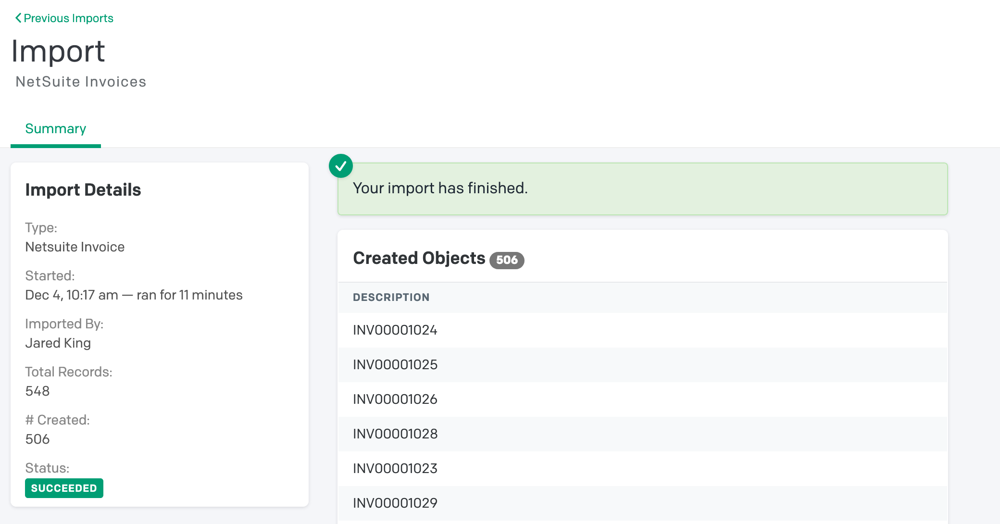](../img/netsuite-invoice-importer-finished.png)

### Manual Customer Imports

You can import customers from NetSuite into Invoiced as a one-time import. Why might you use this? The accounting sync will only import customers that have invoices, whereas a manual import will bring in your entire A/R customer list.

Instructions:

1. Go to the **Customers** tab in the Invoiced dashboard. Click on the **Import** button in the top-right.

   

2. Select **NetSuite**.

   

3. Click **Start**.

   [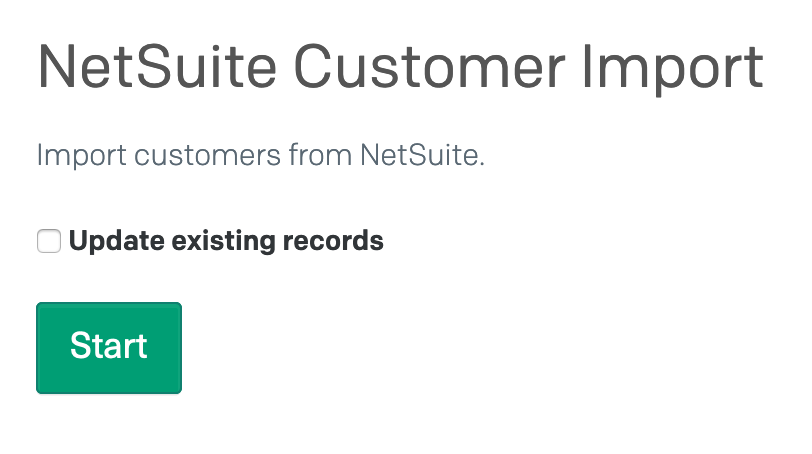](../img/netsuite-customer-importer.png)

4. The importer will begin working. You are free to leave the page once the import starts. If you leave you will get an email afterwards with the result.

   [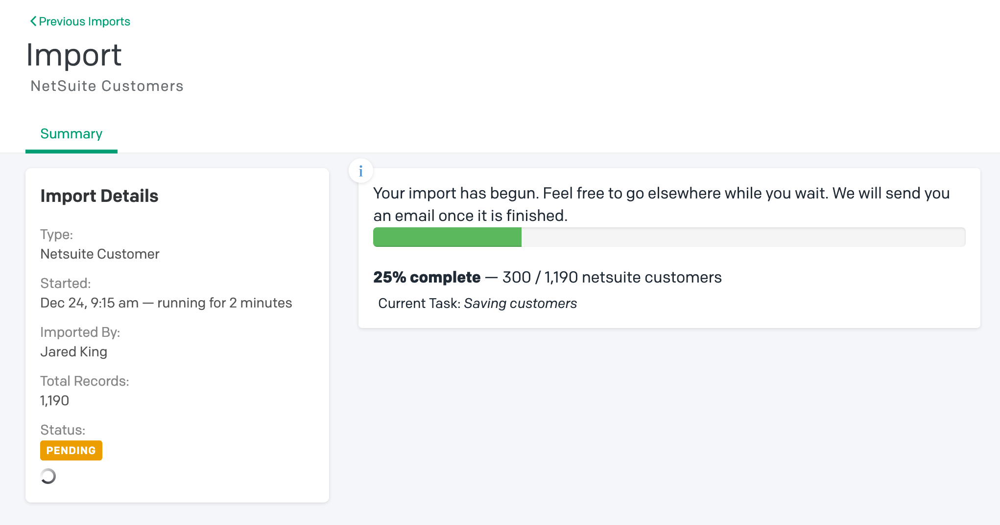](../img/netsuite-customer-importer-pending.png)

5. Once the import is finished you will see the newly imported invoices on the **Customers** page.

   [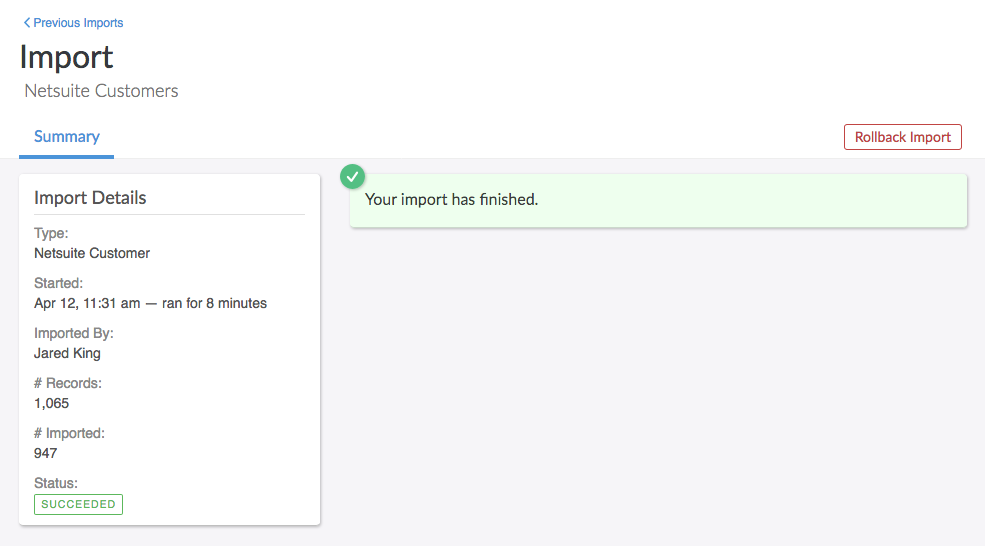](../img/netsuite-customer-importer-finished.png)

## Edge Cases

Here we have documented all of the limitations, nuances, and edge cases to be aware of when using the NetSuite integration.

- Customers on Invoiced are mapped to customers on NetSuite by the customer name.

- Only non-draft invoices on Invoiced that have been updated since the last sync will be synced. On your first sync this means that all non-draft invoices will be synced.

- Any changes to invoices imported from NetSuite that are later modified on Invoiced will not be synced to NetSuite. Payments processed through Invoiced for imported invoices will still be synced.

## Troubleshooting

When a sync fails you will be able to see the error message in the *Recent Syncs* section in **Settings** &rarr; **Accounting Sync**. Normally the error message will include the invoice # that failed and a detailed reason why it could not be synced. Oftentimes there is a manual action required on your end.

Below we have documented commonly encountered errors and recommended resolutions. If you are still unable to get your books synced then please contact [support@invoiced.com](mailto:support@invoiced.com) for further assistance.

### Finding Your NetSuite Account ID

Your NetSuite account ID is required in order to connect the integration. You can obtain your account ID from NetSuite with these steps:

1. Within the NetSuite application, hover over the **Setup** tab and click **Company** &rarr; **Company Information**.

2. You should see an *Account ID* field. This is the account ID that you will use in the connection steps.