# QuickBooks Online

Invoiced integrates with QuickBooks Online out of the box to extend the billing capabilities of QuickBooks. This document describes how to set up the integration and how it works in detail.

## Overview

The QuickBooks Online integration ships with the following capabilities:

- Importing outstanding invoices from QuickBooks Online
- Importing contacts from QuickBooks Online
- Writing invoices generated on Invoiced to QuickBooks Online
- Reconciling payments received on Invoiced to QuickBooks Online
- Syncing payments recorded on QuickBooks Online to Invoiced

[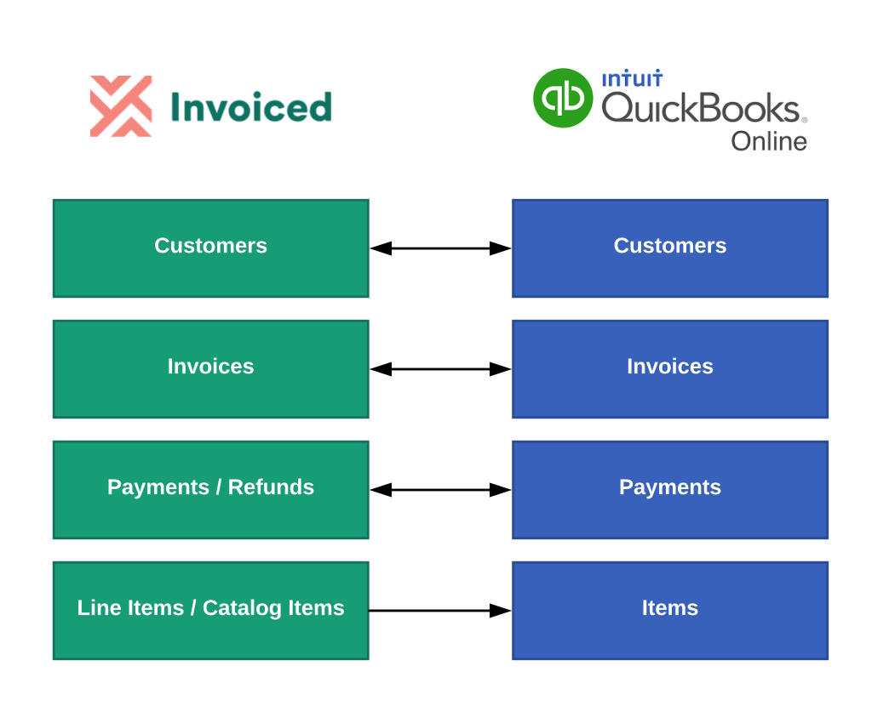](../img/qbo-object-mapping.png)

## Setup

1. In order to begin syncing with QuickBooks Online first go to **Settings** > **Integrations**.  

   

2. Click on **Connect to QuickBooks**. You will be redirected to QuickBooks. You will need to sign in to QuickBooks, if you are not already signed in.

   [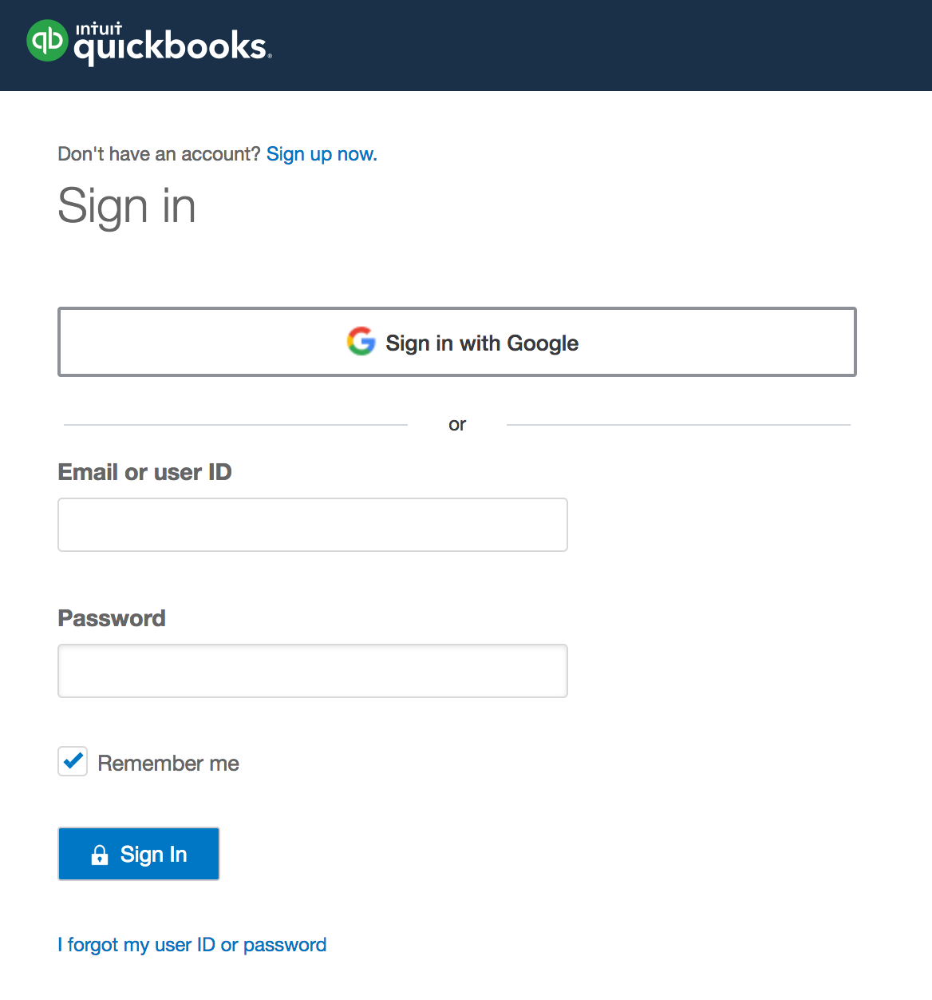](../img/qbo-login.png)

3. Next you will be prompted to authorize Invoiced access to your QuickBooks Online organization.  Click on **Authorize**.

   [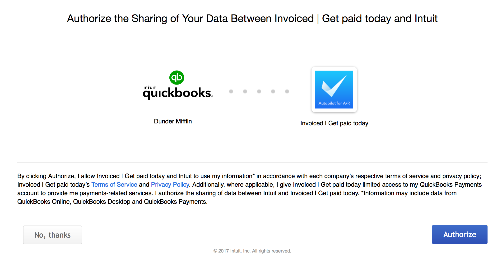](../img/qbo-connect-authorize.png)

4. You will be redirected back to Invoiced. QuickBooks Online is now connected! Now you can configure the accounting sync in order to tell Invoiced how to map the data into your general ledger.

   [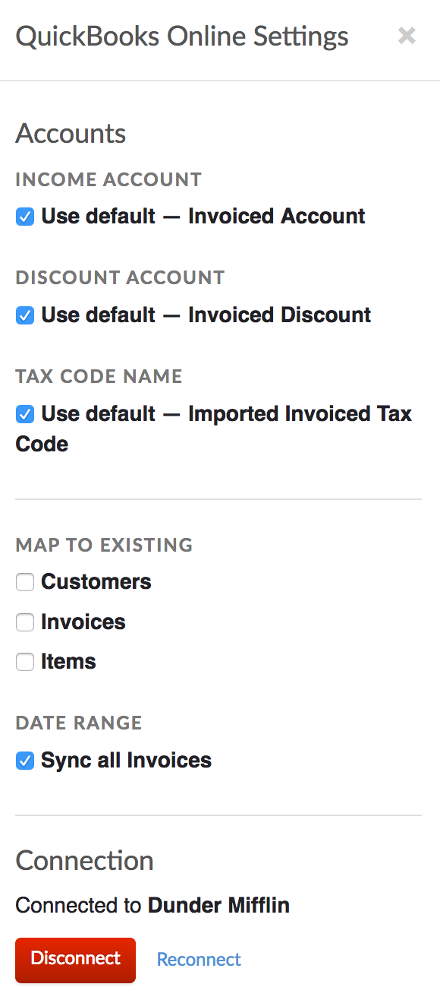](../img/qbo-settings.png)

5. Change the account mapping and other settings. Click **Save**.

#### Account Mapping

Invoiced will create the following accounts in your G/L if you do not specify an account:

- "Invoiced Account" - income account for invoices and line items
- "Invoiced Discount" - income account for discounts
- "Imported Invoiced Tax Code" - tax code for taxes received on Invoiced

## Usage

In this section you will learn how to use the QuickBooks Online integration.

### Enabling Auto-Sync

Auto-sync will run accounting syncs automatically for you on an ongoing basis. Once auto-sync is enabled, accounting syncs will happen approximately once per hour. If you enable invoice and payment importing, those will happen in near real-time as those invoices and payments are created on QuickBooks.

Here's how you can enable auto-sync:

1. Go to **Settings** > **Accounting Sync**. Click **Configure** on the QuickBooks Online integration.

   [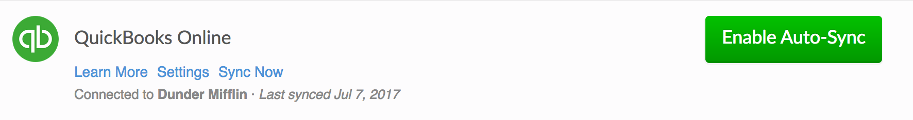](../img/qbo-connected.png)

2. Enable the *Reconcile to QuickBooks* option.

   

3. Click **Save**. You can periodically check back here to see when the next sync run is scheduled or see past activity in the *Recent Syncs* table.

   [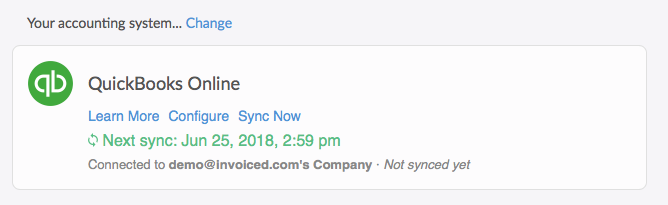](../img/qbo-auto-sync-enabled.png)

### Running Syncs Manually

If you want control over when your books are synced then you can manually trigger accounting syncs. You can run an accounting sync by following these steps:

1. Go to **Settings** > **Accounting Sync**.

   

2. Click **Sync Now** underneath *QuickBooks Online* any time you want to run an accounting sync. When the job is finished you will see it in the *Recent Syncs* table.

   

### Manual Invoice Imports

You can import outstanding invoices from QuickBooks Online using the Invoice Importer located in the top right corner of the Invoice detail page. If you are using the accounting sync, then the auto-sync will continually pass payment information as well as invoices created in Invoiced. You will need to import invoices created in Quickbooks Online manually. 

Instructions:

1. Go to the **Invoices** tab in the Invoiced dashboard. Click on the **Import** button in the top-right.

   

2. Select **QuickBooks**.

   

3. Click **Start**.

   [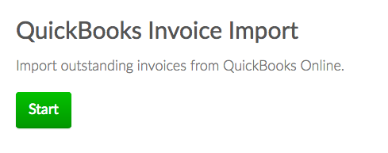](../img/qbo-invoice-importer.png)

4. The importer will begin working. You are free to leave the page once the import starts. If you leave you will get an email afterwards with the result.

   [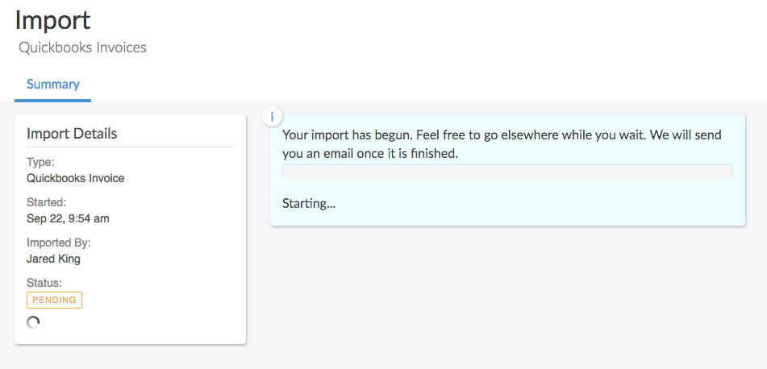](../img/qbo-invoice-importer-pending.png)

5. Once the import is finished you will see the newly imported invoices on the **Invoices** page.

   [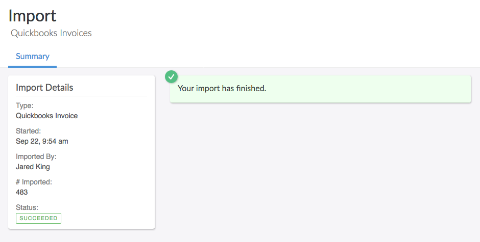](../img/qbo-invoice-importer-finished.png)

### Manual Customer Imports

You can import customers from QuickBooks into Invoiced as a one-time import. Why might you use this? The accounting sync will only import customers that have invoices, whereas a manual import will bring in your entire A/R customer list.

Instructions:

1. Go to the **Customers** tab in the Invoiced dashboard. Click on the **Import** button in the top-right.

   

2. Select **QuickBooks**.

   

3. Click **Start**.

   

4. The importer will begin working. You are free to leave the page once the import starts. If you leave you will get an email afterwards with the result.

   [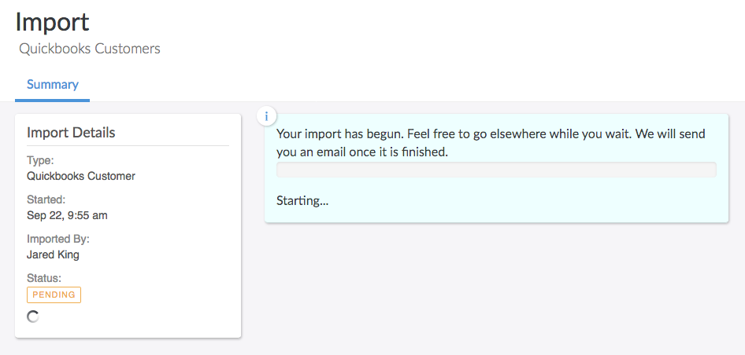](../img/qbo-customer-importer-pending.png)

5. Once the import is finished you will see the newly imported invoices on the **Customers** page.

   [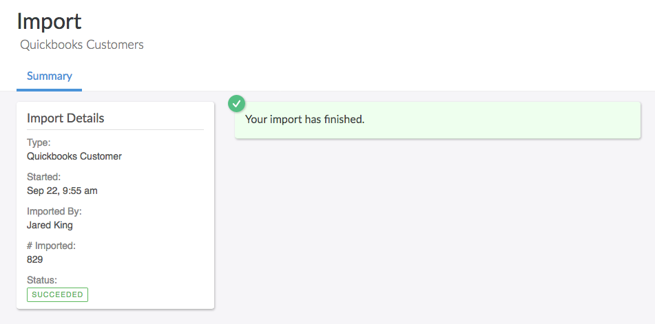](../img/qbo-customer-importer-finished.png)

## Edge Cases

Here we have documented all of the limitations, nuances, and edge cases to be aware of when using the QuickBooks Online integration.

- Customers on Invoiced are mapped to customers on QuickBooks by the name. Please keep in mind that QuickBooks does not allow multiple customers with the same name, but Invoiced does allow duplicates.

- Customer names are truncated to 100 characters due to a character limitation in QuickBooks.

- Only non-draft invoices on Invoiced that have been updated since the last sync will be synced. On your first sync this means that all non-draft invoices will be synced.

- The sync will create an item in QuickBooks for each line item. If the line item name is blank then a generic Invoiced item will be used.

- Line item descriptions over 4,000 characters are truncated due to a character limit in QuickBooks.

- The invoice sync will correctly reconcile bad debt, which are invoices in Invoiced that are closed and do not have a payment against them.

- Any changes to invoices imported from QuickBooks that are later modified on Invoiced will not be synced to QuickBooks. However, any payments received for imported invoices will be synced.

- If a line item on Invoiced has a catalog item attached, then the item created on QuickBooks will have its SKU set to the catalog item ID.

- If a synced payment is refunded on Invoiced, the refund amount will be deducted from the original payment on QuickBooks.

- Payments applied to invoices on QuickBooks will be synced to Invoiced instantly. You must have auto-sync enabled for 2-way payment sync to work.

- Adding a credit note to the invoice on Invoiced that marks the invoice as paid will not sync the payment to Quickbooks Online.

- Adding a credit note to the invoice on Invoiced to partially pay the invoice will show in Quickbooks as undesposited funds.

- Credit balances from Invoiced do not sync to Quickbooks Online.

## Troubleshooting

When a sync fails you will be able to see the error message in the *Recent Syncs* section in **Settings** > **Accounting Sync**. Normally the error message will include the invoice # that failed and a detailed reason why it could not be synced. Oftentimes there is a manual action required on your end.

Below we have documented commonly encountered errors and recommended resolutions. If you are still unable to get your books synced then please contact [support@invoiced.com](mailto:support@invoiced.com) for further assistance.

### Account period has closed

> The account period has closed and the account books cannot be updated through through the QBO Services API. Please use the QBO website to make these changes.

When you see this error message then it means that Invoiced is trying to sync an invoice or payment during a time period that you have already closed. One way you can fix this is by re-opening your books for that time period and running the sync once more. When the sync finishes you can close the books again.

Another solution is to change the date range that Invoiced will sync to QuickBooks. You can tell Invoiced to not sync any invoices before the time period when you closed the books. The sync date range can be set up in the QuickBooks settings at **Settings** > **Integrations** > **Configure** (in the *QuickBooks Online* section).

### You can only add or edit one name at a time

> Business Validation Error: You can only add or edit one name at a time. Please try again.

Often this error means that an accounting sync was running while someone was working in the books. This can be fixed by signing out of the QuickBooks Online interface and re-trying the sync.

### QuickBooks Online could not authenticate

> QuickBooks Online could not authenticate.

If you see this error message then our access token to your QuickBooks account has expired. You need to go to **Settings** > **Integrations** in order to reconnect QuickBooks.

### Subscription period has ended

> Subscription period has ended or canceled or there was a billing problem : You can't add data to QuickBooks Online Plus because your trial or subscription period ended, you cancelled your subscription, or there was a billing problem. To update your subscription, click the gear icon and view your account information.

Your QuickBooks subscription has expired. Please sign into QuickBooks in order to address the issue.