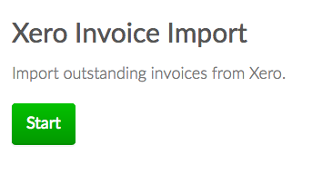
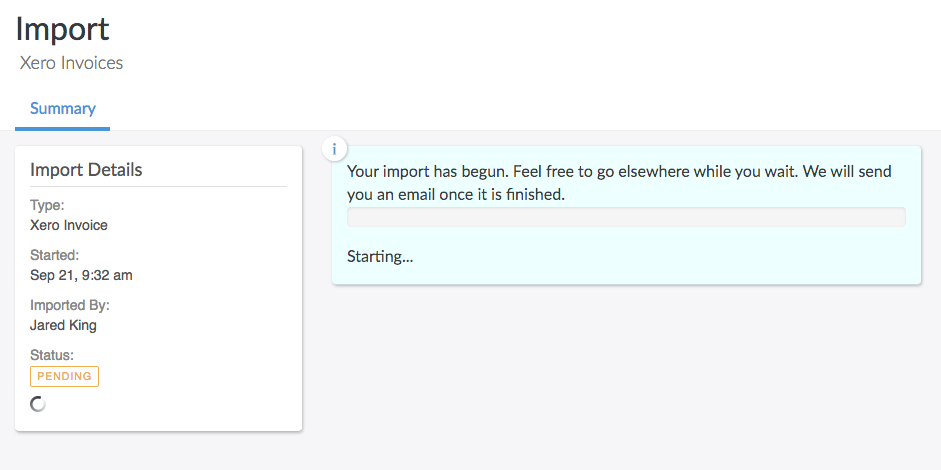
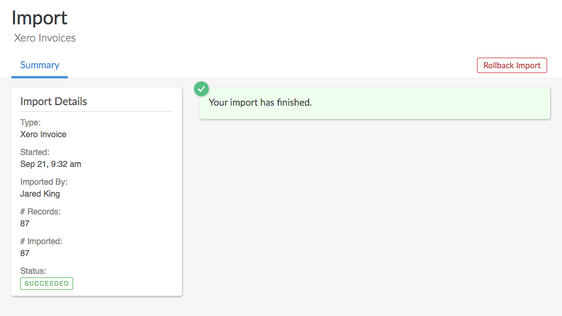
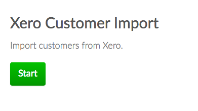
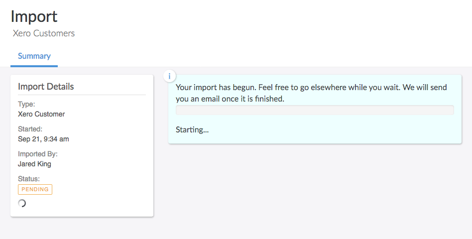

#Xero

The Xero integration lets you sync data by pushing invoices from Invoiced into Xero.  The integration will also push the corresponding contacts and payments from Invoiced into Xero.

##Getting Started

In order to begin syncing with Xero first go to **Settings** > **Accounting Sync**.  

Then click on **Connect to Xero**.

You will get redirected to Xero for authentication. Input your Xero email address and password.

Next you will be prompted to authorize your Xero organization to Invoiced.  Click on **Authorize**.

You will be redirected back to Invoiced.    

Invoiced by default creates a default bank, sales, expense account and tax rate.  However you can choose a existing account or tax rate instead through the **Settings**.

## Usage

In this section you will learn how to use the Xero integration.

### Enabling Auto-Sync

Auto-sync will run accounting syncs automatically for you on an ongoing basis. Once auto-sync is enabled, accounting syncs will happen approximately once per hour. Here's how you can enable auto-sync:

1. Go to **Settings** > **Accounting Sync**.

   

2. Click **Enable Auto-Sync** next to the Xero integration. You can periodically check back here to see activity in the *Recent Syncs* table.

   

### Running Syncs Manually

If you want control over when your books are synced then you can manually trigger accounting syncs. You can run an accounting sync by following these steps:

1. Go to **Settings** > **Accounting Sync**.

   

2. Click **Sync Now** underneath *Xero* any time you want to run an accounting sync. When the job is finished you will see it in the *Recent Syncs* table.

   

### Manual Invoice Imports

You can import outstanding invoices from Xero as a one-time import. If you are using accounting sync then you probably would not need to run an invoice import.

Instructions:

1. Go to the **Invoices** tab in the Invoiced dashboard. Click on the **Import** button in the top-right.

   

2. Select **Xero**.

   

3. Click **Start**.

   

4. The importer will begin working. You are free to leave the page once the import starts. If you leave you will get an email afterwards with the result.

   

5. Once the import is finished you will see the newly imported invoices on the **Invoices** page.

   

### Manual Customer Imports

You can import customers from Xero into Invoiced as a one-time import. This will import your entire A/R customer list. You generally wouldn't need to run manual imports if you are using accounting sync. For example, you might run this if you are setting up your Invoiced account for the first time.

Instructions:

1. Go to the **Customers** tab in the Invoiced dashboard. Click on the **Import** button in the top-right.

   

2. Select **Xero**.

   

3. Click **Start**.

   

4. The importer will begin working. You are free to leave the page once the import starts. If you leave you will get an email afterwards with the result.

   

5. Once the import is finished you will see the newly imported invoices on the **Customers** page.

   

##FAQ
###How long will my Xero organization be connected for?

Your Xero organization will be connected until you click disconnect or some network outage forces you to reconnect.

###How do I disconnect my Xero organization?

Click on Xero->Settings and than disconnect.

###Which Xero organization is connected?

You will find the organization name below the Xero Settings

###How do payment processing fees appear in Xero?

Payment processing fees are not synced with Xero.

###What accounts does Invoiced create?

If you do not specify otherwise in the Xero Settings, Invoiced will create 2 Invoiced associated accounts in Xero.  The accounts that will be created, is a Invoiced Sales Account and Invoiced Bank Account.  The Invoiced Bank Account will be the account for all of your Invoiced payments and the Invoiced Sales Account for all of your invoices and line items. 

###How are taxes carried over?

The integration adds all the taxes on the invoice from Invoiced and adds a tax line item to the corresponding Xero Invoice.

###How can I identify invoices that have been synced?

Synced Xero invoices are marked with the invoice number having the format of INVD-{Invoice Number in Invoiced}.  So a invoice in Invoiced with number "INV-004" would be "INVD-INV-004" in Xero.

###How can I identify contacts that have synced?

Synced Xero contacts are marked with the contact name equal to {customer name in Invoiced} {customer number in Invoiced}. So a customer in Invoiced with name "John Doe" and number "Cust-001" would have a name in Xero of "John Doe Cust-001".

###How many invoices are synced at a time?

Invoices are batch processed and around 50 invoices are synced at a time.

###What should I do when I changed my Xero organization?

If you have changed your Xero organization you will need to reconnect your xero account by clicking on the link in the Xero Integration Page.

###Do changes I make in a synced Invoice in Xero get overridden?

Yes, the sync is one way from Invoiced to Xero, so changes you make in Xero can get overridden.  It is best just to make changes in Invoiced for synced invoices

###Are line items synced from Invoiced to Xero?

Even though line items are carried over through Invoices, they are not explicitly created in Xero.  Invoiced Catalog Items are not migrated over.

###What invoices in Invoiced are synced?

Only non-draft updated/created invoices will be synced.  The associated customers and payments will also be synced.

###What happens if the invoice does not have a due date?

The synced invoice in Xero will have the due date equal to the issue date.

###Are the taxes on the synced invoices exclusive or inclusive?

They are tax exclusive.

##Xero Troubleshooting

- If the sync fails first try to reconnect the Xero organization and try again.  If it still fails please contact [support@invoiced.com](mailto:support@invoiced.com) for further assistance.