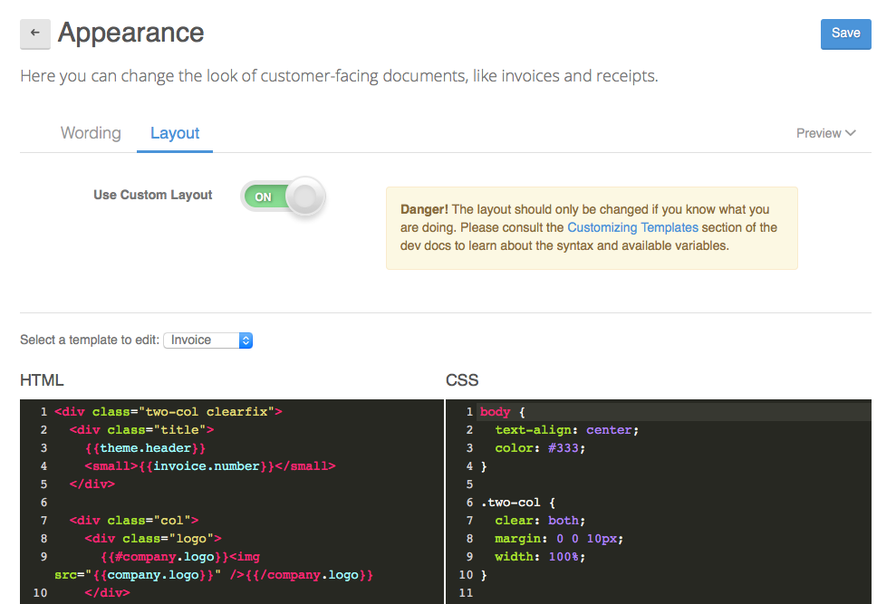

# Customizing Templates

Invoiced ships with default templates for invoices, statements, and receipts, however, it's possible these templates do not match your business or branding needs. In this guide we will show you how to change the layout and appearance of the default templates.

The underlying templates are HTML and CSS. Both the layout and styling can be customized. The first step is to head over to **Settings** > **Appearance** > **Layout**. Then turn on the switch next to **Use Custom Layout**.

[Mustache](https://mustache.github.io/mustache.5.html) is the templating language used to power templates on Invoiced, including the HTML for custom templates.

### Testing

We recommend using the [Try Mustache](http://trymustache.com/) tool to verify your Mustache HTML for correct syntax. After saving any changes you can download a PDF preview by clicking the **Preview** button near the top right of the page. You can also see the generated HTML on a live invoice that has your customizations applied by opening the client view and appending `/html` to the URL, i.e. `https://dundermifflin.invoiced.com/invoices/IZmXbVOPyvfD3GPBmyd6FwXX/html`.

## Variable Reference

These variables can be used in the Mustache templates.

### Invoices

- `company` - A hash representing the business. See [Company Object](#company-object).
- `customer` - A hash representing the customer. See [Customer Object](#customer-object).
- `invoice` - A hash representing the invoice. See [Invoice Object](#invoice-object).

### Receipts

- `company` - A hash representing the business. See [Company Object](#company-object).
- `customer` - A hash representing the customer. See [Customer Object](#customer-object).
- `transaction` - A hash representing the transaction. See [Transaction Object](#transaction-object).

### Statements

- `company` - A hash representing the business. See [Company Object](#company-object).
- `customer` - A hash representing the customer. See [Customer Object](#customer-object).
- `statement` - A hash representing the statement. See [Statement Object](#statement-object).

***

## Objects

### Company Object

A hash containing these properties:

- `name`
- `address`
- `email`
- `logo`
- `url`

### Customer Object

A hash containing the same properties as the [Customer object](/docs/api/#customer-object) in the API.

### Invoice Object

A hash containing these properties:

- `status` - Could be `draft`, `not_sent`, `sent`, `viewed`, `past_due`, `paid`, `bad_debt`
- `url` - Client view URL
- `payment_url` - URL for the payment page in the billing portal
- `number`
- `date`
- `due_date`
- `payment_terms`
- `purchase_order`
- `items` - An array of line items. See [Line Item Object](#line-item-object).
- `subtotal`
- `rates` - An ordered array of any discounts, taxes, and shipping applied to the invoice. See [Rate Object](#rate-object).
- `total`
- `amount_paid`
- `balance`
- `terms` - Terms and conditions
- `notes` - Invoice notes

### Line Item Object

A hash containing these properties:
- `name`
- `unit_cost`
- `amount`
- `description`
- `rates` - summary of any line item discounts/taxes (string)

### Rate Object

A hash containing a summary of a specific rate (discount, tax, or shipping) applied to an invoice. Contains the properties `name` and `total`.

### Transaction Object

A hash containing these properties:
- `date`
- `amount`
- `invoices`
- `amount_refunded`
- `amount_credited`
- `method`
- `check_no`

### Statement Object

A hash containing these properties:
- `start`
- `end`
- `previousBalance`
- `totalInvoiced`
- `totalPaid`
- `totalOverpaid`
- `totalAdjustments`
- `balance`
- `accountDetail` - array of hashes with each these properties:
   - `date`
   - `number`
   - `invoiced`
   - `paid`
- `hasCredits`
- `previousCreditBalance`
- `totalCreditsIssued`
- `totalCreditsSpent`
- `creditDetail`
- `creditBalance` - array of hashes with each these properties:
   - `date`
   - `description`
   - `issued`
   - `charged`
   - `balance`