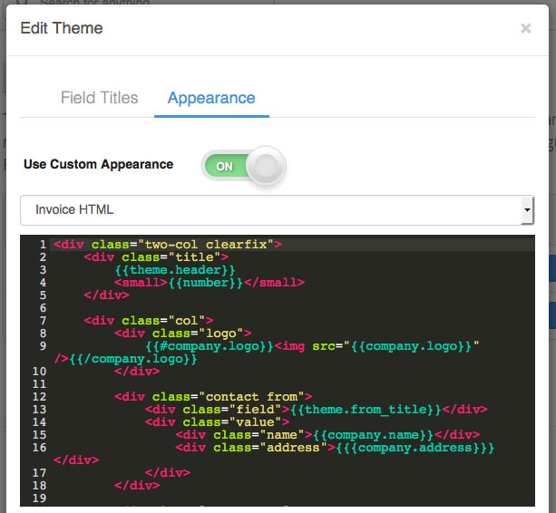

# Customizing Templates

Invoiced ships with default templates for invoices, statements, and receipts, however, it's possible these templates do not match your business or branding needs. In this guide we will show you how to change the layout and appearance of the default templates.

The underlying templates are HTML and CSS. Both the layout and styling can be customized. The first step is to head over to **Settings** > **Themes**. Then click **Customize**, click on the **Appearance** tab, and then turn on the switch next to **Use Custom Appearance**.

[Mustache](https://mustache.github.io/mustache.5.html) is the templating language used to power templates on Invoiced, including the HTML for custom themes.

### Testing

We recommend using the [Try Mustache](http://trymustache.com/) tool to verify your Mustache HTML for correct syntax. After saving any changes you can download a PDF preview by clicking the **Preview** button next to your theme on the Appearance page. You can also see the generated HTML on a live invoice that has the theme applied by opening the client view and appending `/html` to the URL, i.e. `https://dundermifflin.invoiced.com/invoices/IZmXbVOPyvfD3GPBmyd6FwXX/html`.

## Variable Reference

These variables can be used in the Mustache templates.

### Invoices

`company` - A hash representing the business. See [Company](#company).

`customer` - A hash representing the customer. See [Customer](#customer).

`invoice` - A hash representing the invoice. See [Invoice](#invoice).

### Receipts

`company` - A hash representing the business. See [Company](#company).

`customer` - A hash representing the customer. See [Customer](#customer).

`transaction` - A hash representing the transaction. See [Transaction](#transaction).

### Statements

`company` - A hash representing the business. See [Company](#company).

`customer` - A hash representing the customer. See [Customer](#customer).

`statement` - A hash representing the statement. See [Statement](#statement).

### Objects

#### Company

A hash containing `name`, `address`, `email`, `logo`, and `url`.

#### Customer

A hash containing the same properties as the [Customer object](/docs/api/#customer-object) in the API.

#### Invoice

A hash containing the following properties:

`status` - One of `draft`, `not_sent`, `sent`, `viewed`, `past_due`, `paid`, `overpaid`, `bad_debt`

`url` - Client view URL

`payment_url` - URL for the payment page in the billing portal

`number`

`date`

`due_date`

`payment_terms`

`purchase_order`

`items` - An array of line items. See [Line Item](#line-item).

`subtotal`

`rates` - An ordered array of any discounts, taxes, and shipping applied to the invoice. See [Rate](#rate).

`total`

`amount_paid`

`balance`

`terms` - Terms and conditions

`notes` - Invoice notes

#### Line Item

A hash containing `name`, `unit_cost`, `amount`, `description`, and `rates` (summary of any line item discounts/taxes, string).

#### Rate

A hash containing a summary of a specific rate (discount, tax, or shipping) applied to an invoice. Contains the properties `name` and `total`.

#### Transaction

A hash containing `date`, `amount`, `invoices`, `amount_refunded`, `amount_credited`, `method`, and `check_no`.

#### Statement

A hash containing `start`, `end`, `previousBalance`, `totalInvoiced`, `totalPaid`, `totalOverpaid`, `totalAdjustments`, `balance`, and `activity`. Furthermore, the `activity` property is an array of hashes each with the properties `date`, `number`, `invoiced`, `paid`.