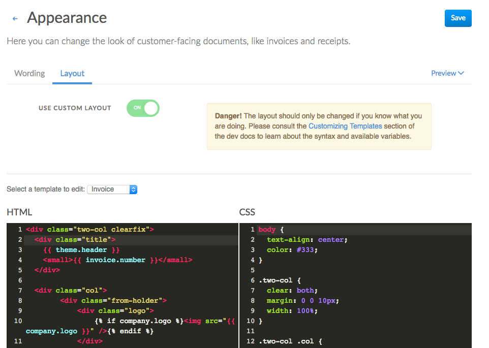

# Customizing Templates

Invoiced ships with default templates for invoices, statements, and receipts, however, it's possible these templates do not match your business or branding needs. In this guide we will show you how to change the layout and appearance of the default templates.

The underlying templates are HTML and CSS. Both the layout and styling can be customized. The first step is to head over to **Settings** > **Appearance** > **Layout**. Then turn on the switch next to **Use Custom Layout**.

[](../img/pdf-template-editor.png)

<p class="alert alert-info">This document describes v2 of our templating system. If you are using the legacy Mustache templating then you can find the <a href="/docs/dev/customizing-templates-legacy">docs here</a>. Please contact support@invoiced.com if you would like to be moved to the new templating system.</p>

## Syntax

[Twig](https://twig.symfony.com/doc/2.x/) is the templating language used to render HTML templates on Invoiced. Below are the tags, filters, and functions available to your templates.

The basic syntax to output variables in your template looks like `{{ customer.name }}`, where the variable name is wrapped in `{{` and `}}`.

### Tags

Tags allow you to implement logic within your template, like branching and looping.

Here is an example:

```

    <div class="past-due-label">PAST DUE</div>

```

Available tags: (click to learn more)
- [`if`](https://twig.symfony.com/doc/2.x/tags/if.html)
- [`for`](https://twig.symfony.com/doc/2.x/tags/for.html)
- [`set`](https://twig.symfony.com/doc/2.x/tags/set.html)

### Filters

Filters allow you to modify values. For example, `{{ invoice.balance|money }}` would format the invoice balance variable as a money amount and output it into your template. 

Available filters: (click to learn more)
- [`abs`](https://twig.symfony.com/doc/2.x/filters/abs.html)
- [`batch`](https://twig.symfony.com/doc/2.x/filters/batch.html)
- [`capitalize`](https://twig.symfony.com/doc/2.x/filters/capitalize.html)
- [`date`](https://twig.symfony.com/doc/2.x/filters/date.html)
- [`date_modify`](https://twig.symfony.com/doc/2.x/filters/date_modify.html)
- [`default`](https://twig.symfony.com/doc/2.x/filters/default.html)
- [`escape`](https://twig.symfony.com/doc/2.x/filters/escape.html)
- [`first`](https://twig.symfony.com/doc/2.x/filters/first.html)
- [`format`](https://twig.symfony.com/doc/2.x/filters/format.html)
- [`join`](https://twig.symfony.com/doc/2.x/filters/join.html)
- [`last`](https://twig.symfony.com/doc/2.x/filters/last.html)
- [`length`](https://twig.symfony.com/doc/2.x/filters/length.html)
- [`lower`](https://twig.symfony.com/doc/2.x/filters/lower.html)
- [`merge`](https://twig.symfony.com/doc/2.x/filters/merge.html)
- `money` - Formats a number as a money amount.
- `money_unit_cost` - Formats a number as a money amount according to the rules for unit cost.
- [`nl2br`](https://twig.symfony.com/doc/2.x/filters/nl2br.html)
- [`number_format`](https://twig.symfony.com/doc/2.x/filters/number_format.html)
- `number_format_no_round` - Formats a number without applying any rounding or modification of decimal.
- [`raw`](https://twig.symfony.com/doc/2.x/filters/raw.html)
- [`replace`](https://twig.symfony.com/doc/2.x/filters/replace.html)
- [`reverse`](https://twig.symfony.com/doc/2.x/filters/reverse.html)
- [`round`](https://twig.symfony.com/doc/2.x/filters/round.html)
- [`slice`](https://twig.symfony.com/doc/2.x/filters/slice.html)
- [`sort`](https://twig.symfony.com/doc/2.x/filters/sort.html)
- [`split`](https://twig.symfony.com/doc/2.x/filters/split.html)
- [`title`](https://twig.symfony.com/doc/2.x/filters/title.html)
- [`trim`](https://twig.symfony.com/doc/2.x/filters/trim.html)
- [`upper`](https://twig.symfony.com/doc/2.x/filters/upper.html)

### Functions

Functions are called to generate content. Functions are called by their name followed by parentheses. For example `{{ max(invoice.subtotal, invoice.total) }}` will show the maximum of the two values.

Available functions: (click to learn more)
- [`cycle`](https://twig.symfony.com/doc/2.x/functions/cycle.html)
- [`date`](https://twig.symfony.com/doc/2.x/functions/date.html)
- `dump_scope` - Dumps all of the variables available within the template in a readable format.

   Example: `{{ dump_scope() }}`
- [`max`](https://twig.symfony.com/doc/2.x/functions/max.html)
- [`min`](https://twig.symfony.com/doc/2.x/functions/min.html)
- [`random`](https://twig.symfony.com/doc/2.x/functions/random.html)
- [`range`](https://twig.symfony.com/doc/2.x/functions/range.html)
- `trans` - Translates a string in the customer's locale.

   Example: `{{ trans('labels.balance_due') }}`
- `transchoice` - Translates a string in the customer's locale with pluralization rules.

   Example: `{{ transchoice('labels.invoice', invoices|length) }}`

## Development Tips

### Testing

After saving any changes you can download a PDF preview by clicking the **Preview** button near the top right of the page. You can also see the generated HTML on a live invoice that has your customizations applied by opening the client view and appending `/html` to the URL, i.e. `https://dundermifflin.invoiced.com/invoices/IZmXbVOPyvfD3GPBmyd6FwXX/html`.

### Outputting available variables

If you want an output of what variables are available to your template you can use this for your HTML template to get a JSON encoded output: `<pre>{{ dump_scope() }}</pre>`

### Resetting a template

If you want to reset any of the specific templates to the default then simply delete all of the text for that template and click **Save**. This will revert that template back to the default value.

***

## Variable Reference

These variables can be used in the Twig templates.

### Invoice Template Variables

- `company` - A hash representing the business. See [Company Object](#company-object).
- `customer` - A hash representing the customer. See [Customer Object](#customer-object).
- `invoice` - A hash representing the invoice. See [Invoice Object](#invoice-object).

### Receipt Template Variables

- `company` - A hash representing the business. See [Company Object](#company-object).
- `customer` - A hash representing the customer. See [Customer Object](#customer-object).
- `transaction` - A hash representing the transaction. See [Transaction Object](#transaction-object).

### Statement Template Variables

- `company` - A hash representing the business. See [Company Object](#company-object).
- `customer` - A hash representing the customer. See [Customer Object](#customer-object).
- `statement` - A hash representing the statement. See [Statement Object](#statement-object).

### Estimate Template Variables

- `company` - A hash representing the business. See [Company Object](#company-object).
- `customer` - A hash representing the customer. See [Customer Object](#customer-object).
- `estimate` - A hash representing the estimate. See [Estimate Object](#estimate-object).

### Object Properties

#### Company Object

The `company` object has these variables:

- `address`
- `country`
- `currency`
- `email`
- `highlight_color`
- `language`
- `logo`
- `name`
- `tax_id`
- `username`
- `url`

#### Customer Object

The `customer` object has these variables:

- `address`
- `attention_to`
- `autopay`
- `chase`
- `country`
- `email`
- `language`
- `metadata`
- `name`
- `number`
- `payment_terms`
- `phone`
- `tax_id`
- `taxable`
- `type`

#### Invoice Object

The `invoice` object has these variables:

- `amount_paid`
- `autopay`
- `balance`
- `custom_fields` - An array of custom fields. See [Custom Field Object](#custom-field-object)
- `date`
- `due_date`
- `items` - An array of line items. See [Line Item Object](#line-item-object).
- `metadata`
- `notes`
- `number`
- `payment_terms`
- `payment_url`
- `rates` - An array of discounts and taxes applied to the invoice. See [Rate Object](#rate-object).
- `ship_to`
- `status`
- `subtotal`
- `terms`
- `total`
- `url`

#### Line Item Object

Line items contain these properties:

- `amount`
- `billing_period`
- `description`
- `metadata`
- `name`
- `rates`
- `unit_cost`

#### Rate Object

Rates represent a summary of discounts or taxes applied to the subtotal. These properties are available:

- `name`
- `total`

#### Custom Field Object

Custom fields have these properties:

- `name`
- `value`

#### Transaction Object

The `transaction` object has these variables:

- `amount`
- `amount_credited`
- `amount_refunded`
- `check_no`
- `credit_notes`
- `date`
- `invoices`
- `metadata`
- `method`
- `payment_source`

#### Statement Object

If it is a Balance Forward statement then the `statement ` object has these variables:

- `type` - set to `balance_forward`
- `start`
- `end`
- `previousBalance`
- `totalInvoiced`
- `totalPaid`
- `totalOverpaid`
- `totalAdjustments`
- `balance`
- `creditBalance`
- `accountDetail` - array of objects each with these properties:
   - `date`
   - `number`
   - `invoiced`
   - `paid`
   - `balance`
- `hasCredits`
- `previousCreditBalance`
- `totalCreditsIssued`
- `totalCreditsSpent`
- `creditDetail` - array of objects each with these properties: of objects with each these properties:
   - `date`
   - `description`
   - `issued`
   - `charged`
   - `creditBalance`
- `unifiedDetail` - array of objects each with these properties:
   - `date`
   - `description`
   - `issued`
   - `charged`
   - `balance`
   - `creditBalance`
- `aging`

If it is an Open Item statement then the `statement ` object has these variables:

- `type` - set to `open_item`
- `end`
- `totalInvoiced`
- `totalPaid`
- `balance`
- `accountDetail` - array of objects each with these properties:
   - `date`
   - `number`
   - `dueDate`
   - `total`
   - `balance`
- `aging`

#### Estimate Object

The `estimate` object has these variables:

- `custom_fields` - An array of custom fields. See [Custom Field Object](#custom-field-object)
- `date`
- `expiration_date`
- `items` - An array of line items. See [Line Item Object](#line-item-object).
- `metadata`
- `notes`
- `number`
- `payment_terms`
- `rates` - An array of discounts and taxes applied to the invoice. See [Rate Object](#rate-object).
- `ship_to`
- `status`
- `subtotal`
- `terms`
- `total`
- `url`