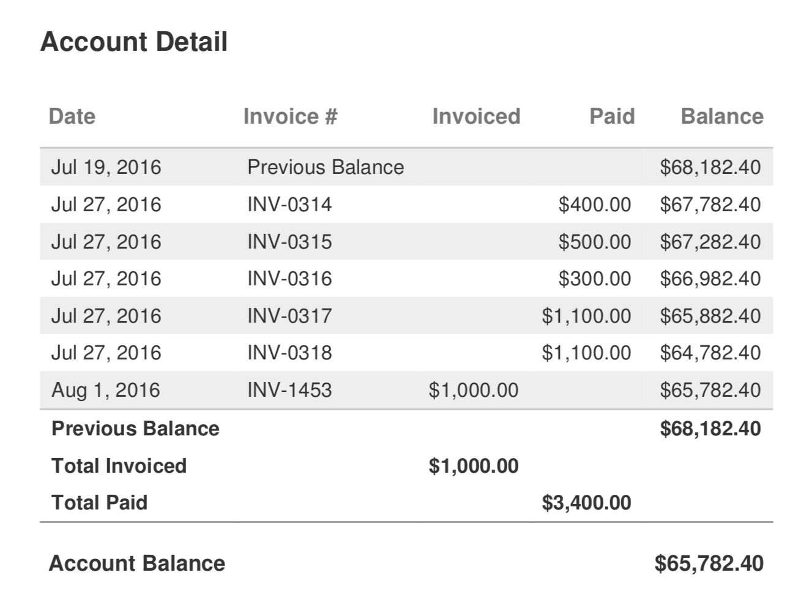
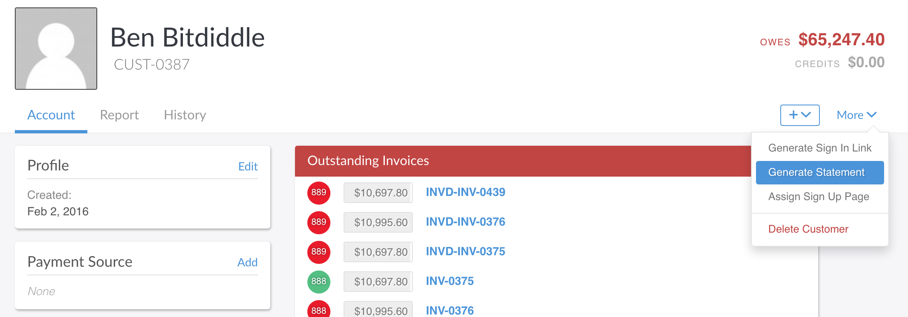
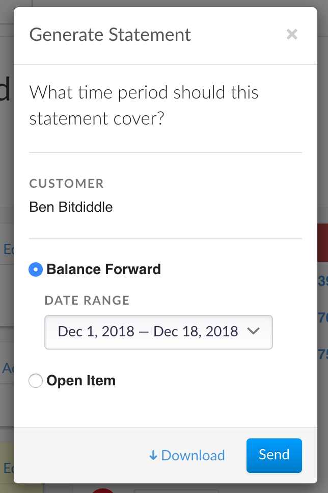
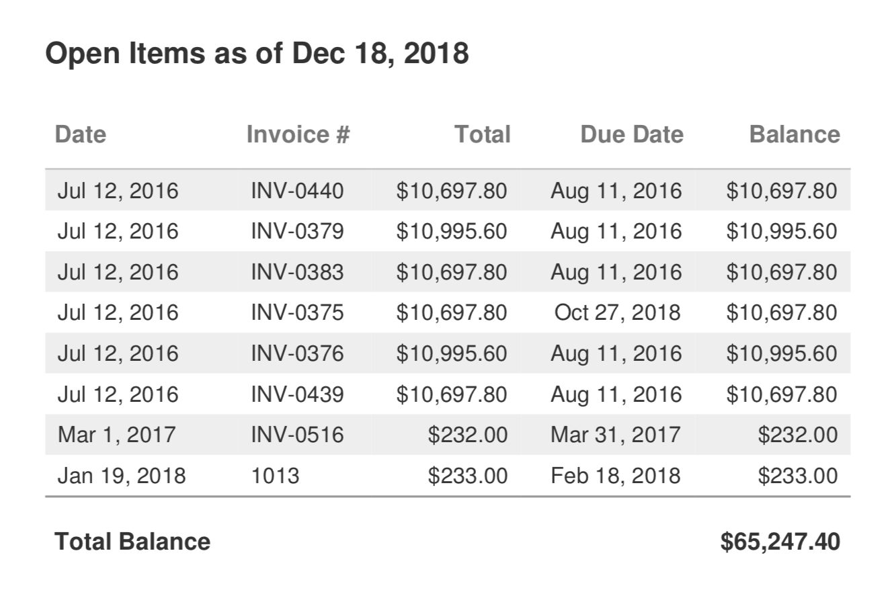
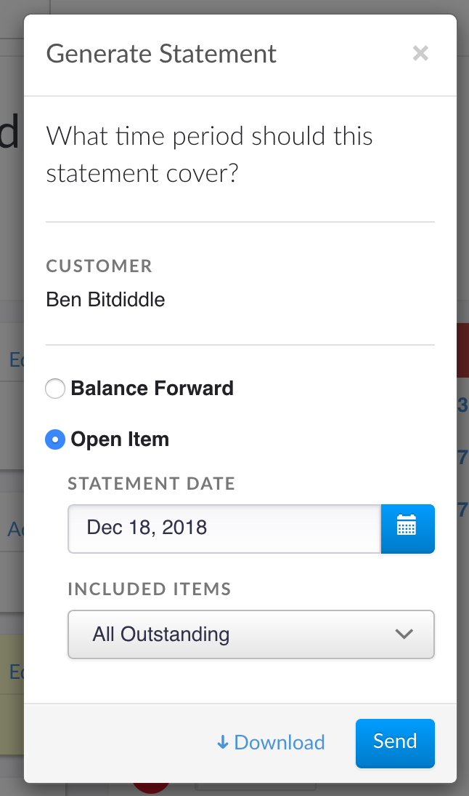

# Account Statements

An account statement is a summary of a customer's account activity with your business. Statements are useful for providing customers with a record of purchases and payments. They are also useful for showing customers that have multiple invoices outstanding at once to see the total amount owed.

Invoiced can generate account statements for your customers with the click of a button. In this guide we will walk through generating account statements. Out of the box, Invoiced can produce these types of statements:

- [Balance Forward](#balance-forward)
- [Open Item](#open-item)

## Balance Forward

A Balance Forward statement shows all of the invoice, payment, and credit note activity in a specified time period. The Balance Forward statement starts with the previous balance from the last statement and keeps a running balance for each entry in the statement. The statement also shows your customer their account balance at the end of the statement period.

Here is an example Balance Forward statement.

Here is how you generate a Balance Forward statement:
1. Open the customer's account in the Invoiced dashboard. Click **More** > **Generate Statement**.

   

2. Select **Balance Forward** and choose the date range the statement should cover.

   

3. Click **Download** to get a printable version of the statement or **Send** to deliver it to your customer via email, letter, or text message.

## Open Item

An Open Item statement shows all of the unpaid invoices for a customer account. There is also an option to only show past due invoices instead of all outstanding invoices. The Open Item statement will show the total balance due for the matching invoices. 

Here is an example Open Item statement.

Here is how you generate an Open Item statement:
1. Open the customer's account in the Invoiced dashboard. Click **More** > **Generate Statement**.

   

2. Select **Open Item** and choose the date range the statement should cover.

   

3. Click **Download** to get a printable version of the statement or **Send** to deliver it to your customer via email, letter, or text message.
