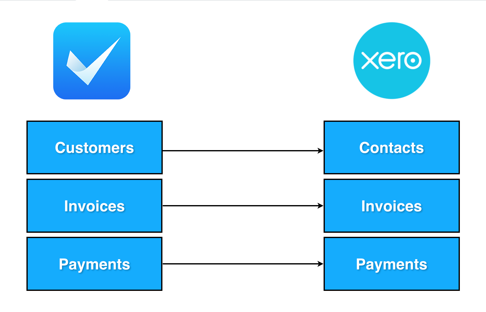
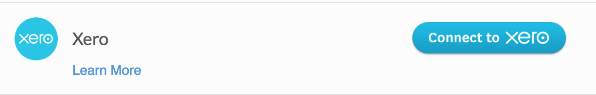
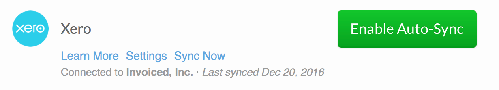
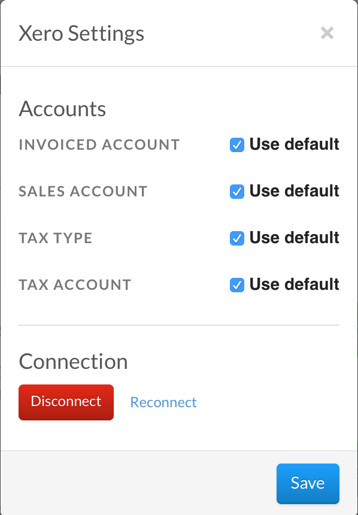

#Accounting Integrations Guide

The guide will go over how to use accounting integrations, and the technical nuances with each integration.  Invoiced currently supports a accounting integration with [Xero](#xero) and [Quickbooks Online](#quickbooks-online).

##Xero

The Xero integration lets you sync data by pushing invoices from Invoiced into Xero.  The integration will also push the corresponding contacts and payments from Invoiced into Xero.

###Getting Started

In order to begin syncing with Xero first go to **Settings** > **Accounting Sync**.  

Then click on **Connect to Xero**.

You will get redirected to Xero for authentication. Input your Xero email address and password.

Next you will be prompted to authorize your Xero organization to Invoiced.  Click on **Authorize**.

You will be redirected back to Invoiced.    

Invoiced by default creates a default bank, sales, expense account and tax rate.  However you can choose a existing account or tax rate instead through the **Settings**.

You can either enable Auto-Sync, which will automatically run a sync every hour by clicking on **Enable Auto-Sync**, or run a one time sync by clicking on **Sync Now**.

No further action is required. You will be able to monitor the progress of your sync once it has started and view the results of past syncs.

###FAQ
####How long will my Xero organization be connected for?

Your Xero organization will be connected until you click disconnect or some network outage forces you to reconnect.

####How do I disconnect my Xero organization?

Click on Xero->Settings and than disconnect.

####Which Xero organization is connected?

You will find the organization name below the Xero Settings

####How do payment processing fees appear in Xero?

Payment processing fees are not synced with Xero.

####What accounts does Invoiced create?

If you do not specify otherwise in the Xero Settings, Invoiced will create 2 Invoiced associated accounts in Xero.  The accounts that will be created, is a Invoiced Sales Account and Invoiced Bank Account.  The Invoiced Bank Account will be the account for all of your Invoiced payments and the Invoiced Sales Account for all of your invoices and line items. 

####How are taxes carried over?

The integration adds all the taxes on the invoice from Invoiced and adds a tax line item to the corresponding Xero Invoice.

####How can I identify invoices that have been synced?

Synced Xero invoices are marked with the invoice number having the format of INVD-{Invoice Number in Invoiced}.  So a invoice in Invoiced with number "INV-004" would be "INVD-INV-004" in Xero.

####How can I identify contacts that have synced?

Synced Xero contacts are marked with the contact name equal to {customer name in Invoiced} {customer number in Invoiced}. So a customer in Invoiced with name "John Doe" and number "Cust-001" would have a name in Xero of "John Doe Cust-001".

####How many invoices are synced at a time?

Invoices are batch processed and around 50 invoices are synced at a time.

####What should I do when I changed my Xero organization?

If you have changed your Xero organization you will need to reconnect your xero account by clicking on the link in the Xero Integration Page.

####Do changes I make in a synced Invoice in Xero get overridden?

Yes, the sync is one way from Invoiced to Xero, so changes you make in Xero can get overridden.  It is best just to make changes in Invoiced for synced invoices

####Are line items synced from Invoiced to Xero?

Even though line items are carried over through Invoices, they are not explicitly created in Xero.  Invoiced Catalog Items are not migrated over.

####What invoices in Invoiced are synced?

Only non-draft updated/created invoices will be synced.  The associated customers and payments will also be synced.

####What happens if the invoice does not have a due date?

The synced invoice in Xero will have the due date equal to the issue date.

####Are the taxes on the synced invoices exclusive or inclusive?

They are tax exclusive.

###Xero Troubleshooting

- If the sync fails first try to reconnect the Xero organization and try again.  If it still fails please contact [support@invoiced.com](mailto:support@invoiced.com) for further assistance.

##Quickbooks Online

The QuickBooks Online integration lets you sync data by pushing invoices from Invoiced into Quickbooks Online (QBO).  Invoiced will also create the accompanying customers, payments, line items, tax, and discount associated with the invoice in QBO.

There is also another sync which lets you download customers from QBO into Invoiced.

###Usage

In order to begin syncing with QuickBooks Online first go to **Settings** > **Accounting Sync**.  

Then click on **Connect to QuickBooks**.

Next you will be prompted to authorize your QuickBooks company to Invoiced. Once you do this you will be redirected back to Invoiced. You can now start syncing your data with QuickBooks Online by clicking **Synchronize**.

No further action is required. You will be able to monitor the progress of your sync once it has started and view the results of past syncs.

Any time you want to sync your data with Xero just return to the **Accounting Sync** page and click **Synchronize**.

###Quickbooks Online Syncing Nuances 
- QBO sync will create items in QBO unless the item is blank and then it will the default Invoiced item.

- Synced QBO Invoices are marked with the invoice number having the format of INVD-{Invoice Number in Invoiced}.  So a invoice in Invoiced with number "INV-004" would be "INVD-INV-004" in QBO.

- Unless you change this in the settings, QBO sync will create a default account, discount account, and tax code.

- QBO sync factors your time-zone when calculating the invoice date and due date.

- Only non-draft invoices from Invoiced will be synced.

- Line item descriptions over 4000 characters are truncated.

- Sync handles bad debt invoices which are invoices in Invoiced that are closed and do not have a payment against them.

- Customer names directly map to QBO display names, to avoid any collisions we append your invoiced customer number after your customer name.

- Customer names are truncated to 100 characters and that is inclusive of your customer number.

- Only invoices updated in Invoiced since the last time you ran the sync will be synced.

- If you need to re-sync all of your invoices please contact support@invoiced.com

###Quickbooks Online Troubleshooting

- If the sync fails first try to reconnect your Quickbooks Online account and try again.  If it still fails please contact [support@invoiced.com](mailto:support@invoiced.com) for further assistance.