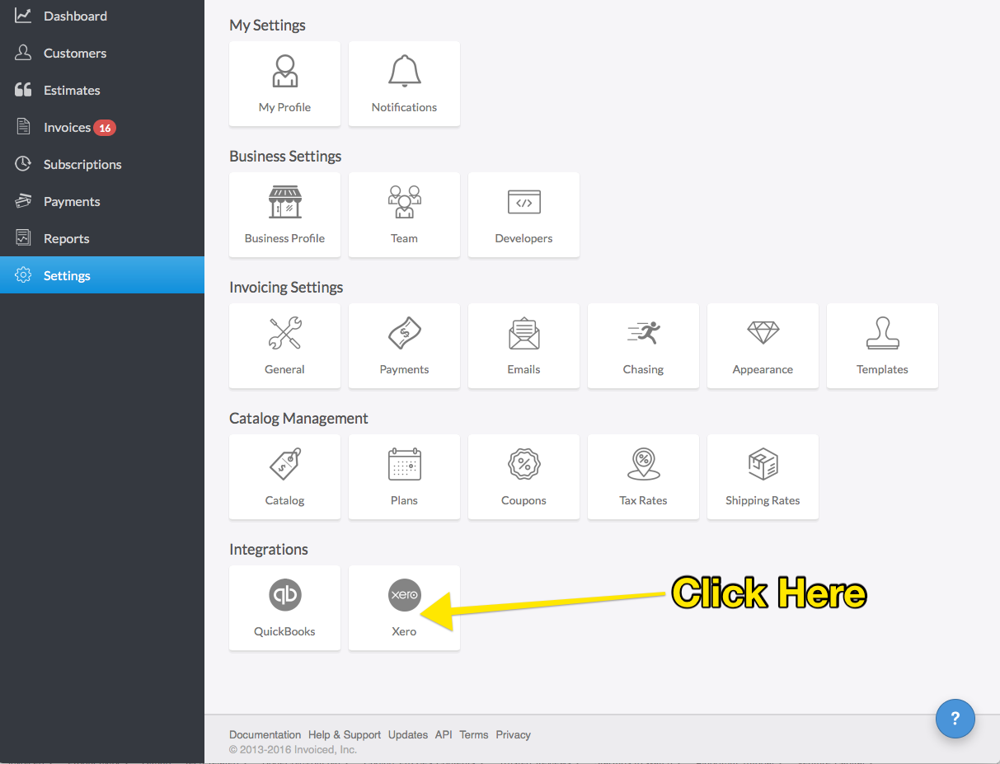
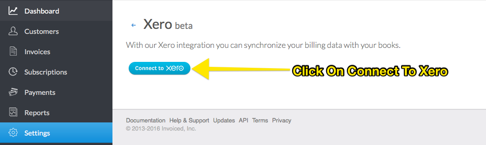
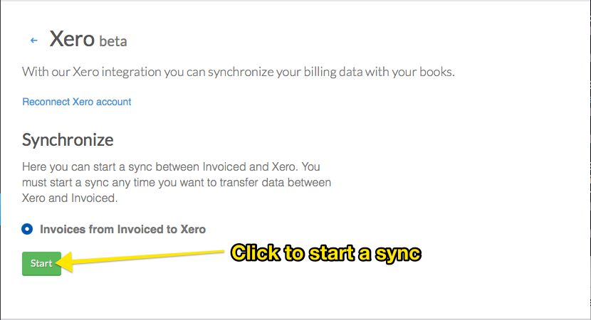
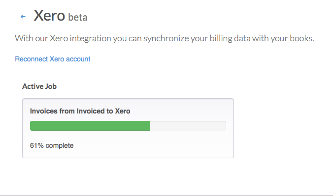
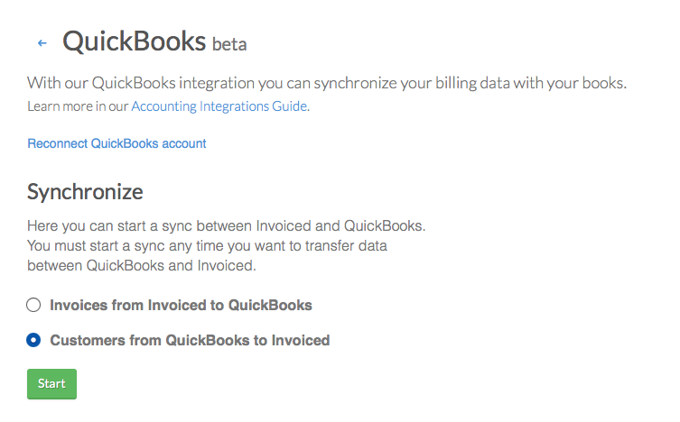
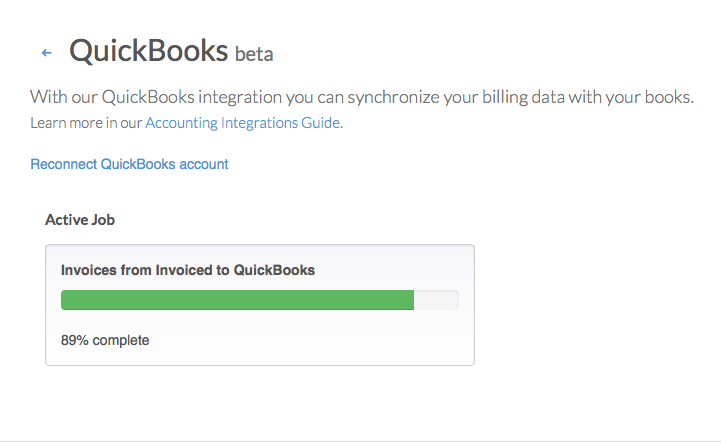

#Accounting Integrations Guide

The guide will go over how to use accounting integrations, and the technical nuances with each integration.  Invoiced currently supports a accounting integration with Xero and Quickbooks Online.

##Xero

The Xero integration lets you sync data by pushing invoices from Invoiced into Xero.  The integration will also push the corresponding contacts, and payments from Invoiced into Xero.

###Usage

To get started using Xero simply go into **Settings** > **Xero**.  

Then click on Connect To Xero

You will get redirected to Xero for authentication. Simply input your Xero Email address and Password.

Next you will be prompted to authorize your Xero Organization to Invoiced.  Simply click on Authorize.

You will be redirected back to Invoiced where you can now start syncing your data with Xero.

You can now monitor the progress of your sync, once your sync has started. 

###Xero Syncing Nuances 

- Currently you are only authenticated for 30 minutes.  You should get a prompt to reconnect when you are Xero Integration page if your authentication has expired. 

- If you have changed your Xero organization you will need to reconnect your xero account by clicking on the link in the Xero Integration Page.

- Invoices are batch processed and around 50 invoices are batched at a time.

- The sync is one way and changes you make in Xero with synced invoices, payments may get overwritten or deleted.

- The Xero sync will only process newly updated invoices in Invoiced.  If a Invoiced payment is updated, than the Invoiced Invoice is considered updated as well.

- Synced Xero Invoices are marked with the invoice number having the format of INVD-{Invoice Number in Invoiced}.  So a invoice in Invoiced with number "INV-004" would be "INVD-INV-004" in Xero.  

- Synced Xero Contacts are marked with the customer name equal to {customer name in Invoiced} {customer number in Invoiced}.  So a customer in Invoiced with name "John Doe" and number "Cust-001" would have a name in Xero of "John Doe Cust-001". 

- Currently we auto-create 2 Invoiced Accounts in Xero.  The accounts that will be created, is a Invoiced Sales Account and Invoiced Bank Account.  The Invoiced Bank Account will be the account for all of your Invoiced payments and the Invoiced Sales Account for all of your invoices and line items.

- Even though line items are carried over through Invoices, they are not explicitly created in Xero.  Invoiced Catalog Items are not migrated over.

- A default Invoiced Tax Rate is created and applied to all synced Invoices.

- Taxes are computing by adding all the invoice taxes + line item taxes.  They are added as 2 line items. The first line item will have a tax amount = 1 * unit price. The unit price will be the total computed tax.  The second line item will have a negative unit price equal to -1 * total computed tax; this will cancel the first line item and leave the tax amount = total computed tax. 

- Discounts are added as a negative line item.  Discounts are first computed by adding all the invoice discounts + line item discounts on invoiced.

- Invoices without the due date in Invoiced, will be set to the Invoice date.

- All synced invoices in Xero are Tax Exclusive

###Xero Troubleshooting

- If the sync fails first try to reconnect the Xero organization and try again.  If it still fails please contact [support@invoiced.com](mailto:support@invoiced.com) for further assistance.

##Quickbooks Online

The QuickBooks Online integration lets you sync data by pushing invoices from Invoiced into Quickbooks Online (QBO).  Invoiced will also create the accompanying customers, payments, line items, tax, and discount associated with the invoice in QBO.

There is also another sync which lets you download customers from QBO into Invoiced.

###Usage

Simply go to **Settings** > **Integrations/QuickBooks**

Then click on Quickbooks and connect your Quickbooks Online account.

To sync your Invoices to QBO simply select "Invoices from Invoiced to QuickBooks" and click Start.

To sync your QBO Customers to Invoiced simply select "Customers from QuickBooks to Invoiced" and click start.

You will now see the sync status on the page.

###Quickbooks Online Troubleshooting

- If the sync fails first try to Reconnect Quickbooks Account and try again.  If it still fails please contact [support@invoiced.com](mailto:support@invoiced.com) for further assistance.

