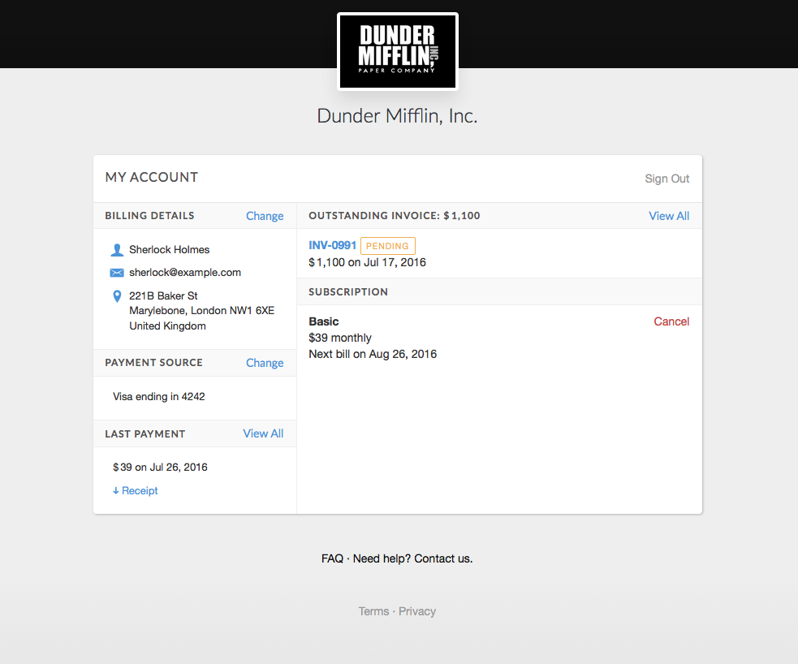

# Billing Portal

Your billing portal is a self-serve website where your customers go to handle all things billing from your business.

The billing portal is provided by Invoiced with no coding or extra setup required. Customers can access the billing portal anytime, anywhere. With your billing portal clients can do all of the following by themselves:

- view and pay invoices
- download receipts for past payments
- subscribe to subscription onboarding requests
- manage subscriptions
- update payment and billing information
- view and approve estimates

## Usage

Your billing portal is hosted at *yourusername*.invoiced.com where *yourusername* matches your Invoiced username in **Settings** > **Business Profile**. Any customer facing activity happens on this domain, like viewing invoices or paying. Customers can also access the billing portal by going directly to this URL.

### Signing In

Customers must be signed in to access the billing portal. We've made signing in as simple as possible while remaining highly secure. There are a few ways that customers can sign in:

1. **Opening invoices, subscriptions, or estimates from emails**
    
    We temporarily sign in any clients when they open an invoice, subscription, or estimate from an Invoiced email. On invoices and estimates there will be a **My Account** button at the top of the page. Also after paying or subscribing there is a **Go to My Account** button.

2. **Passwordless sign in**

   Clients can also visit your billing portal (*yourusername*.invoiced.com) directly and request a sign in link by simply entering in their email address. We will then immediately send them an email with a **Sign In** button.

   The email address provided must match a main email address or attached contact for a customer profile in your Invoiced account. We will only send a sign in link to email addresses matching this criteria.

3. **Single Sign On**

	Our Single Sign On (SSO) feature allows you to securely generate URLs to sign customers into the billing portal. This allows you to transparently sign users into the billing portal from your app or website without requiring an additional login step. We only recommend generating a sign in link for users that you have already authenticated through your own login system.

	SSO links can be generate through the API or through the dashboard by opening a customer profile and clicking **More** > **Generate Sign In Link**.