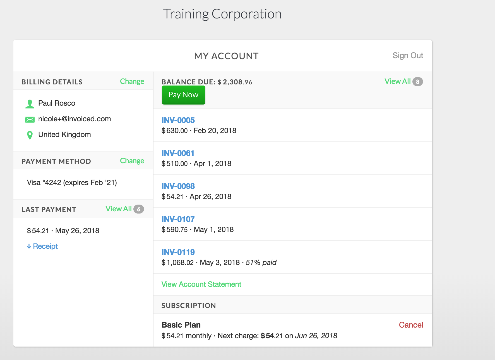
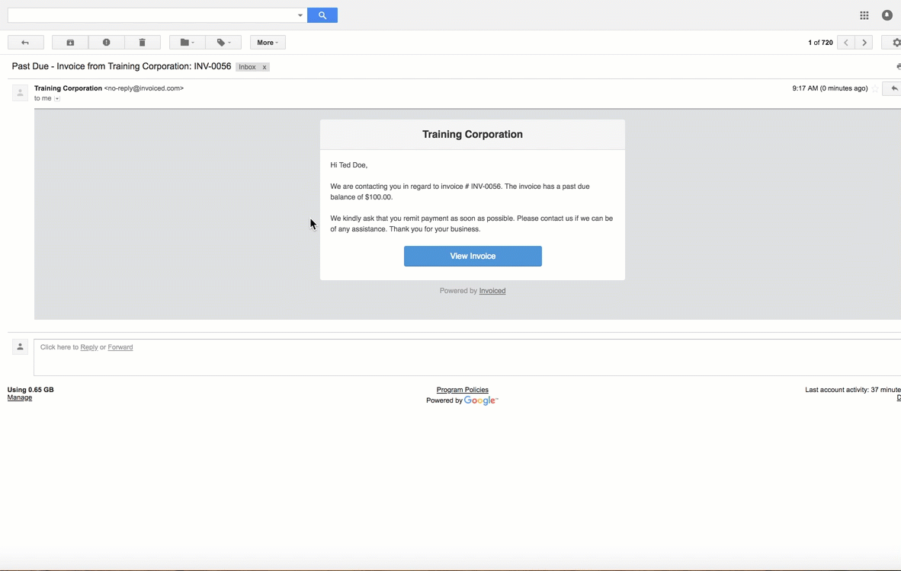
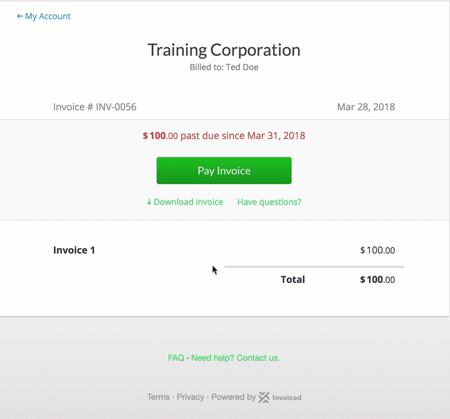

# Billing Portal

The billing portal is a self-serve website where your customers can go to handle all billing related functions from your business. The billing portal is provided by Invoiced with no coding experience or extra setup required. Customers can access the billing portal at anytime and from anywhere with an internet connection. With your billing portal, customers can access the following features:

* view and pay invoices
* download receipts for past payments
* manage subscriptions
* update payment information
* view and approve estimates

*Pay an Invoice*

When customers access an invoice via the View Invoice link received in the invoice email, the customer will be taken directly to the invoice to be paid. The customer will have the option to view the invoice and access the main billing portal screen when on an selected invoice. 

## Usage 

Your billing portal is hosted at yourusername.invoiced.com where yourusername matches your Invoiced username in *Settings* > *Business Profile*. Any customer facing activity happens on this domain, like viewing invoices or paying. Customers can also access the billing portal by going directly to this URL.

## Signing In 

Customers must be signed in to access the billing portal. We've made signing in as simple as possible while remaining highly secure. There are a few ways that customers can sign in:

1. *Passwordless sign in*
    Customers can also visit your billing portal (yourusername.invoiced.com) directly and request a sign in link by simply entering in their email address. We will then immediately send them an email with a *Sign In* button.
    The email address provided must match a main email address or attached contact for a customer profile in your Invoiced account. We will only send a sign in link to email addresses matching this criteria.
2. *Single Sign-On*
    Our Single Sign-On (SSO) feature allows you to securely generate URLs to sign customers into the billing portal. This allows you to transparently sign users into the billing portal from your app or website without requiring an additional login step. We only recommend generating a sign in link for users that you have already authenticated through your own login system.
    SSO links can be generate through the [API](https://invoiced.com/docs/dev/single-sign-on) or through the dashboard by opening a customer profile and clicking *More* > *Generate Sign In Link*.
3. *Sign up pages*
    We temporarily sign in any customers when they sign up from a sign up page. On the thank you page there is a *Go to My Account* button.
4. *Manage Subscription links*
    We temporarily sign in customers when they click on the *Manage Subscription* button on subscription email notices. This allows customers to easily update payment information.

## Leave a Comment on Invoices 

Customers can provide feedback on their invoices in the billing portal by adding a comment to the invoices. This allows customers to ask questions regarding the information on the invoice as well as resolve any billing issues that might arise. 

Invoiced will also flag the customers invoice if a comment is left and alert the users on the Account profile. This gives the business an easy way to filter out invoices that need attention. Once a response is left on the comment, the invoice can be marked as resolved to remove from the needs attention filter.

