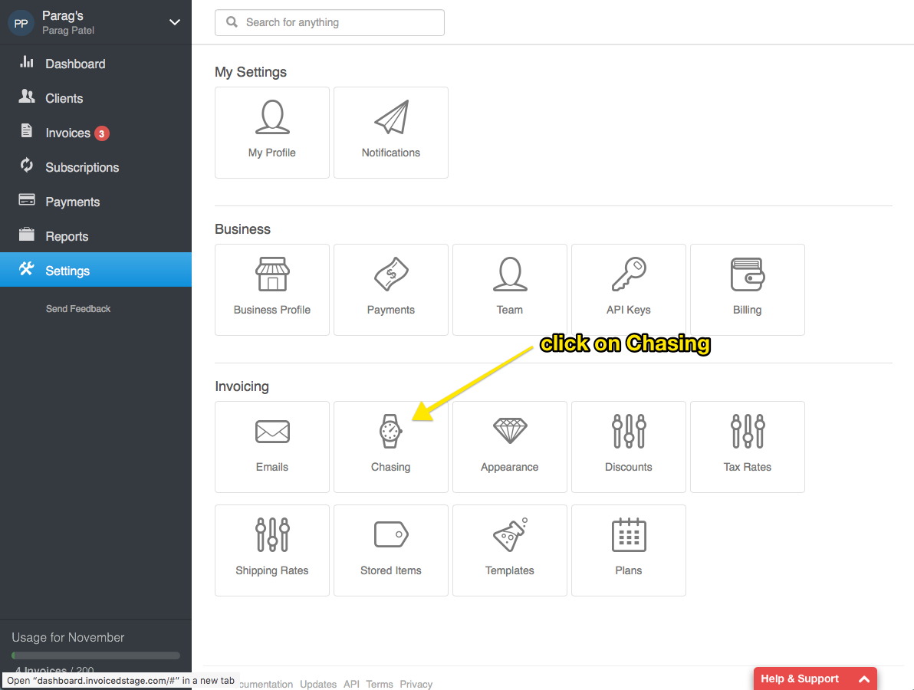
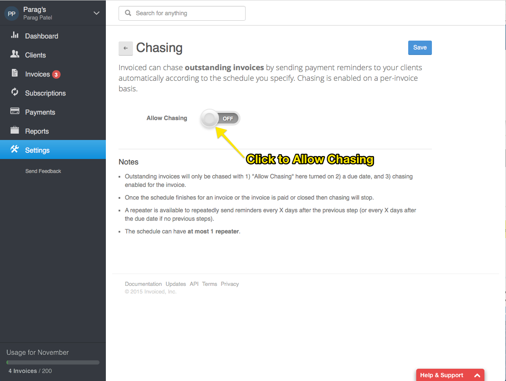
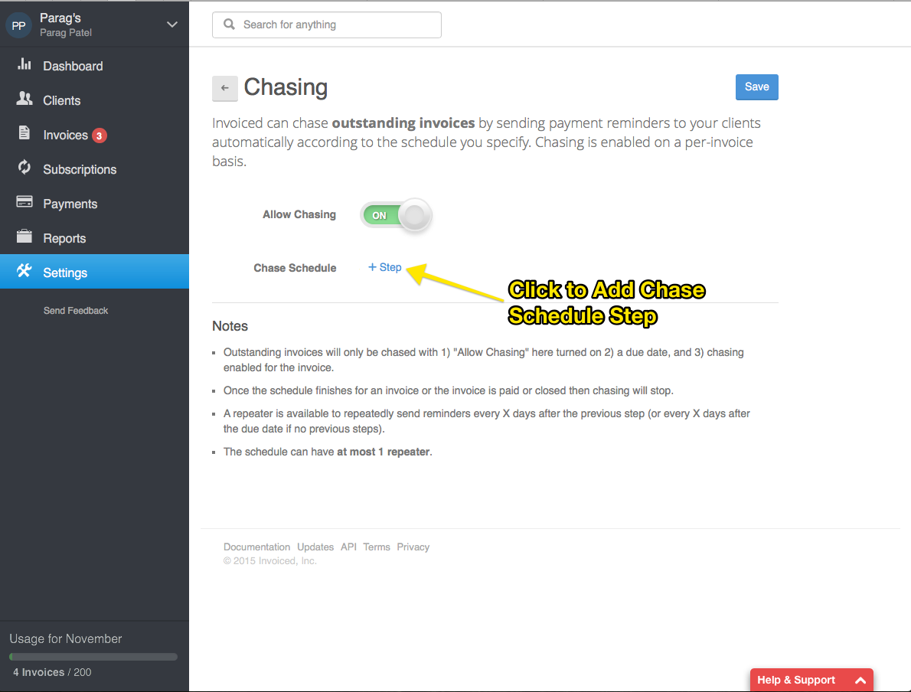
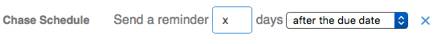
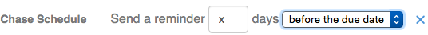
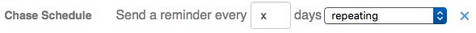
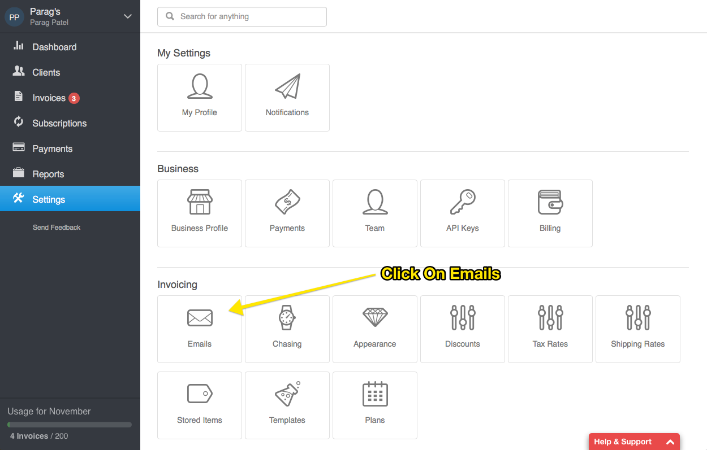
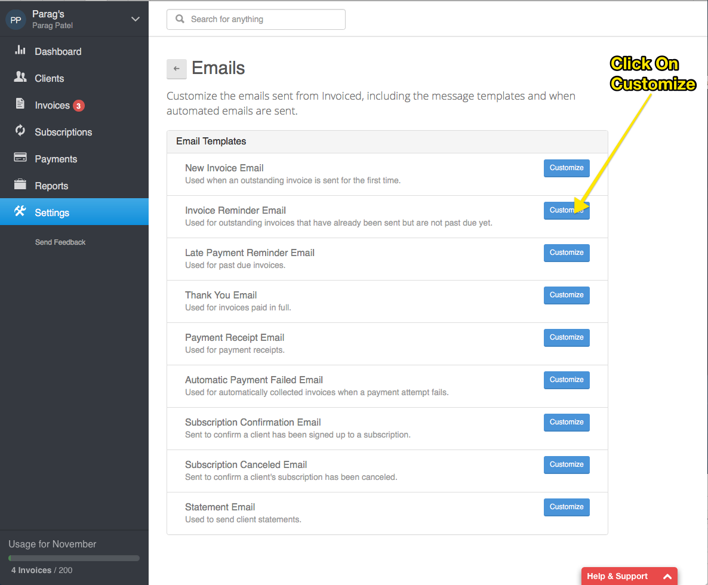

#Chasing Guide

Invoiced lets you send automatic reminders to your client.  This can help you close the gap on the time you get paid, by reminding them that payment is due.

We call this feature Chasing. 

Invoiced Chasing is typically enabled per invoice or subscription.  So you will have to explicitly turn it on per invoice or subscription.  You will also have to enable it in the settings and set a reminding schedule first.

##Enabling Chasing

First you will need to enable chasing in the settings and set a schedule.

Go to **Settings > Chasing**

Click on Allow Chasing to enable it.

Now we are ready to set the chasing schedule

##Setting the Chasing Schedule

It is pretty important to set the chase schedule correctly.  The chase schedule determines when and how often your client receives the reminders.

Now to set the chasing schedule, let us add a step.

The chase schedule has 3 schedule steps you can choose from.

1. *Send a reminder X days after the due date*

2. S*end a reminder X days before the due date*

3. *Send a reminder X days repeating*

Schedule 1 means your client will get a 1 time reminder x days after the due date.

###Example 1

We set our schedule to

*Send a reminder 5 days after the due date*

If our Invoice is due on September 10th.  Than our client will get a reminder 5 days after on September 15th.

Schedule 2 means your client will get a 1 time reminder x days before the due date.

###Example 2

We set our schedule to

*Send a reminder 5 days before the due date*

If our Invoice is due on September 10th.  Than our client will get a reminder 5 days before on September 5th.

Schedule 3 means your client will get a continual reminder either x days after the due date if schedule 1 or 2 has not been sett.  If schedule 1 or 2 have been set, schedule 3 will repeat x days from the date that the client receives the reminder from schedule 1 or 2.

###Example 3

Let the invoice due date be September 10th

####CASE A

We set our schedule to

*Send a reminder 5 days before the due date.**

And we also add in

*Send a reminder 5 days repeating*

What will happen is the first reminder will go September 5th, the next one will go on September 10th, 15th, etc, until the invoice is paid.

####CASE B

We set our schedule just to 

*Send a reminder 5 days repeating*

What will happen is the reminder will start on the due date and keep repeating until the invoice.

Since our due date is September 10th, our reminder will be sent on September 15th, and it will keep repeating every 5 days until the invoice is paid.

Once the invoice is paid the reminders will automatically stop not matter what schedule or combination of schedule templates that we use.

###Best Practices

Although we allow you add as many schedule templates as you like, we generally recommend to keep the schedule simple (no more than 2 schedule templates).   Adding a combination of many schedule templates can make it hard for you to predict precisely every time your client gets a reminder. 

##Editing The Chasing Emails

Invoiced sends out a default chasing email depending on the context.  

There are 3 email templates that are sent depending on context *New Invoice Email*, *Invoice Reminder Email*, *Payment Reminder Email*.

That means that if you have not sent the invoice to the client, it will send out the *New Invoice Email*, which is the standard email sent out.

If you already have sent the invoice to client and the invoice is not over due, it will send out *Invoice Reminder Email*, whose purpose is to remind the client that the invoice will be due soon.

If the invoice has been sent and is over due than the *Payment Reminder Email* is sent, it's purpose is to gently remind clients that they are late and payment is due as soon as possible.

To edit these emails you can go to **Settings > Emails**.

To edit or customize these email templates click on the customize button.

