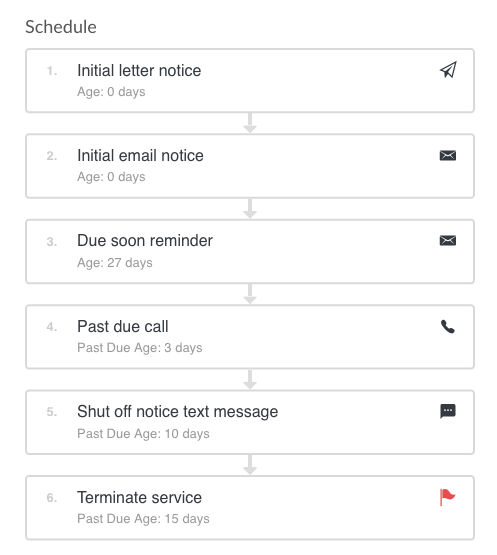

# Chasing

SmartChasing helps you close the gap on getting paid by codifying your invoice distribution and follow ups. Once setup, Invoiced will ensure that collection activities always happen on time.

## How It Works

With chasing you setup your cadences once, and then enroll customers in the appropriate cadence. A cadence contains the steps you'd like to take when working a customer account towards paid. Cadences describe how and when to follow up with your customers. Each communication is personalized to the account to maximize its effectiveness.

Chasing cadences support the following activities:
- Sending an email
- Mailing a physical letter
- Sending a text message
- Calling the customer
- Escalating the account internally

A cadence consists of a series of steps to be taken according to the account's age (how many days the customer has owed you money). If at any point the customer pays the balance then the cadence stops.

Here is an example cadence:

According to the example above, a customer with a newly issued invoice would receive a letter and an email from Invoiced. Most actions are completely automated, with the exception of phone calls and escalations, which must be handled by a team member (more details below). 

One other neat aspect of chasing is that you get to choose when schedules run. For example, you could choose to execute any scheduled activities at 7am every day. Or maybe you want to restrict this to specific days of the weeks or month. Chasing gives you the fine-grained control to make sure you are reaching your customers at optimal times.

## Setup

This document describes the latest version, SmartChasing. If you are using the legacy chasing feature then you can find the <a href="/docs/guides/chasing-legacy">docs here</a>. Please contact support@invoiced.com if you would like to be upgraded to SmartChasing.

### Building cadences

The first step to using chasing is to setup a cadence. You can build as many cadences as you'd like and assign them to customers based on how you would like them to be followed up.

1. Go to **Settings** > **Chasing** in the Invoiced application. Click **New Cadence.**

   -screenshot-

2. In the first step you will give your cadence an easily identifiable name, configure when chasing activities should occur, and optionally set a threshold if you do not want smaller balances to be chased (i.e. < $100).

   -screenshot-

3. The second step is the most important part. This is where you build the schedule of chasing activities. Each step represents a single action that will happen. You specify the account age or past due age when that step should run. Depending on the action selected there will be different settings. For example, in the email step you can select which email template to use.

   -screenshot-

4. In the final step you can have chasing cadences automatically assigned to customers based on certain conditions, like payment terms or customer language. If you do not setup any assignment rules then the cadence must individually be assigned to customers.

   -screenshot-

5. Once you are ready click the **Save** button to create the cadence. You can come back and edit the cadence any time, however, once assigned to customers you cannot change the schedule.

   -screenshot-

### Enrolling customers

Now that you have one or more cadences, you can start assigning them to customers.

Assigning cadences from the customer page:

-screenshot-

Bulk assigning cadences to customers:

-screenshot-

## Usage

### Chasing Activities

Below we describe each of the chasing actions supported, including emails, letters, text messages, phone calls, and escalations.

#### Send an email

The email action allows you to send an email to customers. The email will have a "Pay Now" button directing the customer to the customer portal. You can optionally have all of the outstanding invoices attached to the email as a single PDF attachment.

These variables are available for use in your email templates:
- `{{customer_name}}`
- `{{customer_contact_name}}`
- `{{customer_number}}`
- `{{customer_address}}`
- `{{customer_payment_terms}}`
- `{{account_balance}}`
- `{{invoice_numbers}}`
- `{{invoice_dates}}`
- `{{invoice_due_dates}}`
- `{{{customer_portal_button}}}`

#### Send a letter

The letter action will mail an Open Item statement to your customer via our [Lob integration](/docs/integrations/lob). In order to use this feature you must have a Lob account connected.

#### Send a text message

The text message action will send a text message to the customer's text-message enabled phone number on file (must be added as a contact to the customer). In order to use this feature you must have a [Twilio account connected](/docs/integrations/twilio).

#### Phone calls

The phone call action will add an item to your to do list. You or another team member will be responsible for making the call. Our system makes it easy to keep track of any collection calls and record notes.

#### Escalations

An escalation will flag an account for review. This can go on the team-wide to do list, or can escalate an account to a specific person and get added to their to do list.

### Monitoring chasing progress

You can see chasing progress across your entire customer list at a glance.

-screenshot-

If you want to see the specifics of an individual account then you can go to the **Collections** tab of that customer's account.

-screenshot-