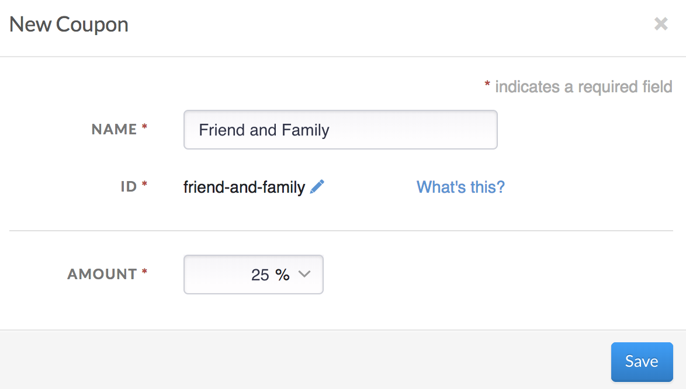
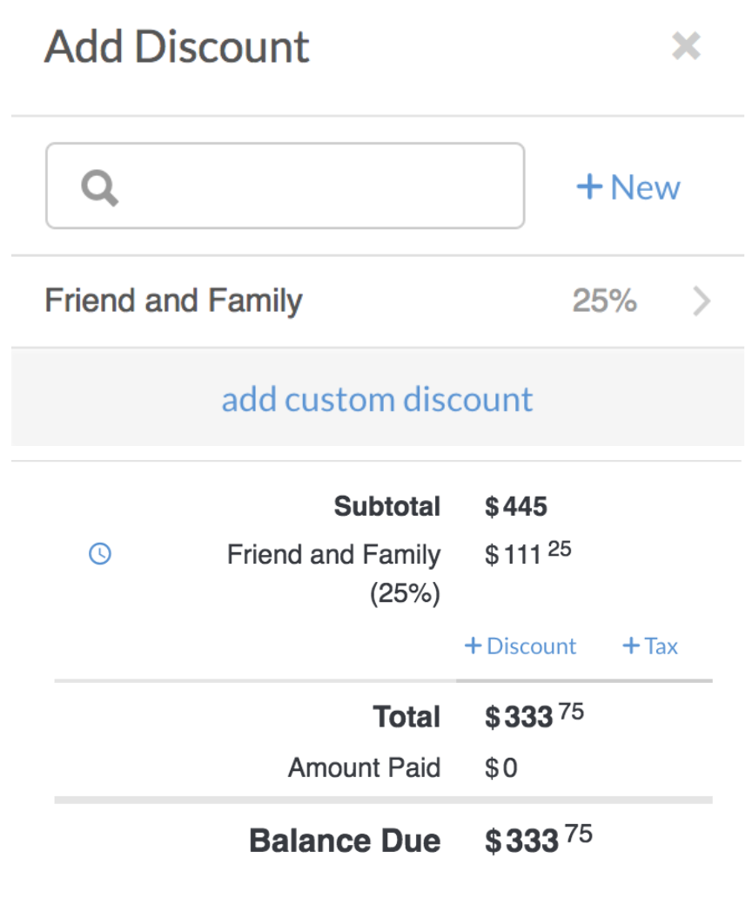
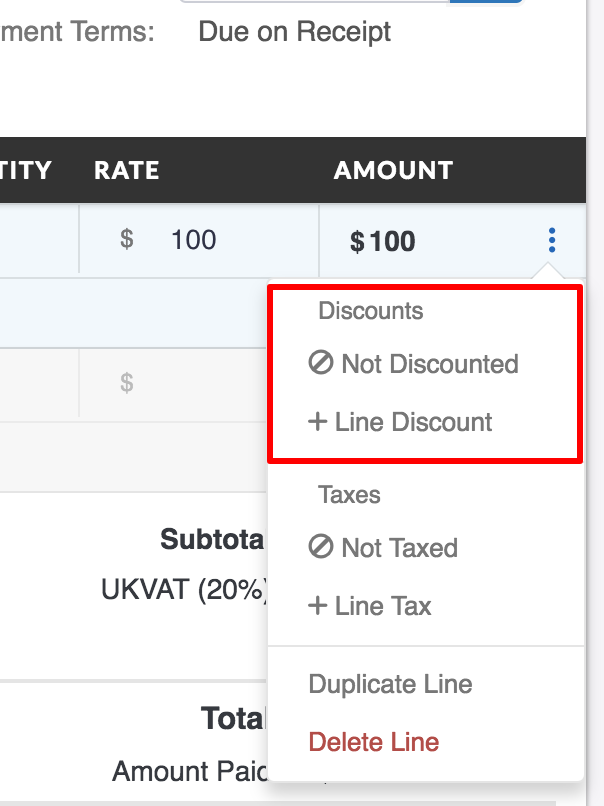
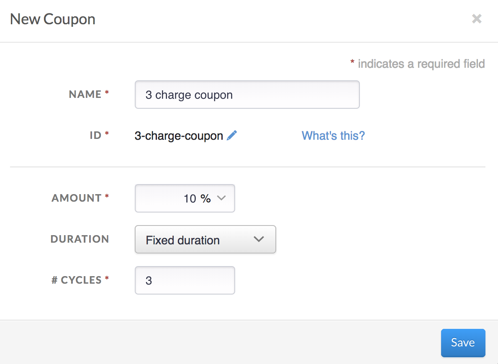

#Coupons

Using Coupon codes can incentivize customers and build brand loyalty. They can also help learn more about your consumers behavior. Invoiced has built an easy to use coupon tool to create flat rate and percentage based discounts for customers to allow users to apply coupons to invoicing with ease. 

To access Coupons, navigate to **Settings** &rarr; **Coupons**

 

##Creating a Coupon

To create a new Coupon, simply click New Coupon. This will prompt the user to add conditions for the coupon. Here, apply a name for the coupon and the amount. Please note: the amount can be a flat rate, in which a currency is needed, or it can be a percentage of the total. The ID will be auto generated based on the name of the coupon being created.

 

 

After creating the coupon, it is now ready to be applied to an Invoice. 

##Using a Coupon

After creating the Coupon, it is now ready to be applied to Invoicing. A coupon can be applied anywhere there is a line item or subtotal. Press the +Discount to Add the coupon code. A list of the Coupons created will be shown. Select the correct Coupon that is needed to apply discount to the Invoice.

Once selected, the Coupon will be added to the invoice as a line item and discount will be applied to the Balance Due. 

##Setting Expiration Dates on Coupons

Setting expiration dates on discount codes can be done directly on the Invoice for the customer. This allows for discount codes to be applied to an invoice and if they pay the invoice before the coupon expires, they can receive that discount rate on their invoice. Once the coupon expires, the coupon will no longer be applied to the invoice and the customer will paid the original amount. 

##To set an expiration date on a coupon

Once the invoice is set and a discount is ready to be applied, choose the discount option under the SubTotal section on the invoice. Here, you will apply the discount percentage or rate to be taken off the invoice. Once the discount has been applied, click the clock icon next to discount rate. 

This will allow the discount to be expired on a specific date. This setting defaults to Never. Select the date on the calendar and press save. Once the date is saved, the expiration date will show on the invoice. 

##Place Discount on Line Item

Just like setting a discount on the entire invoice, Invoiced also allows for coupons to be placed on each line item of the invoice. As each item is added to the invoice, there is a settings section located to the right side of the lined item. In the setting section, a user can add a Line Discount or remove the lined item from adding the discount placed in the subtotal. 

##Apply Coupon Duration

An additional feature has been added to coupons that allows the user to apply a duration to discounts. The duration settings is meant to be used for plans that the user would only like to add a discount to X number of charges on that plan. 

To access Coupons, navigate to **Settings** &rarr; **Coupons**.

Start by creating a coupon or editing an existing coupon. There is now a drop down to select a duration. 

1. Forever
2. One Time
3. Fixed Duration

When choosing fixed duration, a box to enter number of cycles to use the discount on. There, enter X number of cycles of the plan. 

Still have questions regarding coupons? Contact Invoiced support : support@invoiced.com.

