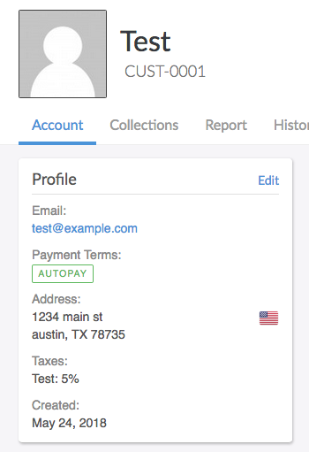
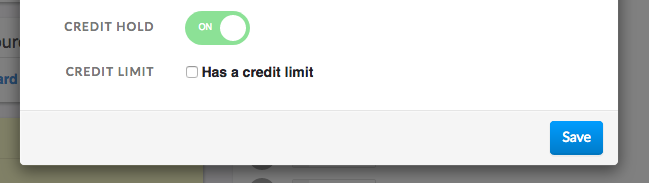
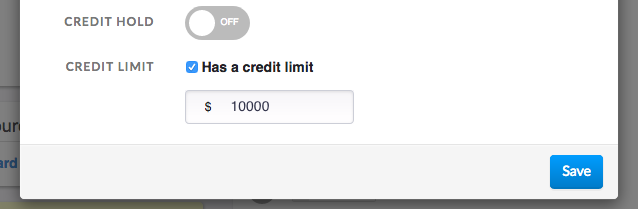

# Credit Holds

Credit holds and credit limits can be used to control the credit extended to customers and reduce your organization's exposure to risk.

## Setting a Credit Hold

When an account has a credit hold, new invoices cannot be created for that customer.

Here is how to setup a credit hold:
1. Open the customer's account in the Invoiced dashboard. Click **Edit**.
   
   

2. In the *More Options* section, toggle on the **Credit Hold** option.

   

3. Click **Save** to finalize the credit hold.

When a credit hold is in place you will see this error message when trying to create invoices:
> New invoices cannot be created for this account because it has a credit hold.

Credit holds can be released through the same process as adding a credit hold, by simply toggling the credit hold option off on the customer.

## Setting a Credit Limit

A credit limit puts a restriction on the amount an account can have outstanding at a time. When there is a credit limit for an account, each time an invoice is created, Invoiced will check to see if that causes the customer to exceed their credit limit. When in excess of the credit limit the invoice will be rejected.

Here is how to setup a credit limit:
1. Open the customer's account in the Invoiced dashboard. Click **Edit**.

2. In the *More Options* section, check the **Has credit limit** option and enter in the credit limit.

   

3. Click **Save** to finalize the credit limit.

When a credit hold is in place you will see this error message when trying to create invoices:
> This invoice cannot be created because the new amount outstanding ($11,000.00) exceeds the account's credit limit ($10,000.00).

Credit limits can be modified or removed through the same process as adding a credit limit.