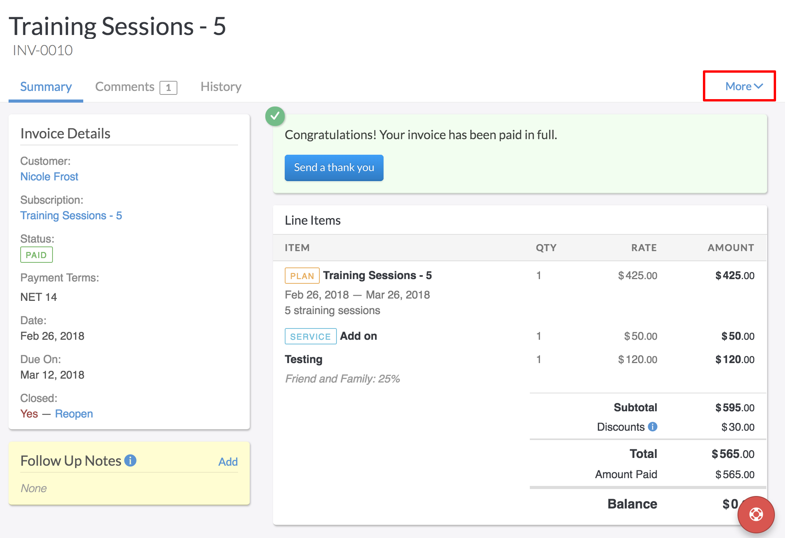
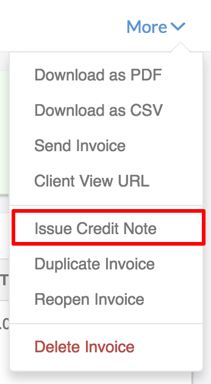
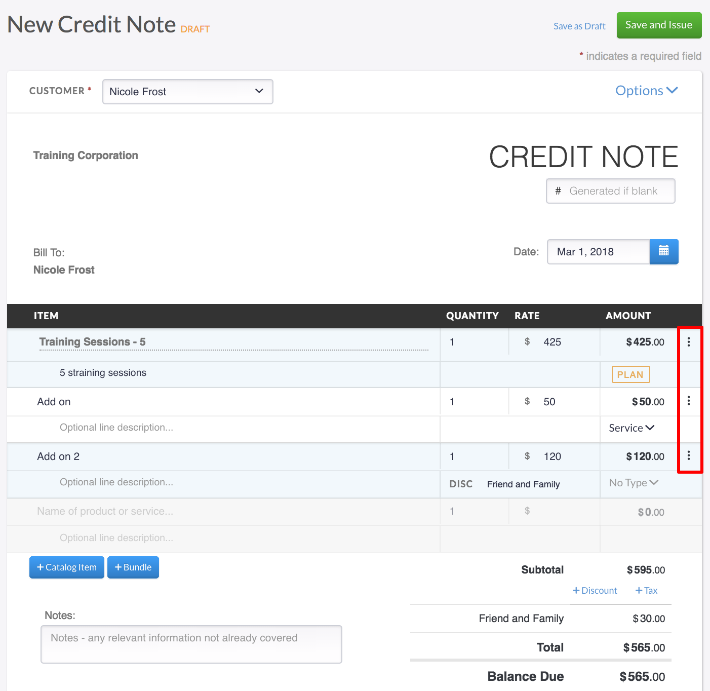
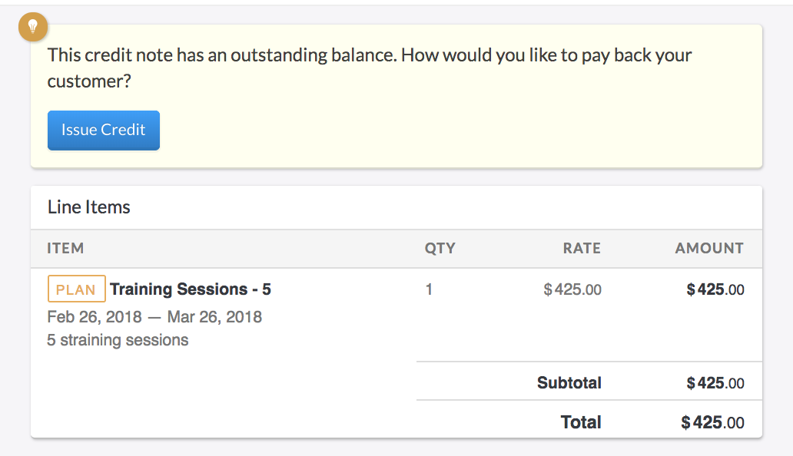
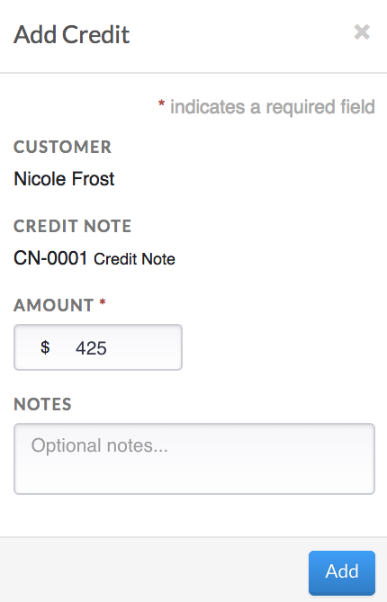
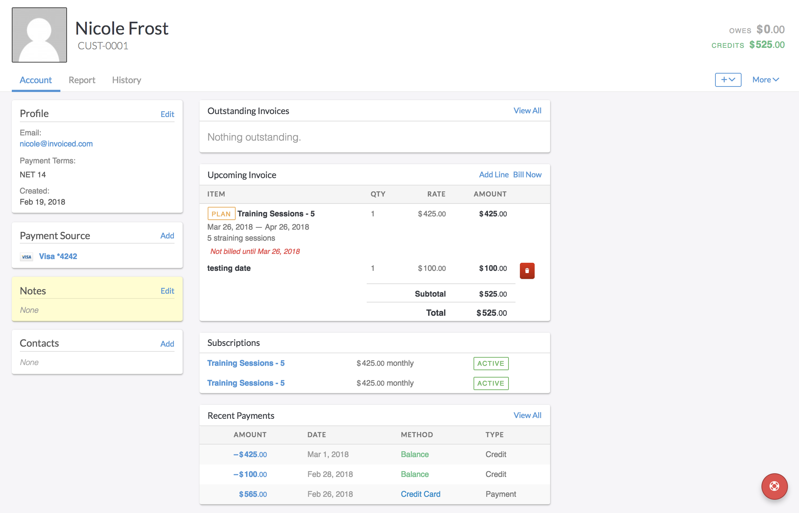
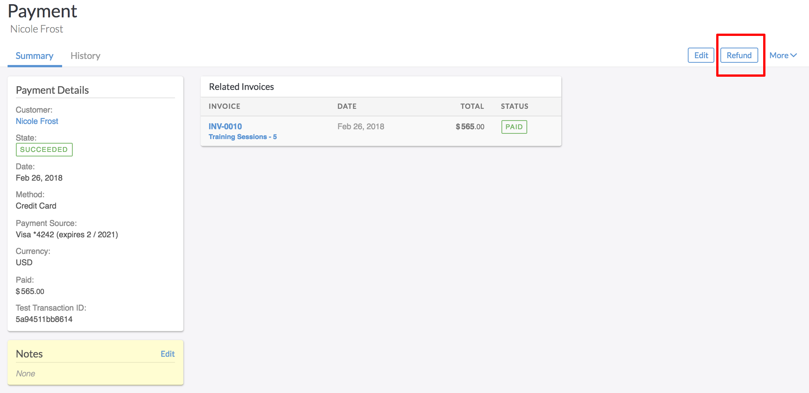
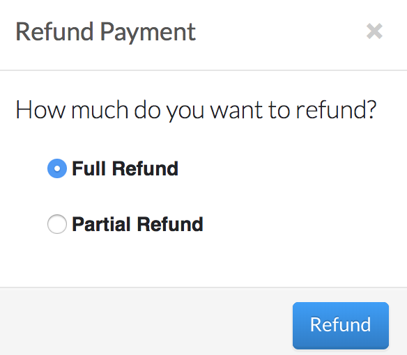
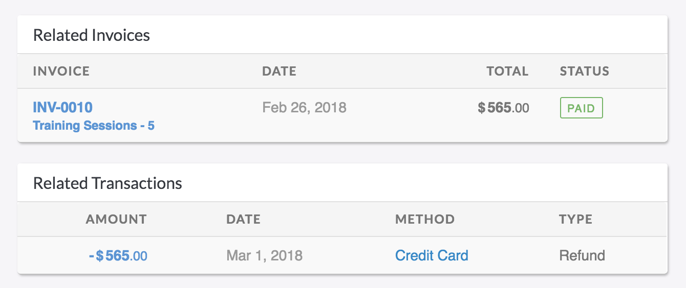

#Credit Notes

Issuing credit notes against invoices has never been made easier than with Invoiced. Invoiced offers different ways you can create a credit note and how it is applied to the customer. 

##How to Apply Credits

The first thing you will want to consider is, when you draft a new invoice, if you wish for it to  automatically apply any credits your customer has on their balance. If you do wish to have it automatically apply, we recommend setting the Apply Credits to New Invoices to on. If not, you can switch this to off. Head to:

**Settings** > **General** > *Apply Credits to New Invoices*

Once you have set your application of credits setting, you are ready to begin using credits. 

###Adding credit notes to invoices

In some cases, the customer no longer wants the item or service ordered and you are needing to apply a credit or refund the customer. To apply a credit to the customers invoice for the amount they paid:

Access the customers paid invoice that needs to be credited and select *Actions* in the top right corner of the Invoice page. 

Select Issue Credit Note in the drop down. Here, you will be allowed to remove items from the invoice that does not need to be issued a credit. This allows you to control the amount the credit is being issued for. Clicking the icon next to each line item will allow you to delete the charge. 

Once you have confirmed the line items you wish to have credited, simply click Save and Issue. This will ask you to confirm the crediting of the balance to the customers account. 

Now that the credit has been approved and applied to the customer, you will see the credit reflected in the customers account, as well as recent payment transactions.  

Credit notes allow you to credit back the item and taxation associated with the customers invoice. Credit notes will also cancel out an invoice if you are refunding the entire invoice. The credit note is telling the system the item is being returned. You can issue the credit to the next invoice, or have it automatically apply by using the Setting to Apply Credits to New Invoices. 

##Refunds

There will come a time when you need to fully refund a customer to their original source of payment and not issue a Credit Note to the invoice. To Refund a customers invoice:

Navigate to the customer's invoice that needs to be refunded. You can search under the customer record or in the paid Invoice Tab. At the top of the paid invoice, there will be an action to Refund. You have the option of a full or partial refund. Partial refunds allow you to type in the amount you wish to refund back to the customer. 

Once you have chosen a Full or Partial refund, simply click Refund. This will refund the customer on their form of original payment, and detail the refund in the Related payments section of the invoice.

