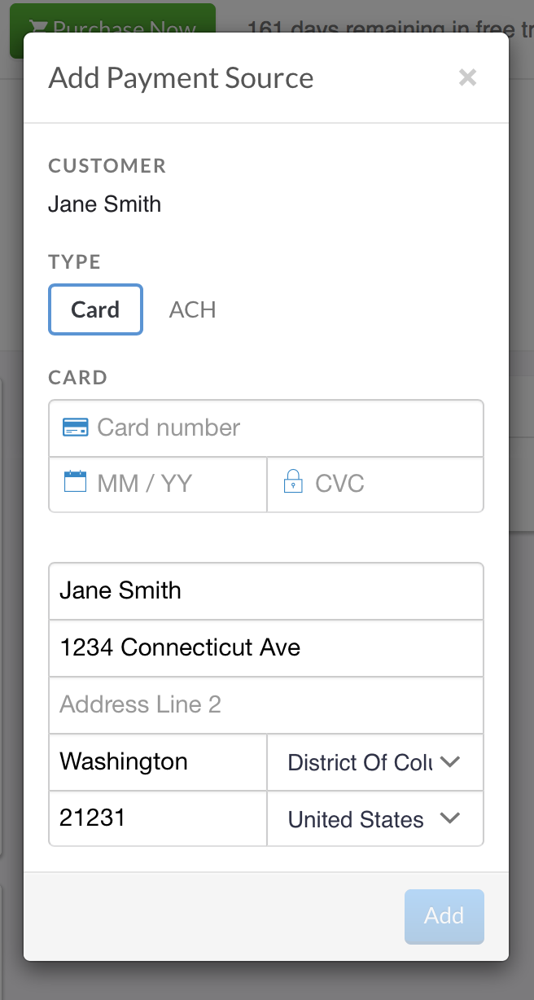
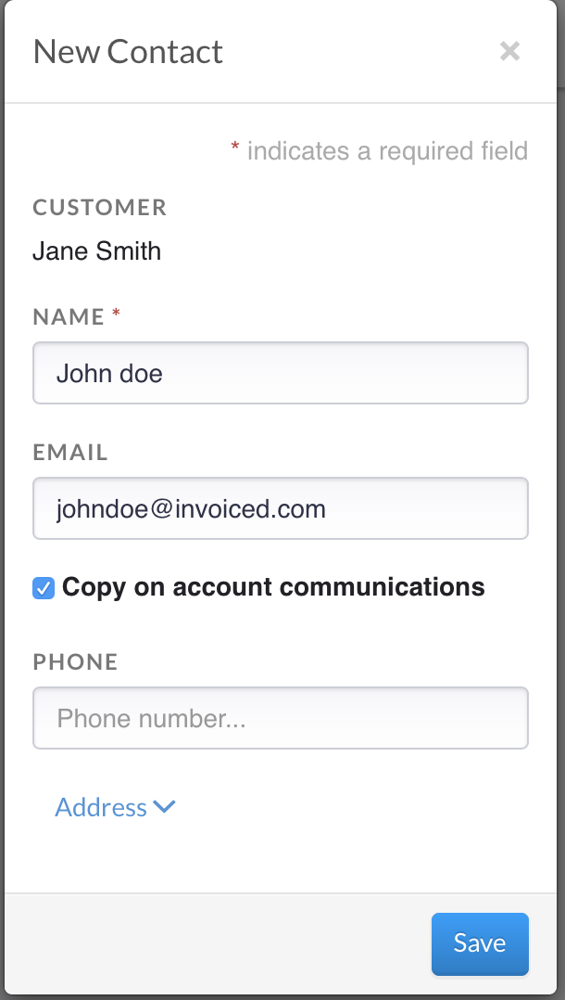

#Customers	

Invoiced makes it easy to add and update customers. While a customer can be added when creating an invoice, a customer can also be created simply by selecting:

Customers > New Customer

You will be prompted to add a name, account number (this will generate if left blank), and an email address. On the New customer set up, you can also add a payment method, billing address, specify allowed payment methods, and allow chasing on the customers profile. If you do not know this information, you can leave these items blank. 

Once a customer is created, you can apply invoices, pending line items, and subscriptions to the customers account.

## Adding a Payment Method

Customer records also allows you to store a payment method on the customer's account. Simply access the customer by finding the customer in Invoiced. 

Under the *Payment Method* section, you can add a payment method to use for the customer. 

## Additional Contacts

Want to add more contacts to a customers account to receive invoice notifications? Simply access the customer account that needs additional contacts added and press the "Add" button. Add the contact and check the box for *copy on account communications*. 

