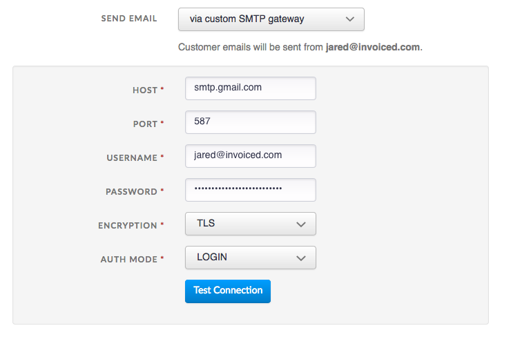
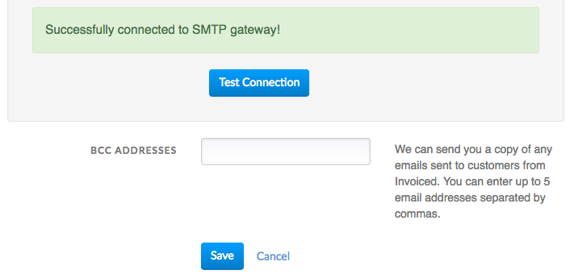

# Emails

Email is a core component to any online billing system. Here you can learn more about how sending works on Invoiced.

## Features

We have built many features around sending and email to make billing less stressful.

### View Tracking

Anyone that has billed customers before has probably heard the "I never received it" excuse, at least once. Sometimes it is true that the client never received the invoice. We built view tracking to to solve this problem.

All invoices have what is known as the **Client View**. The client view renders the full document in the recipient's web browser and supports several features, like online payments, PDF downloads, commenting, file attachments, and more. The client view is hosted on your [customer portal](billing-portal).

Sending invoices have a **View Invoice** button that links to the client view. As soon as your client clicks the view button we log it and notify you.

*Note: we have taken precautions to prevent false alerts should you open the client view of your own invoice.*

### Auditing

We log and track every message sent to customers from Invoiced. When it comes to billing, it's super important to be able to look up past communications with your customer. Within the dashboard you can see precisely what messages were sent to customers, when, and by whom. We track opens, clicks, and views (for invoices).

### Email Whitelabeling

Invoiced allows you to completely whitelabel your billing emails when you elect to have emails sent through your own email infrastructure. All you need to send customer emails from your own servers are SMTP credentials. Keep reading to learn how to set up email whitelabeling.

### Gmail Actions

We also have a partnership with Gmail that will give special treatment to the invoices you send to Gmail users. Your clients will see a **View Invoice** next to the subject line that takes them straight to the client view without ever needing to open the email. We've seen an uptick in views and paid invoices with this integration.

## Customizing Email Templates

Our default email templates were written to be professional and clearly communicate important billing information to your client, however, we understand these defaults do not work for everyone. It's easy to change the default email templates we use for emails.

The email templates use Mustache for templating awesomeness. Please consult the [Mustache documentation](https://mustache.github.io/mustache.5.html) to learn more. You can use [this tool](http://trymustache.com/) to validate your email templates. The funny-looking values like **{{customer_name}}** are placeholders that get replaced with the correct value, like the client's name, at send time.

In order to customize any of the email templates go to **Settings** > **Emails** in the dashboard. You can edit or create email templates from that page.

## Available Email Templates

### Invoices

**New Invoice** - Used when an outstanding invoice is sent to a customer for the first time, or when a manually collected invoice is generated from a subscription. Includes a **View Invoice** button and a PDF attachment of the invoice.

**Invoice Reminder** - Used for outstanding invoices that have already been sent but are not past due yet. Includes a **View Invoice** button and a PDF attachment of the invoice.

**Late Payment Reminder** - Used for past due invoices. Includes a **View Invoice** button and a PDF attachment of the invoice.

**Thank You** - Used for invoices that have been paid in full. Includes a PDF attachment of the invoice. *Turned off by default.*

**Payment Plan Onboarding** - Sent when there is a customer has a new payment plan that they need to approve. *Turned off by default.*

**Credit Note** - Used for credit notes that have been issued. Includes a **View Credit Note** button and a PDF attachment of the credit note.

### Payments

**Payment Receipt** - Used for payment receipts. Includes a PDF attachment with the receipt and the invoices associated with that payment on separate pages.

**Failed AutoPay Attempt** - Sent when a payment attempt on an AutoPay invoice fails. Includes an **Update Payment Info** button.

### Customers

**Statement** - Used to send customer statements. Includes a **View Statement** button and a PDF attachment of the statement.

### Subscriptions

**Sign Up Confirmation** - Sent to confirm a customer has been signed up to a subscription. Includes a **Manage Subscription** button. *Turned off by default.*

**Renews Soon** - Sent to notify a customer their subscription renews soon. You specify how many days in advance of a subscription renewal to send these notices. Includes a **Manage Subscription** button. *Turned off by default.*

**Cancellation** - Sent to confirm a customer's subscription has been canceled. *Turned off by default.*

### Estimates

**Estimate** - Used to send estimates. Includes a **View Statement** button.

## Email Delivery

Out of the box Invoiced will send emails to your customers using our carefully tuned email infrastructure. Emails will appear as if they came directly from your business. Customers should not see the Invoiced brand anywhere, and any replies will go to your email address. Any emails sent through our servers will be from **no-reply@invoiced.com**.

Sending via Invoiced's email servers works just fine for most businesses, and it requires zero set up. However, some businesses might run into deliverability issues when sending to customers with strict spam filters. Generally this is an issue when sending to large corporations. If you run into deliverability issues then you can ask your customer to whitelist **no-reply@invoiced.com**, although this is less than ideal.

An even better solution would be to let us send emails through your own email account or server. By providing us with [SMTP](https://en.wikipedia.org/wiki/Simple_Mail_Transfer_Protocol) credentials we can send through any server you specify. Invoiced will then send any customer emails through that SMTP interface using your email address as the sender instead of no-reply@invoiced.com. This will improve email delivery for your customers, and as a side benefit, make it possible for you to directly monitor all of the emails sent to customers through Invoiced.

### Setting up custom SMTP

1. Go to **Settings** > **Email** > **Delivery Settings** in the Invoiced dashboard. Click **Change** next to the email settings.

2. Select the send email **via custom SMTP gateway** option.

   

3. Enter in your SMTP credentials and click **Test Connection** to verify they are correct.

   

4. Click **Save** to save these changes.

Emails will now be sent through the SMTP gateway you entered. You can test this out by sending an invoice to yourself and checking if the sender address matches your company address.

Since emails will be sent with your business email address as the sender please make sure that your SMTP gateway is properly configured for this. Your SMTP gateway must also support TLS or SSL encryption in order to be used with Invoiced.

If we are unable to connect to the gateway for any reason when sending email then we will failover to our email servers.

#### G Suite / Gmail Users

You can send through a Google email account using [SMTP](https://support.google.com/a/answer/176600?hl=en), however, there are a few extra considerations needed:

1. You must first enable sign in for less secure apps [here](https://www.google.com/settings/security/lesssecureapps). You can learn more about this in [Google's docs](https://support.google.com/accounts/answer/6010255).

2. Your username will be your full email address, i.e. **bob@gmail.com**, and the password will be the same as the one used to sign in. If you have 2-step verification enabled then you can [generate an app-specific password](https://support.google.com/mail/answer/185833?hl=en) for Invoiced instead of using your primary password.

3. When entering in the SMTP credentials, before you click **Test Connection**, you might need to visit [this page](https://accounts.google.com/DisplayUnlockCaptcha). If you still run into issues then this [Google article](https://support.google.com/accounts/answer/6009563) might help.

4. Please be aware of the [sending limits](https://support.google.com/a/answer/166852) when sending through Google.

You can verify the SMTP gateway is working by checking your **Sent Mail** folder. You should see emails sent through Invoiced in there.

## Automatically sending new invoices

Invoiced can automatically send out new invoices for you. It's as easy as flipping a switch! This works for invoices, estimates, payment plans, and credit notes.

Here is how you set it up:

1. Go to **Settings** > **Emails** > **Triggers**.

2. Click **Customize** on the *New Invoice Email*. You can also enable this on the *Payment Plan Onboarding Email*, *Estimate Email*, or *Credit Note Email* to automatically send out payment plans, estimates and credit notes.

3. Turn on the **Send automatically when a new invoice is issued** setting.

4. Click **Save**.

Now any new invoice will be sent automatically that meets these criteria:

1. Customer has an email address on file.
2. The invoice has an issue date of today or earlier.
3. The invoice is not closed, paid, pending payment, or in draft mode.
4. The invoice does not have AutoPay enabled, or if it does, the customer does not have payment information on file.
5. The invoice has not been sent or marked sent.
6. The invoice does not have a payment plan attached.

Please note there is a 5 minute delay between when an invoice is issued and when the system sends it out. This delay is intentional to give you padding in case a correction needs to be made. If you send out the invoice or mark it as sent before the system has sent it out then your customer will not receive the automated email.

This feature can also be nifty for scheduling invoices. If an invoice is dated in the future then it will not be sent until the issue date.

Also please keep in mind that the system will send out an individual email for each outstanding invoice. If your customer has multiple, newly issued invoices at the same time then they would receive an email for each invoice. 

## PDF attachments

The default behavior for sending invoices, credit notes, receipts, and statements will attach a PDF of the invoice, in addition to including a **View Invoice** button (using invoices as an example).

If you wish to change this behavior, you may do so by following these instructions:

1. Click **Edit** on the email template you want to have a PDF attachments in **Settings** > **Emails**.

2. You can enable or disable the **Attach PDF** option.