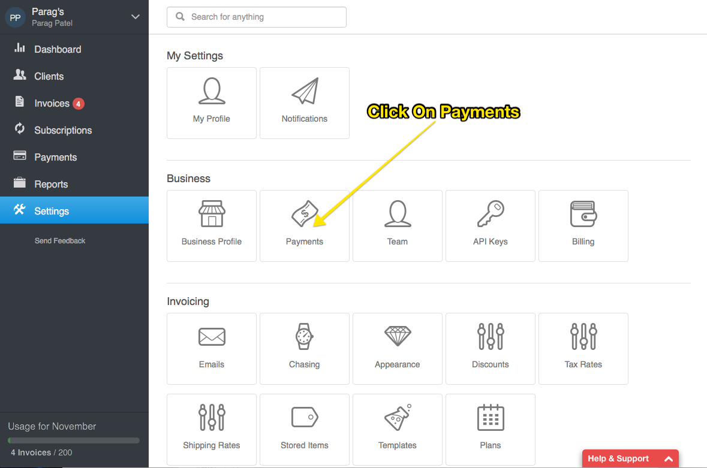
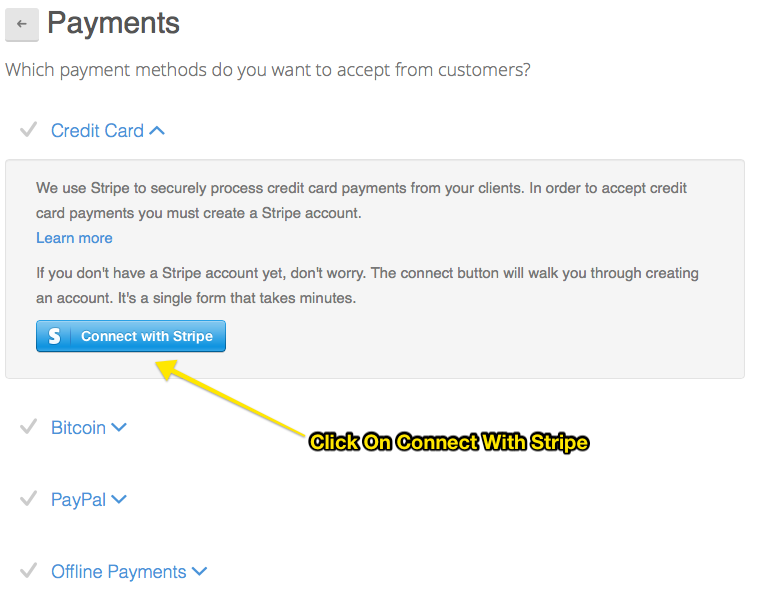
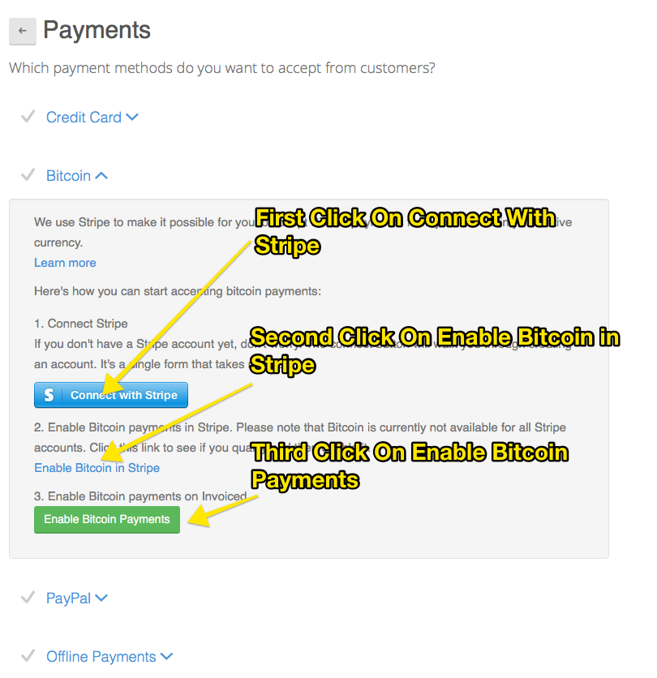
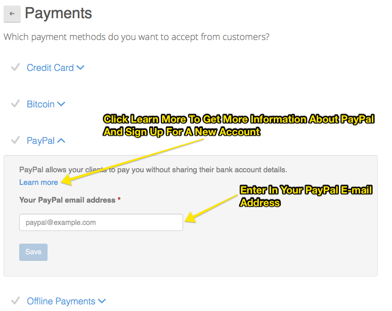

#Online Payments Guide

Invoiced lets you accept online payments such as Credit Cards, Bitcoin, and PayPal.  Online payments are essential if you want to get paid quicker.  They also are key to auto-charging your clients through subscriptions. 

For Credit Cards and Bitcoin we use a payment processor called Stripe.  *Note: We may enable additional payment processors in the future*

After setting up Stripe and PayPal you may want to note how long it typically takes to receive payments.  You can find that information for [Stripe](https://stripe.com/help/transfers) and [PayPal](https://www.paypal.com/webapps/mpp/paypal-payments-standard)

###Setting up Online Payments

Invoiced makes setting up Stripe and PayPal dead simple.  Here is how you can set them up.

Go to Settings -> Payments 

**Enabling Credit Cards**
 
Click on `Credit Card` and than click on `Connect With Stripe` and than you should be re-directed to Stripe's page to complete registration.  Complete your registration with Stripe and you will be automatically redirected to Invoiced.

**Enabling Bitcoin**
 
Click on `BitCoin`.  You will see than see instructions on how to enable bitcoin.  *Note: Not all Stripe accounts will qualify for Bitcoin*

It is a 3 step process.

1. Click on `Connect With Stripe`
2. Click on `Enable Bitcoin in Stripe`
3. Click on `Enable Bitcoin Payments`

If you are redirected to a Stripe page for registration, you will be re-directed back to Invoiced once you complete the process for Steps 1 & 2.

**Enabling PayPal**
 
Click on `PayPal` and enter in your PayPal e-mail address or click on learn more to register for one at PayPal and than enter in the PayPal address.  Than click Save.

###Refunding Payments

Whenever a payment is made on a invoice generated by a subscription (automatic or manual), or invoice, Invoiced records a payment.

To get a quick glance at all the invoices, subscriptions, and payments a client has, simply go into the client details by clicking on a client name, after you selected `Clients` from the left navigation bar.

Simply click on a payment you want to refund.  Once the payment details show up, click on the `Refund` button.

