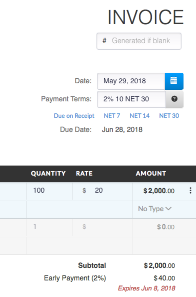
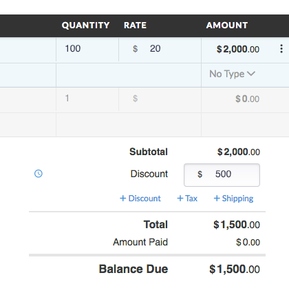
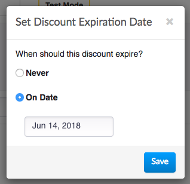
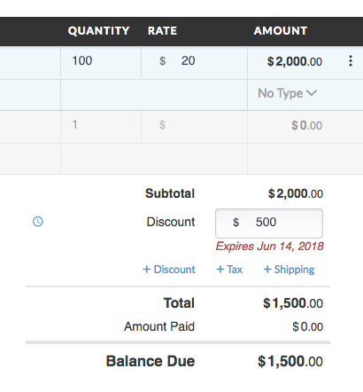
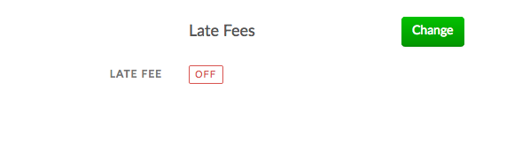
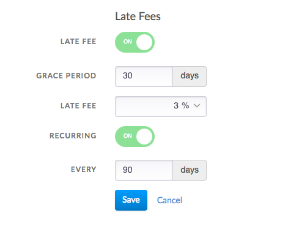
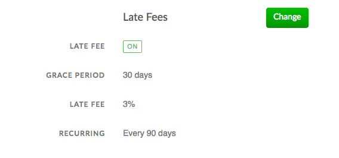
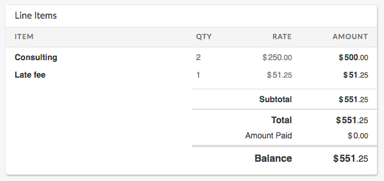

# Payment Incentives

In this guide we are going to show you different techniques to provide incentives to your customers to pay on time, and even pay early. You can provide customers incentives to pay you on time with early payment discounts and late fees. We are going to walk you through setting up and using each feature.

## Early Payment Discounts

Early payment discounts provide your customer with an incentive to pay well before an invoice is due. For example, a common early payment discount that businesses offer is a 1% discount if a customer pays within 10 days. This can be useful for businesses that benefit from faster cash flow or to decrease the risk of not being paid on a large invoice amount.

Invoiced can handle two different kinds of early payment discounts. The first kind is early discount payment terms. These are in the format **2% 10 NET 30** (invoice due in 30 days with a 2% discount if paying in 10 days). The second kind of early discount is an expiring discount. The way these work is when you've added a discount to an invoice you can set a date after which that discount expires.

### Using early payment discount terms

Early payment discount terms can be used by adding `X% Y NET D` payment terms to your invoice. The system will calculate and add the discount to the invoice for you. If the customer views and pays the invoice by the early discount deadline then they will only owe the discounted amount. If a customer pays after the discount expiration date then they will be asked to pay the full amount.

### Using expiring discounts

When you have added a discount to an invoice you have the option to set an expiration date.

After you have added a discount then you can click on the clock icon to convert it into an expiring discount.

Once you enter in the expiration date your discount will look like this:

## Late Fees

Late fees can be used to provide an incentive for customers to not pay you late, less they incur a penalty. Generally late fees are not used for the revenue they produce, but as a situation your customer would want to avoid. In some cases late fees might be useful as a bargaining chip because they 

You can configure Invoiced to assess late fees on your invoices for you automatically.

### Setting up late fees

These instructions can be followed to setup late fees on Invoiced for all of your invoices with chasing enabled:

1. Go to **Settings** > **General**.

   

2. Click **Change** on the *Late Fees* section.

   

3. Turn on late fees and enter in the parameters on your late fees. The grace period will assess a late fee X days after the invoice is past due. You can assess a percent or flat amount for a late fee. The recurring setting will allow you to assess the same late fee repeatedly every Y days. Click **Save** when you are done.

   

### Using late fees

Late fees will be assessed on your past due invoices automatically as they age. Any assessed late fees will be added as a separate line item with a type equal to `late_fee`. Only customers with chasing enabled will have late fees assessed. If you do not want to assess late fees for a customer then you need to disable chasing for that customer or invoice.

