# Payment Plans

Payment plans allow you to collect an invoice balance from your customer through a set of installment payments.

## How it works

You can think of a payment plan as an extension of the invoice due date. Typically an invoice has payment terms, like NET 7, that says for an October 1 invoice the full blanace is due on October 8. Rigid due dates are not helpful in scenarios where you do not want to collect the full balance at once. This is where payment plans can help.

A payment plan describes a multi-step schedule for collecting payment on an invoice. When coupled with our [AutoPay](autopay) feature this will completely automate the collection of payment for an invoice according to the payment schedule that you and your customer agree on. This ensures that you are always paid on time and saves your customer the hassle of remembering when to send in installment payments.

Consider this example, your customer has purchased a water heater from you for $1,000. Perhaps that customer is not able to pay the entire balance up front, but you still want to work with them. With payment plans you can issue a $1,000 invoice for the work performed / products sold, like usual, except that you can establish a schedule agreed upon by you and your customer to pay off the invoice balance. Such a payment schedule might look like this:

1. $500 on October 1
2. $250 on November 1
3. $250 on November 15

Once your customer approves the payment plan they will be charged automatically for the installments on the date each one is due. Invoiced will keep track of the installments as they become due, and update the invoice balance as payment is collected.

Unlike subscription billing, neither the time between installment payments nor the installment amounts need to be uniform. Payment plans are attached to a single invoice, and thus can  work with any schedule. The only constraint is that the payment plan must add up to the invoice balance.

## Usage

Prerequisites:
- Your account must support [AutoPay](autopay).
- You have [created an invoice](/docs) with an outstanding balance.

### Creating a payment plan

1. Open the invoice that has the outstanding balance. We are going to add a payment plan to pay off this balance.

   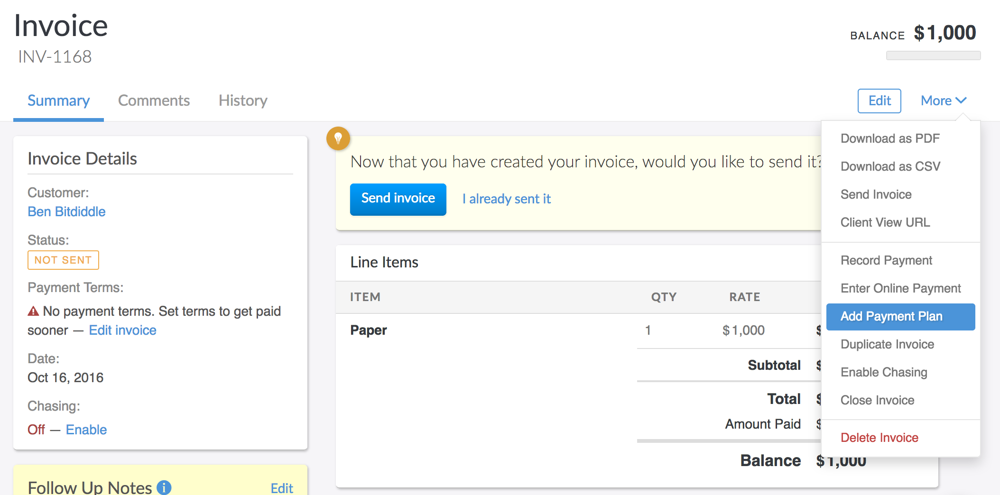

2. Click **More** > **Add Payment Plan**. A new dialog will appear.

   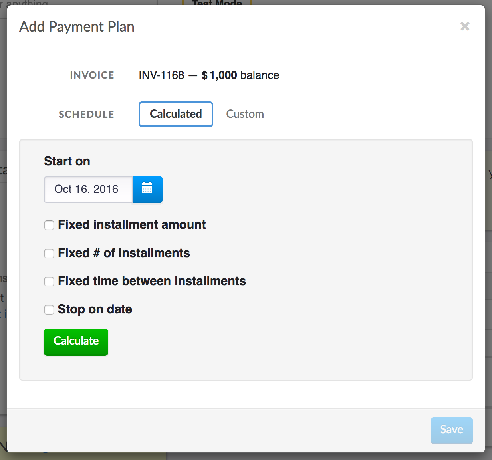

3. Setting up a payment plan is simply building the installment schedule. Each step in the installment schedule represents the date and amount to be paid. Invoiced has a nifty payment plan calculator that handles most common scheduling scenarios. Just input your constraints and it will calculate the installment schedule for you.

   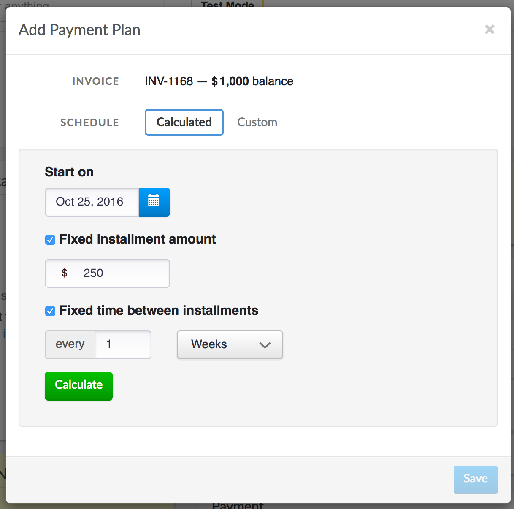

   

   If your payment plan is not uniform, or needs further customization then you can switch the schedule to **Custom**. This will give you fine-grained control over the installment schedule.

   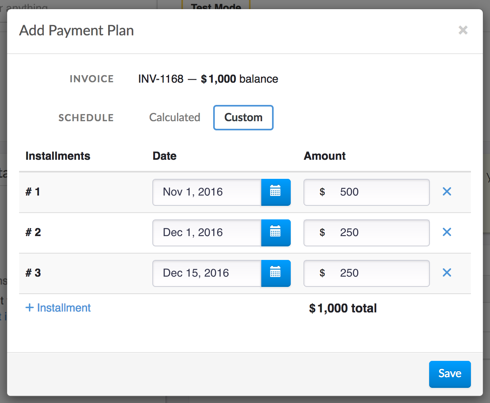

4. Once you are finished adding your installments then you can save the payment plan. Please make sure to double-check that the installments have the correct dates and amounts before clicking **Save**. It's not possible to edit a payment plan once created. Instead you would have to cancel the payment plan and start over.

   If your customer already has a payment source connected then there's nothing left to do. AutoPay will be enabled on the invoice and payment will be collected according to your newly created schedule.

   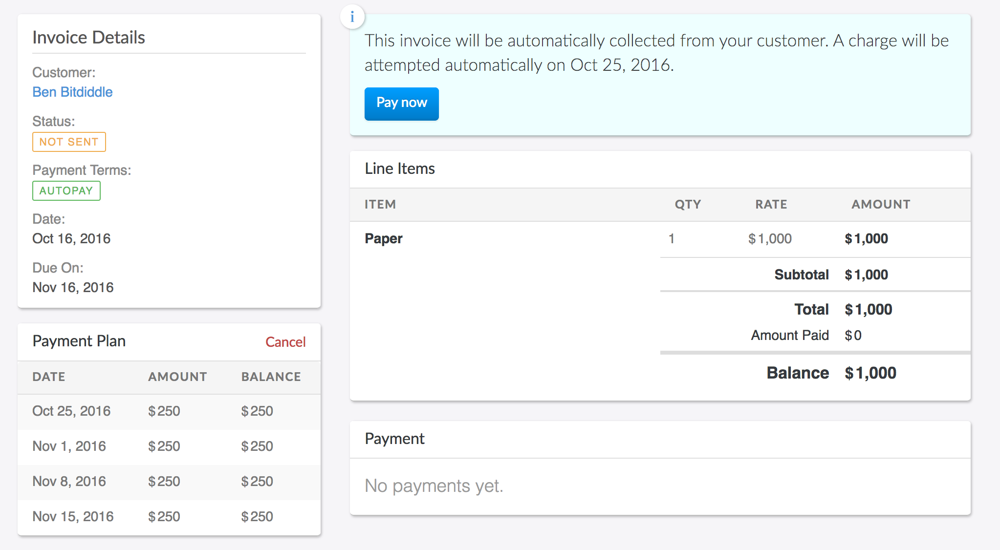

   If your customer does not have a connected payment source yet then please read the next section to learn how to finish enrolling the customer in the payment plan.

   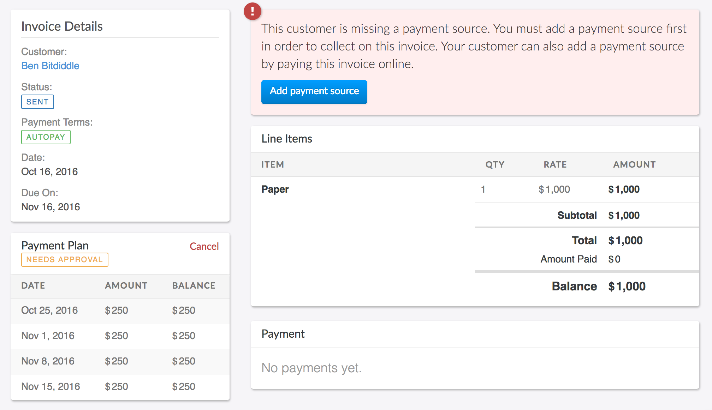

### Signing up customers

Customers that do not already have a connected payment source must approve the payment plan and connect a payment source before installments can be collected. They can do this by viewing the invoice online.

1. Send the invoice with the payment plan to your customer.

   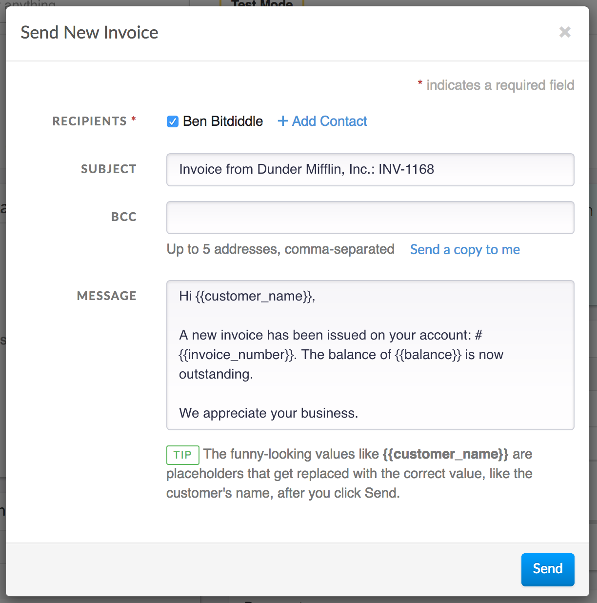

2. Your customer will then open the email from you and click **View Invoice**.

   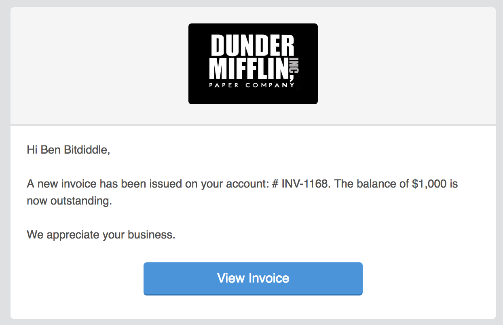

3. Your customer will then click **Pay**.

   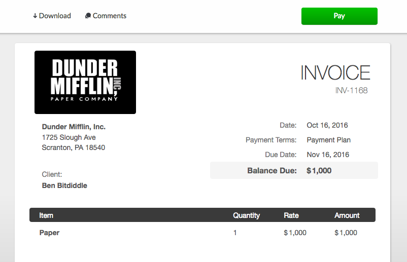

4. Instead of the normal payment screen the customer will see the payment plan. After reviewing the payment plan they will click **Approve**.

   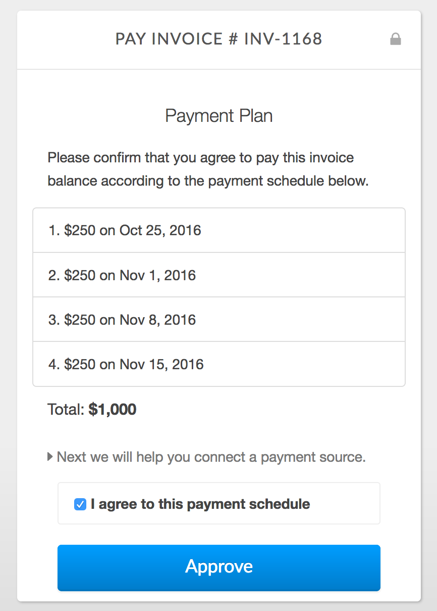

5. Finally, they will need to connect a payment source to pay for the payment plan.

   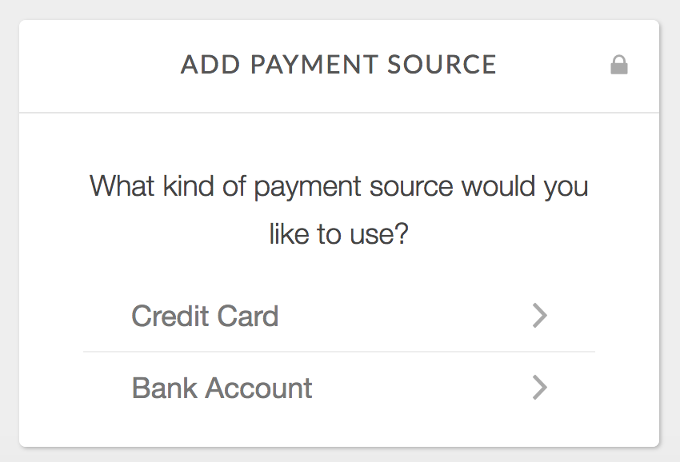

   AutoPay for the invoice will be enabled now that your customer has approved the payment plan and connected a payment source. Invoiced will then automatically collect the correct amount from your customer as each installment becomes due.

## FAQ

### How do I manually trigger a collection attempt?

As with all AutoPay invoices, you can manually trigger a collection attempt before Invoiced does automatically performs collection. When a payment plan is attached, then instead of collecting the full invoice balance, Invoiced will only collect the amount of the next installment. This might be useful if your customer wants the next installment to be collected a few days earlier.

### How do I edit or cancel active payment plans?

Once a payment plan is running then the payment plan cannot be edited. With the invoice open, just click **Cancel** in the *Payment Plan* section to instantly stop the payment plan. If needed, you can re-add a new payment plan.

Please keep in mind if there were any previously received payments that replacing the payment plan with a new one must add up to the current balance, and not the original balance.

### When are payment plan installments collected?

Payment plan installments will be collected on the day the installment is due. Generally this will be at the beginning of the day, however, the specific time might vary.

### How are failed payments handled?

Just like any other [failed AutoPay attempt](autopay#failed-payments), we will contact the customer for you with the reason the payment failed and the option to update their payment information. We will also schedule retries according to your payment retry schedule. The installment will not be marked as paid until the amount is collected successfully.

### How can customers see the current balance?

Customers can open the invoice at any point to see the current balance. As installments are collected the invoice balance will be updated to reflect the remaining amount that is due. With a payment plan attached to an invoice, the payment terms will be *Payment Plan* to reflect how payment is being collected and customer will not be able to manually pay the invoice. Otherwise, an invoice with a payment plan behaves like any other invoice.