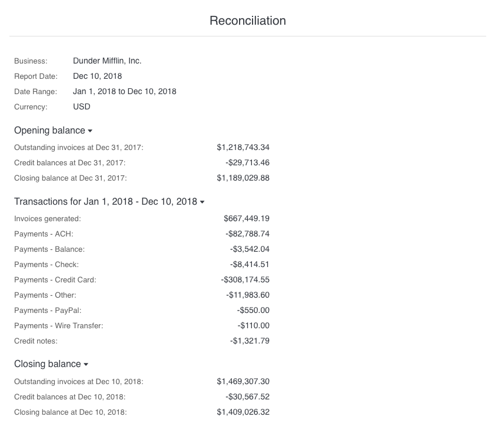
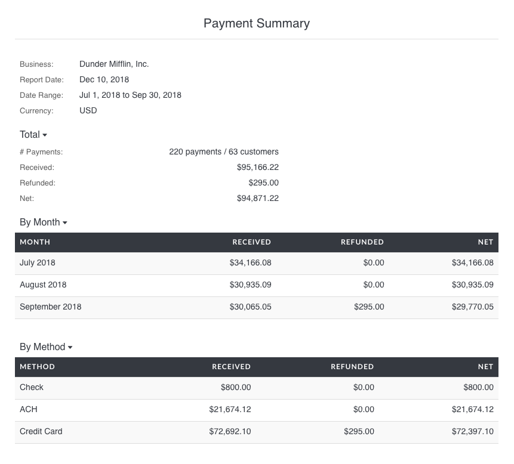
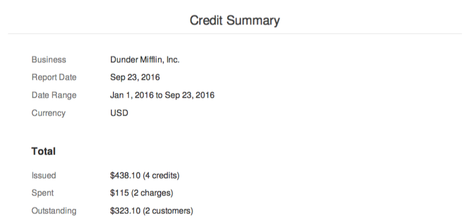
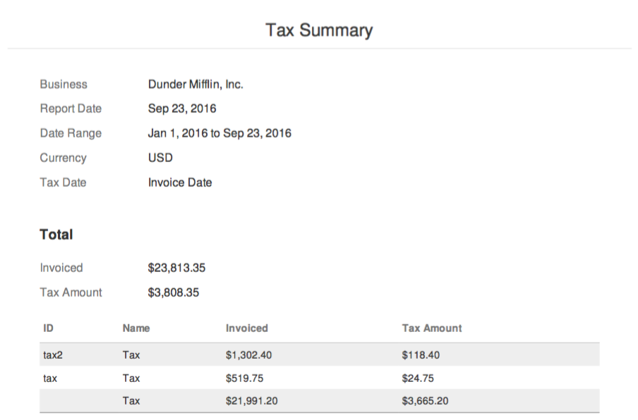
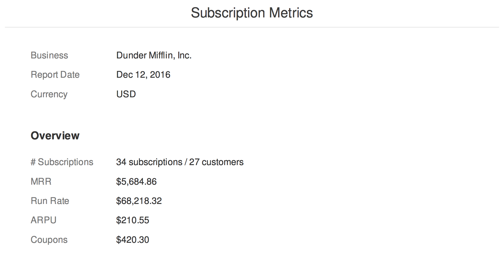
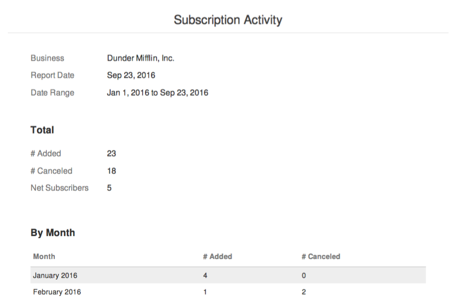

# Reports

Invoiced includes robust reporting out of the box to give you insight into your accounts receivable. You can generate up-to-date reports for all things revenue with accuracy down to the cent.

We currently target two file formats with reporting: **PDF** or **CSV** (comma-separated values).

## A/R Overview

The **A/R Overview** report gives you an overview of your Accounts Receivable activity over a time range. The report shows the aggregate amount invoiced, received, still outstanding, and considered bad debt during the time period you selected. The report does not include detail on any of these activities. Instead, you can use one of the reports below to dig into the numbers.

## Reconciliation

The **Reconciliation** report gives you a concise report to help you quickly reconcile a previous accounting period with Invoiced. The report shows the aggregate amount invoiced, payments collected, bad debt recorded, refunds, adjustments, and credit activity.

## Invoice Summary

The **Invoice Summary** report lists all of the invoices in the time period you select. Only high-level information about invoices is included, like the date, total, and balance. On this report invoices are grouped by month.

## Invoice Aging

The **Invoice Aging** report gives you a breakdown on the age of your currently outstanding invoices. An invoice's age is the number of days it has been outstanding. Invoices are grouped into the following aging categories:

- 0-7 days old
- 7-14 days old
- 14-30 days old
- 30-60 days old
- 60+ days old

## Outstanding Invoices

The **Outstanding Invoices** report lists all of the invoices that are currently outstanding.

## Past Due Invoices

The **Past Due Invoices** report lists all of the invoices that are currently past due.

## Bad Debt

The **Bad Debt** report lists all of the invoices classified as bad debt within a time period. An invoice is considered bad debt if it was closed before it was paid in full.

## Payment Summary

The **Payment Summary** report analyzes the payments that were received in a time period. In addition to aggregate payment amounts, you will also be able to see payment activity broken down by month and by payment method.

## Credit Summary

The **Credit Summary** report helps you understand the credit balances of your customers. You can filter this report by date range to see the amount of credits issued, spent, and remaining for any time period.

## Expiring Cards

The **Expiring Cards** report shows customers with cards that are at risk of expiring in the near future, or cards that have already expired.

## Tax Summary

The **Tax Summary** report shows a breakdown of tax billed or tax collected during a specified time period. Taxes will be grouped by tax rate on this report.

With the **Tax Date** option you can tell Invoiced when to recognize tax. You can choose between when it was billed (**Invoice Date**) or when it was collected (**Payment Date**). The method you choose might depend on how you account for taxes or the rules in your tax jurisdiction.

## Sales by Item

The **Sales by Item** report gives you a breakdown of your sales, including what was sold and how much. With this report we will analyze all of the line items billed within the given time period. The report will include how much was sold broken down by type and by catalog item.

*Please note that any line items that do not have a catalog item associated will be grouped together.*

## Subscription Metrics

The **Subscription Metrics** report gives you high-level metrics on your subscription billing, including MRR and ARPU.

## Subscription Activity

The **Subscription Activity** report gives you a shows how many subscriptions have been added and canceled over a given time period.

### Need more?

If you need a particular insight into your receivables that's missing then please contact us at [support@invoiced.com](support@invoiced.com). We would love to hear about it.