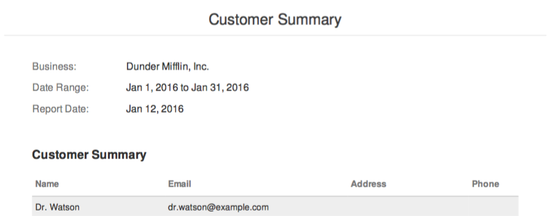
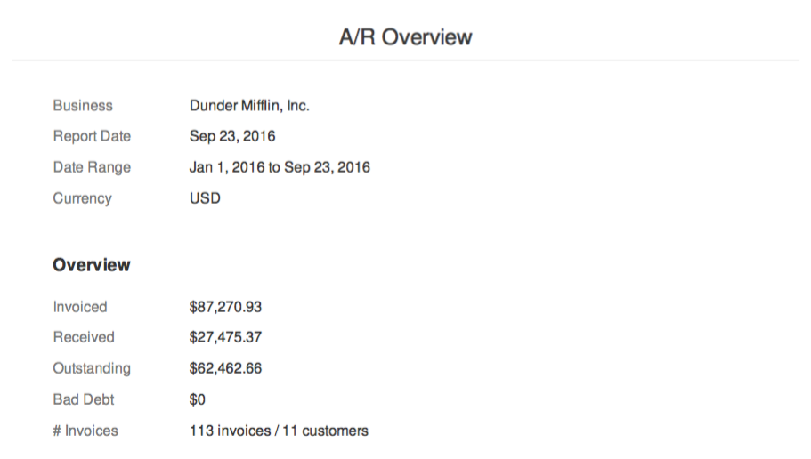
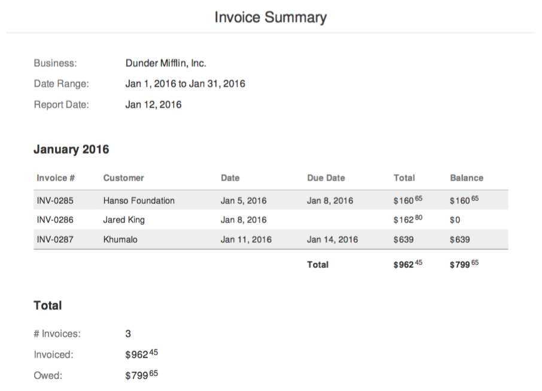
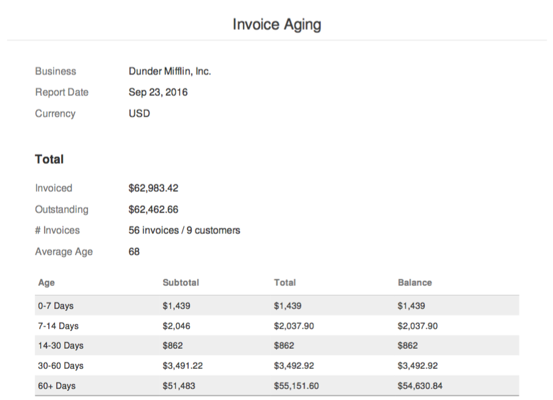
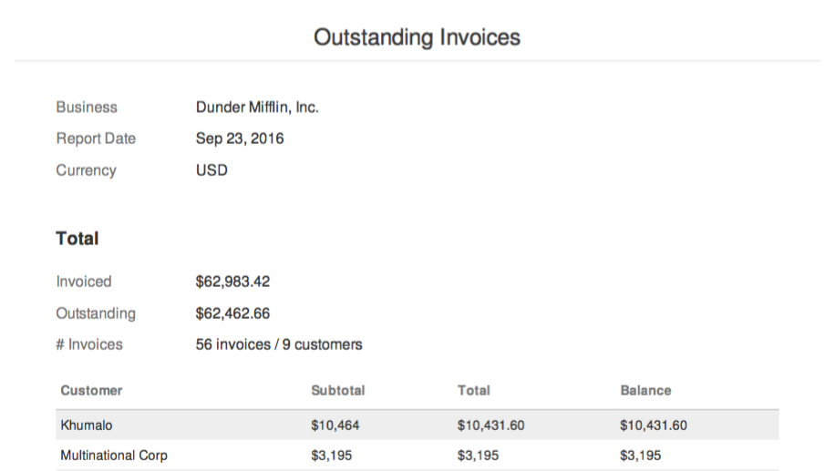
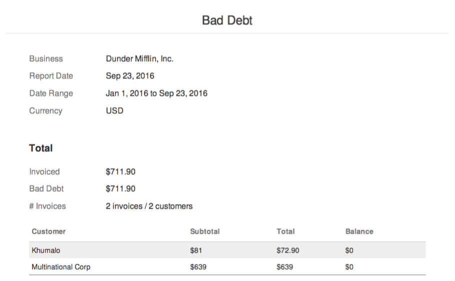
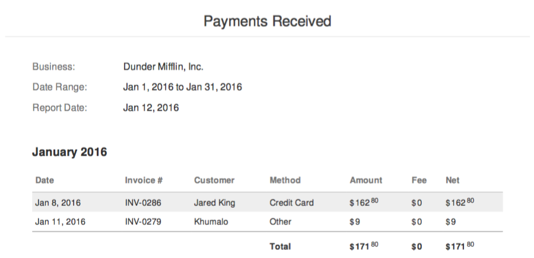
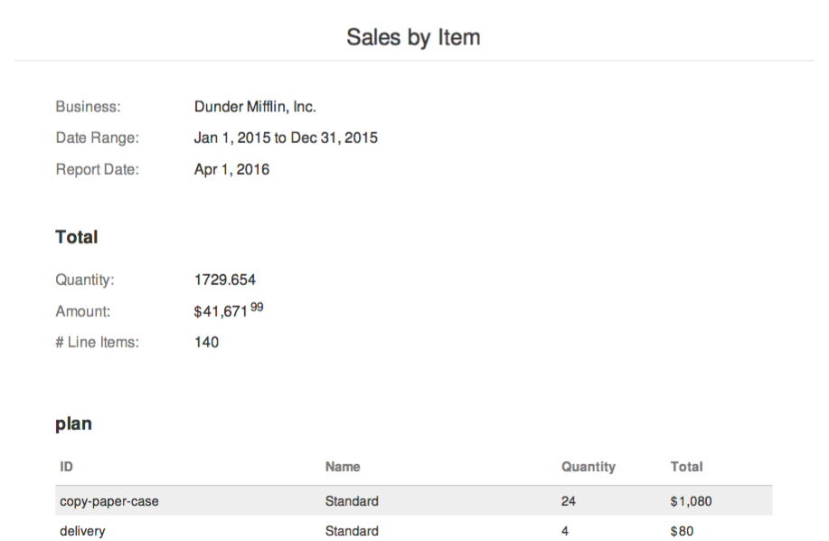

# Reports

Invoiced includes robust reporting out of the box to give you insight into your accounts receivable. You can generate up-to-date reports for all things revenue with accuracy down to the cent.

We currently target two file formats with reporting: **PDF** or **CSV** (comma-separated values).

## Customer Summary

The **Customer Summary** report includes an overview of the customers in your Invoiced account along with contact information.

## A/R Overview

The **A/R Overview** report gives you an overview of your Accounts Receivable activity over a time range. The report shows the aggregate amount invoiced, received, still outstanding, and considered bad debt during the time period you selected. The report does not include detail on any of these activities. Instead, you can use one of the reports below to dig into the numbers.

## Invoice Summary

The **Invoice Summary** report lists all of the invoices in the time period you select. Only high-level information about invoices is included, like the date, total, and balance. On this report invoices are grouped by month.

## Invoice Aging

The **Invoice Aging** report gives you a breakdown on the age of your currently outstanding invoices. An invoice's age is the number of days it has been outstanding. Invoices are grouped into the following aging categories:

- 0-7 days old
- 7-14 days old
- 14-30 days old
- 30-60 days old
- 60+ days old

## Outstanding Invoices

The **Outstanding Invoices** report lists all of the invoices that are currently outstanding.

## Past Due Invoices

The **Past Due Invoices** report lists all of the invoices that are currently past due.

## Bad Debt

The **Bad Debt** report lists all of the invoices classified as bad debt within a time period. An invoice is considered bad debt if it was closed before it was paid in full.

## Payments Received

The **Payments Received** report lists all of the payments that have been received in a time period. Included on the report are details about each transaction, including the amount received, any processing fees, and the payment method.

## Taxes Collected

The **Taxes Collected** report shows a breakdown of the total for each tax that was collected during a specified time period. Only invoices that have been paid in full will show up on this report. Taxes will be grouped by tax rate.

Here are two different times when Invoiced can consider a tax collected: **Invoice Date** or **Payment Date**. The choice is yours to make that might depend on how you report taxes or the rules in your tax jurisdiction.

## Sales by Item

The **Sales by Item** report gives you a breakdown of your sales, including what was sold and how much. With this report we will analyze all of the line items billed within the given time period. The report will include how much was sold broken down by type and by catalog item.

*Please note that any line items that do not have a catalog item associated will be grouped together.*

### Need more?

If you need a particular insight into your receivables that's missing then please contact us at [support@invoiced.com](support@invoiced.com). We would love to hear about it.