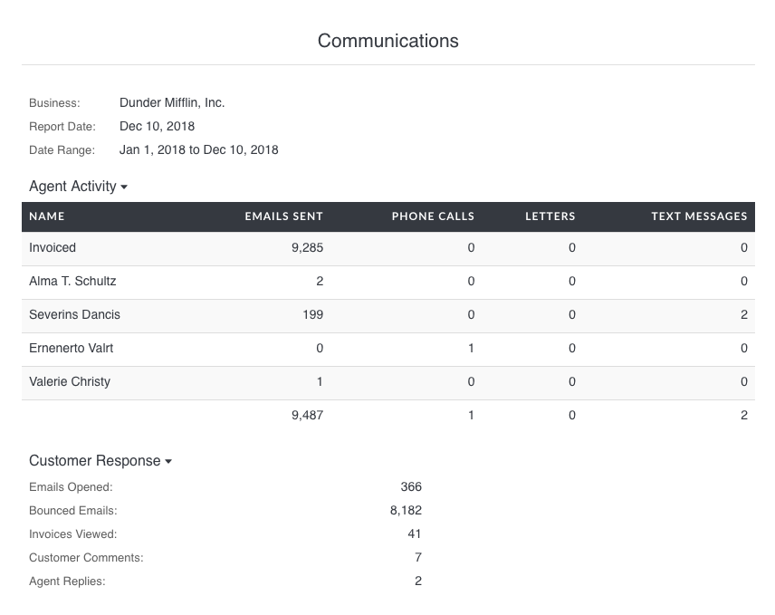
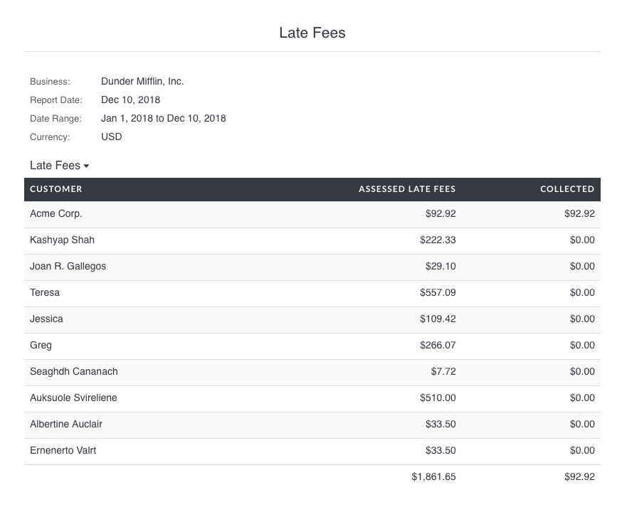

# Reports

Invoiced includes robust reporting out of the box to give you insight into your accounts receivable. You can generate up-to-date reports for all things revenue with accuracy down to the cent.

We currently target two file formats with reporting: **PDF** or **CSV** (comma-separated values).

## Available Reports

- [A/R Overview](#ar-overview)
- [Communications](#communications)
- [Reconciliation](#reconciliation)
- [Invoice Summary](#invoice-summary)
- [Invoice Aging](#invoice-aging)
- [Bad Debt](#bad-debt)
- [Late Fees](#late-fees)
- [Payment Summary](#payment-summary)
- [Credit Summary](#credit-summary)
- [Expiring Cards](#expiring-cards)
- [Tax Summary](#tax-summary)
- [Sales by Item](#sales-by-item)
- [Subscription Metrics](#subscription-metrics)
- [Subscription Activity](#subscription-activity)

## A/R Overview

The **A/R Overview** report gives you an overview of your accounts receivable activity over a time range. The report shows the aggregate amount invoiced, collected, and considered bad debt during the time period you selected. It will also produce standard collection metrics, like Days Sales Outstanding and Collections Efficiency. The report does not include detail on any of these activities. Instead, you can use one of the reports below to dig into the numbers.

## Communications

The **Communications** report shows you messaging and calling activity from your internal collection efforts. You can see activities performed by individual team members, like emails sent, phone calls made, etc. You can also see customer responses, like invoice views and bounced emails. 

The *Invoiced* user shows you activities performed automatically by the system as part of a chasing cadence or by an API caller.

## Reconciliation

The **Reconciliation** report helps you reconcile the Invoiced sub-ledger with your general ledger. It will show you the A/R balance at the beginning and end of the report time range. The report also has a summary of activity within the date range, including invoices generated, payments received, and adjustments.

## Invoice Summary

The **Invoice Summary** report lists all of the invoices in the time period you select. Only high-level information about invoices is included, like the date, total, and balance. On this report invoices are grouped by month.

The *Outstanding* amount shows you the amount that is outstanding for the matched invoices, at the current point in time. The outstanding number does and not reflect the balance at the end of the report date range. The **Reconciliation** report will let you see you historical A/R balances.

## Invoice Aging

The **Invoice Aging** report gives you a breakdown on the age of your currently outstanding invoices. An invoice's age is based on the number of days it has been outstanding or the number of days past due. You can choose whether to use the date or due date for aging in **Settings** > **General**.

Invoices by default are grouped into the following aging categories:
- 0-7 days old
- 7-14 days old
- 14-30 days old
- 30-60 days old
- 60+ days old

If you would like to change the age ranges please contact [support@invoiced.com](mailto:support@invoiced.com).

## Bad Debt

The **Bad Debt** report lists all of the invoices classified as bad debt within a time period. An invoice is considered bad debt if it was closed before it was paid in full.

## Late Fees

The **Late Fees** report shows you the late fees assessed and collected over a time range.

## Payment Summary

The **Payment Summary** report analyzes the payments that were received in a time period. In addition to aggregate payment amounts, you will also be able to see payment activity broken down by month and by payment method.

## Credit Summary

The **Credit Summary** report helps you understand the credit balances of your customers. You can filter this report by date range to see the credits issued, spent (applied to invoices), and outstanding for any time period.

## Expiring Cards

The **Expiring Cards** report shows customers with cards that are at risk of expiring in the near future, or cards that have already expired.

## Tax Summary

The **Tax Summary** report shows a breakdown of tax billed or tax collected during a specified time period. Taxes will be grouped by tax rate on this report.

With the **Tax Date** option you can tell Invoiced when to recognize tax. You can choose between when it was billed (**Invoice Date**) or when it was collected (**Payment Date**). The method you choose might depend on how you account for taxes or the rules in your tax jurisdiction.

## Sales by Item

The **Sales by Item** report gives you a breakdown of your sales, including what was sold and how much. With this report we will analyze all of the line items billed within the given time period. The report will include how much was sold broken down by type and by catalog item.

*Please note that any line items that do not have a catalog item associated will be grouped together.*

## Subscription Metrics

The **Subscription Metrics** report gives you high-level metrics on your subscription billing, including MRR and ARPU.

## Subscription Activity

The **Subscription Activity** report gives you a shows how many subscriptions have been added and canceled over a given time period.

### Need more?

If you need a particular insight into your receivables that's missing then please contact us at [support@invoiced.com](support@invoiced.com). We would love to hear about it.