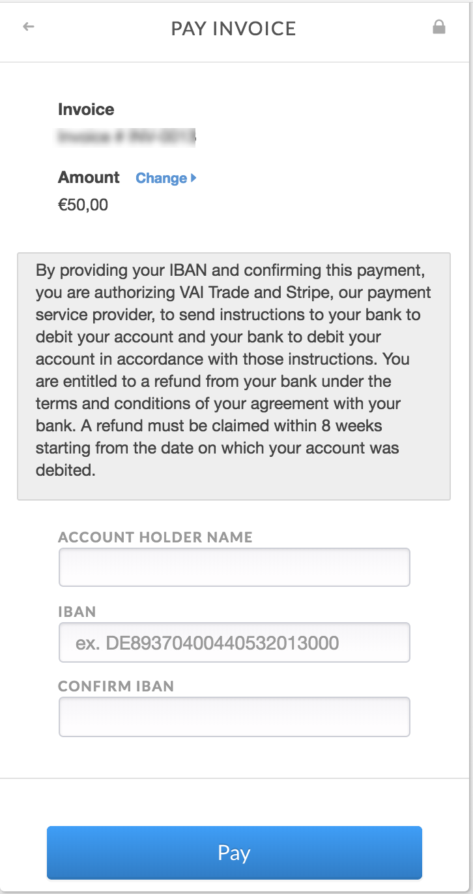

#SEPA Payments	

The Single Euro Payments Area (SEPA) is a payment-integration to allow for bank transfers in Euro. Invoiced allows European users to integrate a SEPA payment source using Stripe. This allows users to collect the customers bank account information that allows for a direct debit. 

## How to set up SEPA

Because Stripe's SEPA feature is not public, you will need to enable your SEPA payments per Stripe's SEPA documentation:

https://stripe.com/docs/sources/sepa-debit

Once this is completed, Invoiced can enable SEPA payments for your customers to use. 

 

