# Subscription Billing Guide

Subscriptions allow businesses to automate billing customers on a recurring basis.

With subscription billing on Invoiced we can charge customers automatically each billing cycle or issue an invoice that can be paid with any of the payment methods you accept.

If you find yourself sending the same invoices every month then subscription billing is probably for you. Not only will subscription billing save you time, but your customer likely will appreciate the predictability and convenience of subscriptions.

## Introduction

We've designed our subscription billing system to offer power and flexibility, while remaining simple to understand and use. There are a few key concepts you might want to become familiar with before starting.

### Subscriptions

A subscription bills a customer for a fixed amount on regular intervals, according to the plan the customer is subscribed to. Subscription pricing is flexible on Invoiced with quantities, addons, discounts, and taxes supported. We also support customizable billing intervals and fixed-duration subscriptions.

### Collection Mode

Collection modes are a major concept within Invoiced. We support two collection modes: **Automatic** and **Manual**. The collection mode is set per customer meaning that any invoices that you issue against that account will inherit the customer's collection mode.

#### Automatic Collection Mode

With automatic collection mode we are going to charge your customer's payment source for any invoice issued against their account, including subscription invoices. We currently support credit cards and bank accounts as payment sources.

*Note: You must have [online payments](/docs/guides/payments) enabled to use automatic collections.*

#### Manual Collection Mode

Manual collection mode on the other hand lets you invoice customers normally. When enabled each invoice gets paid using any of the payment methods you accept. In the case of subscription invoices we are going to send an invoice to your customer each billing cycle. Again, this can be paid with any of the payment methods you accept.

With manual collection mode you can also set the default payment terms for invoices. Payment terms succinctly tell the customer when an invoice is due. For example, NET 7 means that payment is due within 7 days of the invoice whereas NET 30 means payment is due in 30 days. You can read more about the different kinds of payment terms in this [blog post](http://blog.invoiced.com/how-to-get-paid-faster-on-your-invoice-part-i/).

### Plans

A plan describes how much and how frequently you want to bill your customer. An example plan might be one for website hosting that is $100 per month. Plans are reusable templates for building subscriptions. You can setup and manage your plans in **Settings** > **Plans**.

### Subscription Addons

Subscription addons are meant to give you pricing flexibility on top of the base plan amount. Addons save you from creating a large number of plans for every possible combination of products/services that a customer could subscribe to. An addon is simply the application of a catalog item to a subscription. You can setup and manage catalog items in **Settings** > **Catalog**.

### Subscription Invoices

A subscription will generate an invoice each billing cycle for the amount owed in that billing cycle. A  containing line items for the plan and any addons.

### Prorations

Invoiced supports prorations on subscriptions when changing a plan, quantity, or addons mid- billing cycle. If you choose to prorate a subscription change then we will generate a separate invoice immediately for the prorated amount.

## Creating a Subscription

We are going to walk you through the entire process of creating a subscription that charges your customer's credit card each billing cycle.

The first step is to sign in to the dashboard, go to the **Subscriptions** page, and click **Add Subscription**.

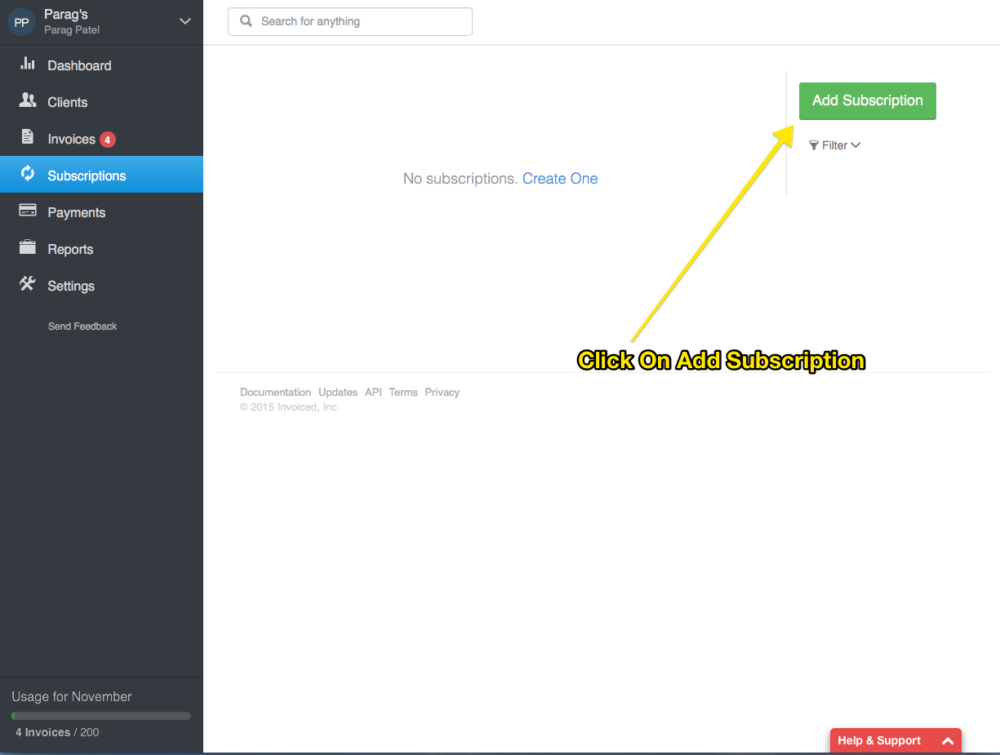

Next a dialog for creating your subscription will appear.

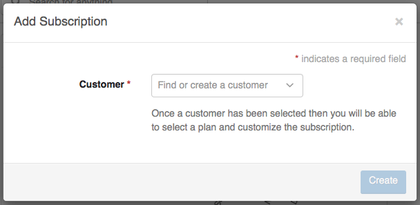

We first need to select or create a customer. Let's assume you have not added your customer to Invoiced yet. Just type in your customer's name and click *Add Ben Bitdiddle as a new customer*.

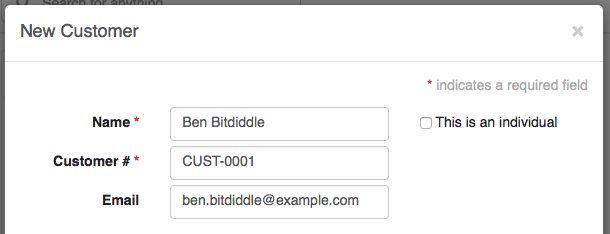

A new dialog will be opened for you to set up your customer. You can fill in any contact information for the customer now, but it's not required. Next we want to set the customer's collection mode to **Automatic** in order to have their credit card automatically charged each billing cycle.

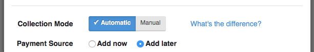

If you had the customer's card in front of you then it would be possible to enter now, but let's assume you don't. By selecting **Add later** for the payment source Invoiced is going to help you send a subscription signup request to your customer. When subscribing your customer will be able to securely connect a payment source.

Now you can go ahead and click **Create** to finish creating your customer.

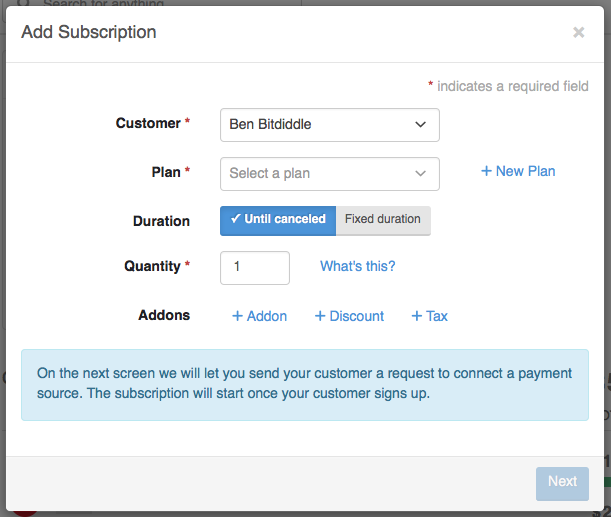

Next we need to select a plan. If you don't have a recurring plan you can select then let's create one.

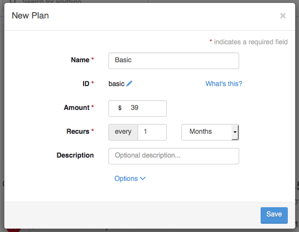

Let's say we want to create a **Basic** plan for **$39/month**. The **ID** field is a unique identifier used to reference the plan through the API. The ID is automatically generated for you, but you are free to rename this to match your own internal SKU or naming scheme. Once finished you can click **Save**.

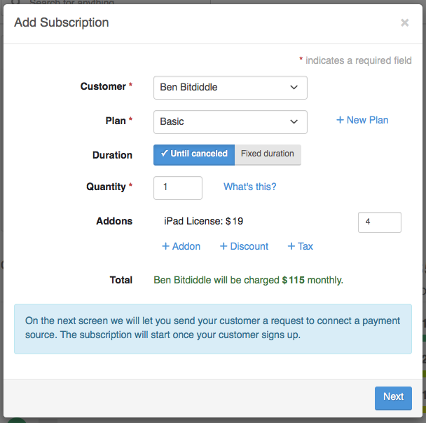

All that is left is to customize how long the subscription should run and select any addons. If the **Duration** setting is set to **Fixed Duration** then you can specify the number of billing cycles to run the subscription. Otherwise the subscription will be renew until canceled by you or the customer.

In our example we selected an **iPad License** addon and set the quantity to 4. At the bottom of the screen you can see the computed recurring total.

Once everything looks correct click **Next** to create the subscription. Since our customer does not have a connected payment source a new dialog will open to send a secure signup request.

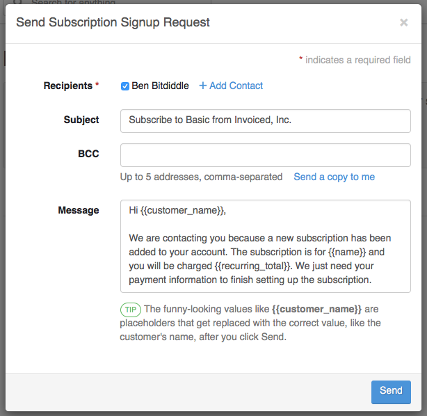

You can customize the message and recipients. Once ready to send the request just click **Send**.

### Customer Signup Flow

Now that the signup request has been sent, your part is done. It's now up to your customer to open the request, subscribe, and enter in their payment information.

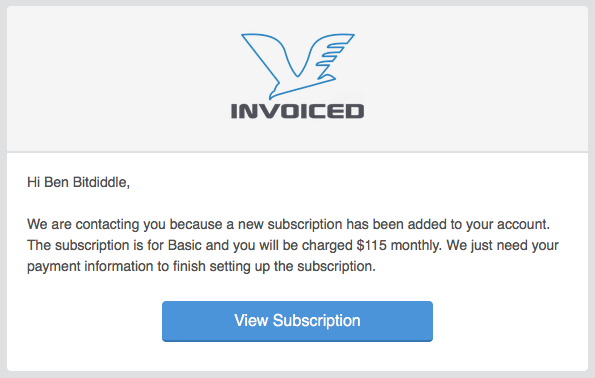

Your customer will click the **View Subscription** button.

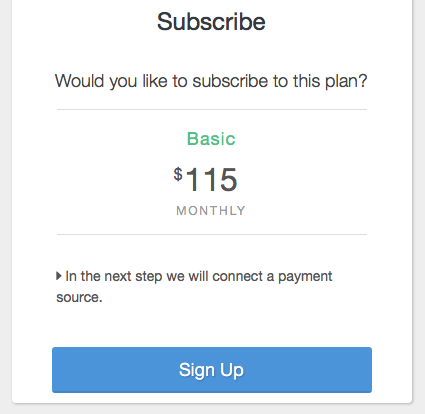

Next, they will be shown a summary of the subscription. They will then click **Sign Up**.

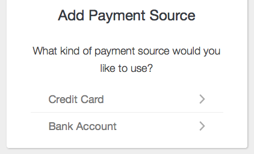

Now they are prompted to connect a payment source. In this example let's assume we are connecting a credit card.

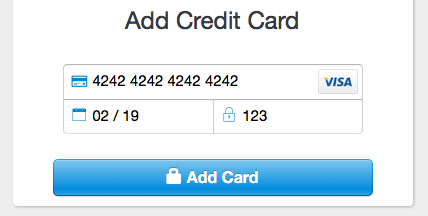

Woo! Once a credit card has been connected the customer is now subscribed to the plan. The first invoice will be issued shortly and collected on within an hour.

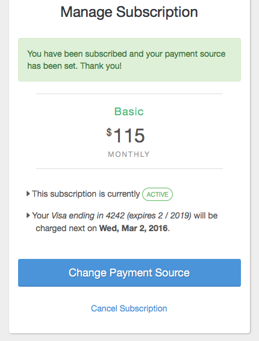

In the dashboard you will see that the subscription is active. The first invoice has already been generated and paid automatically without any extra effort on your part.

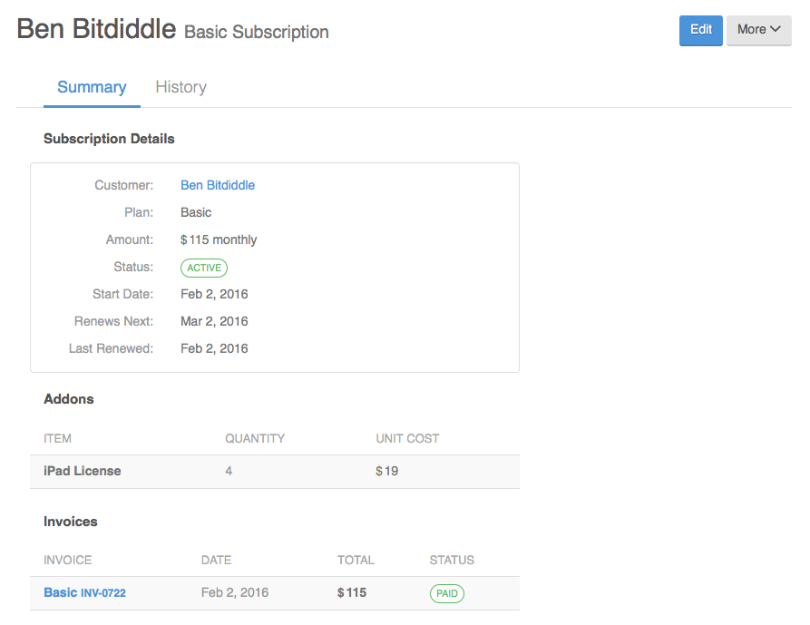

## Editing a Subscription

What happens when your customer falls in love with your service and wants to purchase more? This common scenario is easily handled with Invoied. We will even (optionally) calculate the prorated amount when switching a plan, quantity, or addons in the middle of the billing cycle.

You can edit a subscription by opening the subscription in the dashboard and clicking the **Edit** button in the top right corner.

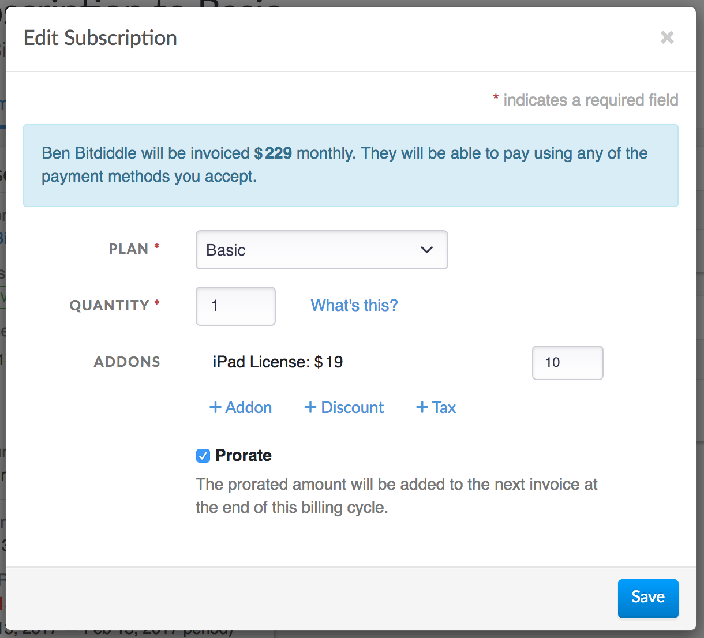

## Canceling Subscription

Cancel a subscription is pretty easy. Simple open the subscription in the dashbaord and click on **More** > **Cancel Subscription**. 

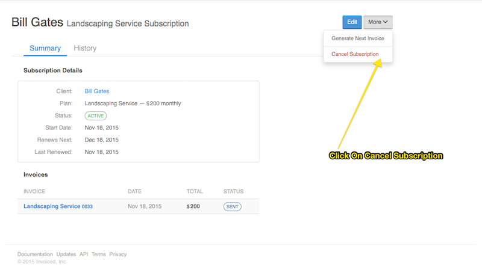

## FAQs

### What automated emails does Invoiced send for subscriptions? 

- **Sign up confirmation**
  
  Confirmation that a customer has finished signing up for automatic billing.

- **New invoice**
  
  Sends any invoices generated from a subscription to your customer.

- **Cancellation**

  Notification when a subscription is canceled.

### When do subscription invoices go out?

Subscriptions are usually renewed within a minute of the next renewal date.