# Subscription Billing Guide

Subscriptions allow businesses to automate the billing for customers on a recurring basis. With subscription billing on Invoiced, you can charge customers automatically each billing cycle, or issue an invoice that can be paid with payment methods accepted on the account.

If you find yourself sending the same invoices each month, then subscription billing is the solution . Not only will subscription billing save you time, but your customers will likely appreciate the predictability and convenience of subscriptions.

## Introduction

Invoiced has designed a subscription billing system to offer power and flexibility, while remaining simple to understand and to use. There are a few key concepts you might want to become familiar with before starting:

### Plans

A plan describes how much and how frequently your customer will be billed. An example plan might be one for website hosting that is $100 per month. Plans are reusable templates for building subscriptions. You can setup and manage your plans in *Settings* > *Plans*.

### Subscriptions

A subscription bills a customer for a fixed amount on a systematic basis, according to the plan the customer is subscribed to. Subscription pricing is flexible on Invoiced and allows for quantities, add-ons, discounts, and taxes to be combined. Subscriptions also support many options to customize the billing intervals.

Although we use traditional defaults, we also support many advanced subscription billing features that you might want to become familiar with. The advanced features include: 

#### Trial Period

Subscriptions support a free trial period at the beginning of the subscription where the customer is not charged. For example, a subscription might have a 30-day trial period where the customer is given service for free until the first bill is issued. After the trial period, the customers subscription will begin to bill. 

#### Renewal Date

The renewal date is the date when the next bill for the subscription is going to be generated. Essentially when a subscription renews, the next invoice in the cycle is formed and issued. Renewal dates are controlled by you and dependent on whether anniversary or calendar billing is used.

#### Anniversary Billing

As stated in the renewal date section, *Anniversary Billing* renews a subscription on the anniversary of the start date.
For example, if your customer purchased a monthly subscription on the 9th then they would be billed each month on the 9th. In Invoiced, subscriptions use anniversary billing by default.

#### Calendar Billing

Another option to Anniversary Billing is *Calendar Billing, *which renews subscriptions on a specific day of the month chosen, instead of the start date. Calendar billing also has the ability, on the first invoice, to prorate partial months.

For example, let's consider a scenario where your customer purchased a monthly subscription on the 9th with calendar billing set to the 1st of the month. The first bill would be prorated for the time remaining until the next 1st of the month. Future bills will be generated on the 1st of the month for the full amount.

#### Billing Period

Each subscription keeps track of the current billing period. The billing period represents the time frame that the subscription will cover. The length of the billing period always matches the plan interval. By default, the billing period will be the interval following the renewal date. If a monthly subscription renewed on December 1 then the current billing period would be December 1 - December 31.

#### Billing Period Offset

The billing period offset allows you to offset the billing period X number of days from the renewal date. Billing period offsets are great in enterprise billing scenarios where the customer is billed before the service period.
For example, consider a subscription with a billing period offset of 14 days and a renewal date of November 17. This would produce a billing cycle of December 1 - December 31. The result is that the customer will be billed on November 17 for the billing period of December 1 - December 31.

*NOTE: Changing the billing period offset will not change when the subscription renews. Instead change the renewal date for this.*

#### Duration

Subscriptions can be *infinite* or *fixed* duration. An infinite subscription (the default) runs forever until the customer cancels. A finite subscription will run for a fixed number of billing cycles.

#### Quantity

The subscription quantity acts as a multiplier to the base plan price. If your subscription is based on a per-user subscription (i.e. $30/user/month) then the quantity would represent the number of users the customer should be billed for each month.

### Subscription Addons

Subscription addons are meant to give you pricing flexibility on top of the base plan amount. Add-ons save you from creating a large number of plans for every possible combination of products/services that a customer could subscribe to. An addon is simply the application of a catalog item to a subscription. 

You can setup and manage catalog items in *Settings* > *Catalog*.

### Subscription Invoices

A subscription will generate an invoice each billing cycle for the amount owed in that billing cycle. The invoice contains line items for the plan and any add-ons.

#### AutoPay

Since subscriptions are a generate invoice monthly, that means AutoPay (https://invoiced.com/docs/payments/autopay) customers are fully supported with subscription billing. AutoPay will automatically charge your customer's payment source for any invoices issued against their account, including subscription invoices.

If a customer with AutoPay enabled is subscribed to a plan, but has not connected a payment source yet, then we will send them the first invoice automatically. Upon paying the invoice, we will capture the customer's payment information for use on future invoices.

#### Payment Terms

When AutoPay is not enabled, then the customer will receive an invoice each billing period that they can pay using any of the payment methods you accept.

Payment terms succinctly tell the customer when an invoice is due. For example, NET 7 means that payment is due within 7 days of the invoice whereas NET 30 means payment is due in 30 days. 

You can read more about the different kinds of payment terms in this blog post (https://invoiced.com/blog/how-to-get-paid-faster-on-your-invoice-part-i).

#### Pending Line Items

If there are any unbilled one-time charges (setup fees or usage charges) that were added to the customer's account during the billing cycle, then those line items will be swept into subscription invoice at the time it is generated.

### Prorations

Invoiced supports prorations on subscriptions when changing a plan, quantity, or add-ons mid- billing cycle. When a customer downgrades, they will receive a credit, and when they upgrade will be charged.

Prorations are calculated any time a subscription is changed, unless disabled. A proration will generate a credit for the time remaining on the current billing cycle before the subscription update and a charge for the time remaining with the subscription update. If the proration is negative (downgrade) then we will issue the customer a credit. If positive (upgrade) then will add the amount to the next subscription invoice.

When switching to a plan with a different billing cycle, for example, switching from monthly to annual billing, then a new billing cycle will be started at the time of pro-ration. This means an invoice will be generated for the next billing cycle on the plan.

#### Proration Calculation

Prorations are calculated based on the number of seconds left in the billing cycle. More specifically, here is how we calculate prorations. 

The `% time remaining` is calculated with:

`seconds left in period / total seconds in period`

Then a proration credit line item is computed using this formula:

`% time remaining * subscription price before change`

And a proration charge line item is computed using this formula:

`% time remaining * subscription price after change`

### Sign Up Pages

Sign up pages allow customers to purchase a subscription online through a self-serve form hosted by Invoiced. The [Sign Up Pages Guide](sign-up-pages) has more information on this.

###Add a discount code to a plan

Wanting to discount some of the subscription payments but not all? You now have the flexibility to add a duration to a coupon discount. That way, when you apply that discount, it will only be discounted for the X duration applied to on the discount code. To learn more about this functionality, please visit the Coupons documentation. 

## Usage

### Creating a Subscription

The following example is based off of a subscription invoice with a NET 14 terms. In this scenario, AutoPay will be disabled. If you wish to use AutoPay, we recommend using the signup pages to subscribe a new customer and capture the payment information on signup. 

Subscriptions are created and accessed in the Subscriptions tab. To begin creating a subscription, you can click the + sign next to the subscription tab or access the Add Subscription button in the Subscriptions tab. 

   

A dialogue box will now show to select or add a customer. If the customer does not exist, you will add the customers name and Invoiced will create the customer. 

   [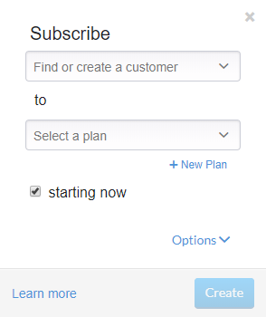](../img/create-customer.png)

This will allow you to enter the customers contact information, select AutoPay (if applicable), payment terms,  and options for payment methods. This example will use NET 14. Click create when finished.

   [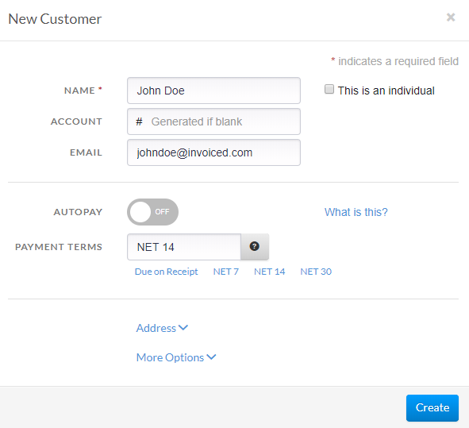](../img/net-14.png)

Once the customer is saved, it is time to create a plan. Click +New Plan to create a new plan. 

   

Let's say we want to create a plan called *Basic* for *$39/month*. The *ID* field is a unique identifier used to reference your plan through the API. The ID is automatically generated for you, but you are free to rename this to match your own internal SKU or naming scheme. Click save when completed. 

   [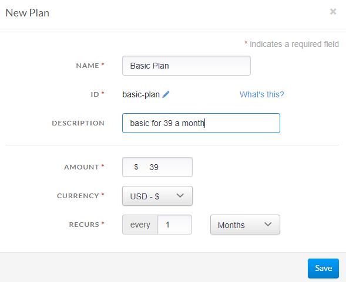](../img/create-new-plan.png)

The last step is to customize the duration of the subscription and if you wish to have any add-ons. To reveal these options, click the *Options *drop down. 

   [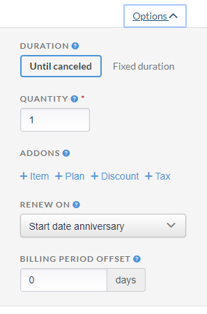](../img/options.png)

In this example, we want to start the subscription now. If you wish to start the subscription at a later date or offer a free trial period then you can uncheck the *Starting now *option to select a start date. We are going to leave the *Duration* as Until canceled. The subscription will renew until canceled by you or the customer. The *Quantity* can be left as 1, unless the customer is purchasing multiple quantities of the base price. Let's try adding an addon by clicking *+ Addon*. In our example we are selecting an 1 on 1 session addon and setting the quantity to 4.

   [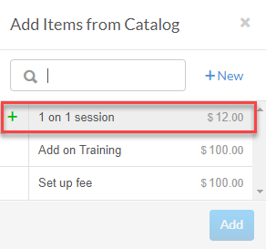](../img/add-on.png)

For the *Renew On* setting we are going to leave it as Start date anniversary. This will renew the subscription each billing cycle on the same day of the month as the start date, which is today in this example. If you selected Day of month instead then this would bill your customer on a specific day of the month you choose, like the first of the month. The first bill would be prorated for the time remaining until the next billing cycle. Future renewals will be on the date you've specified.
We can leave the *Billing Period Offset* at 0 days unless we wanted to shift the billing period.

At the bottom of the screen you can see the calculated recurring total. If you click the *Preview* button you can even see a preview of the upcoming billing cycles. Once the subscription looks right you can now click *Create*.

   [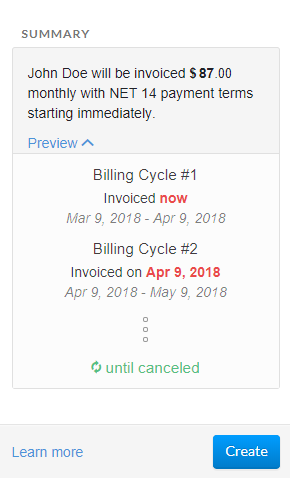](../img/summary.png)

You will now see that your newly created subscription is active. The invoice for the first billing cycle has already been generated.

   [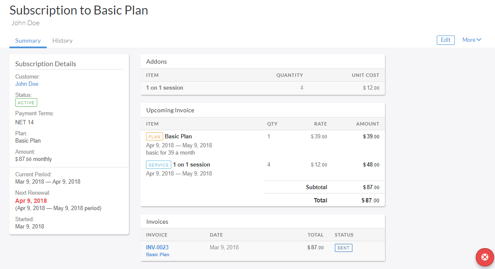](../img/subscription-overview.png)

### Editing a Subscription

What happens when your customer falls in love with your service and wants to purchase more? This common scenario is easily handled with Invoiced. We will even (optionally) calculate and bill the prorated amount when switching a plan, quantity, or addons in the middle of the billing cycle.

You can edit a subscription by opening the subscription in the dashboard and clicking the *Edit* button in the top right corner.

[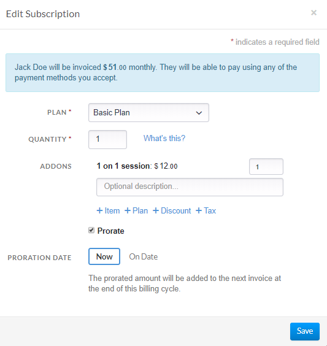](../img/edit-a-subscription.png)

This allows you to change the quantity, add additional add-on items, add a discount, or an additional subscription. 

### Changing the Renewal Date

Once your subscription is running you might want to change when it renews next. The reason might be that the customer wants the subscription to renew on a certain day of the month, maybe the wrong start date was chosen, or else you want to issue invoices sooner.

With the subscription in the dashboard you can click **More** > **Change Renewal Date** to change when the subscription will renew next.

[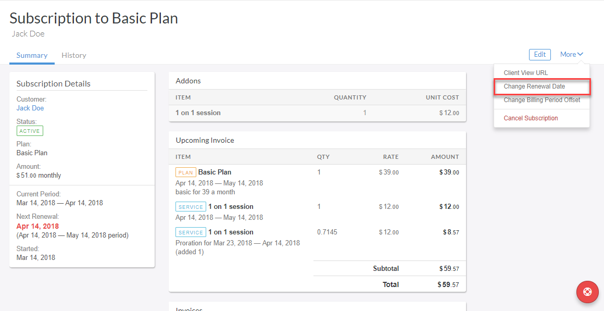](../img/change-renewal-date-step1.png)

The renewal date cannot be set in the past. Changing the renewal date will not produce any prorations.

[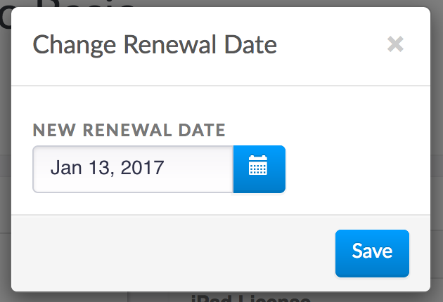](../img/change-renewal-date-step2.png)

You can also change the billing period offset as well by clicking **More** > **Change Billing Period Offset**. This will adjust the current billing period right away, however, it will not change when the next bill is generated or produce any prorations.

### Canceling a Subscription

Canceling a subscription is simple. With the subscription open in the dashboard you can click **More** > **Cancel Subscription**.

[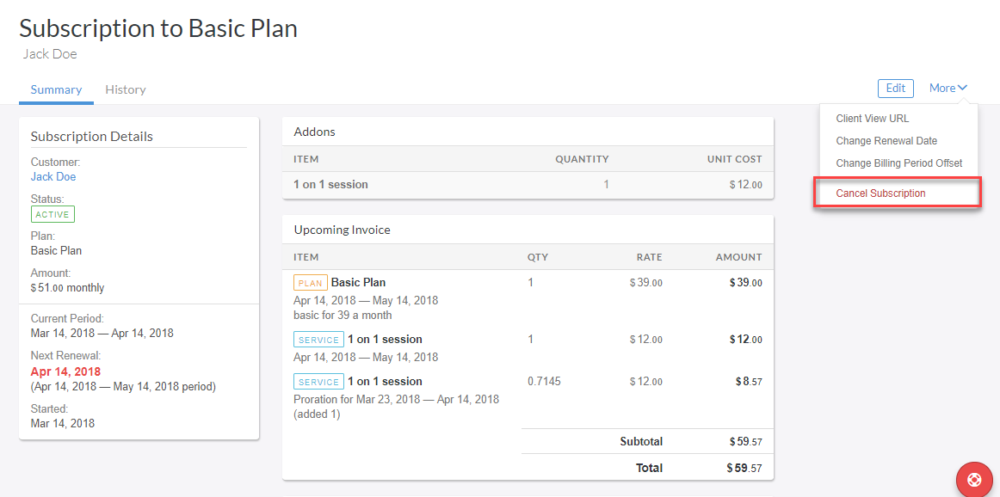](../img/cancel-the-subscription.png)

You can choose whether you want the subscription to be canceled immediately or at the end of the billing period.

[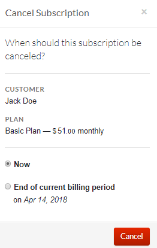](../img/canceling-the-subscription.png)

When a customer cancels a subscription in the billing portal, the subscription will end at the end of the billing cycle. This also means that the cancellation will not trigger a credit to the customers account. This is because the subscription is pre-paid at the beginning of the billing cycle. 

## FAQs

### What automated emails does Invoiced send for subscriptions? 

Invoiced can send these emails with subscriptions:

- **Sign up confirmation**
  
  Confirmation that a customer has finished signing up for automatic billing.

- **Renews Soon**

  A reminder sent X days before a subscription renews to let customers know about upcoming charges.

- **New invoice**
  
  Sends any invoices generated from a subscription to your customer.

- **Cancellation**

  Notification when a subscription is canceled.

You can learn more about these emails in the [Emails Guide](emails#subscriptions).

### When do subscription invoices go out?

Subscriptions are usually renewed very close to the renewal timestamp (within a minute). Subscriptions will never renew early but please keep in mind that they might be renewed late. If a subscription does happen to be renewed later than scheduled then our system will not punish the customer for non-payment, as should yours.