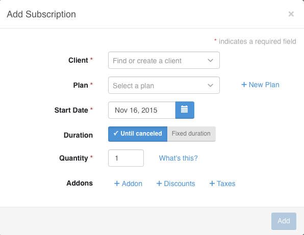
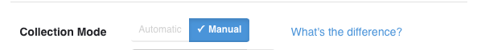
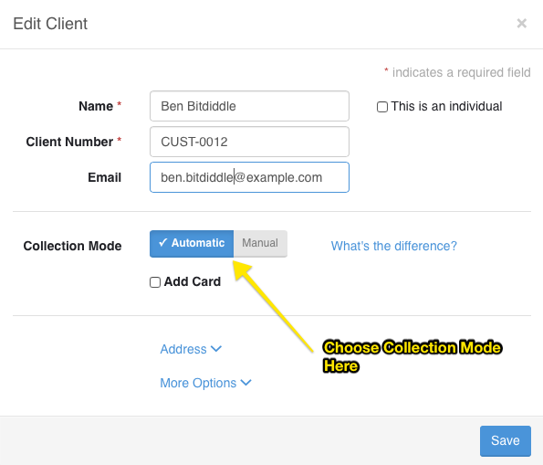
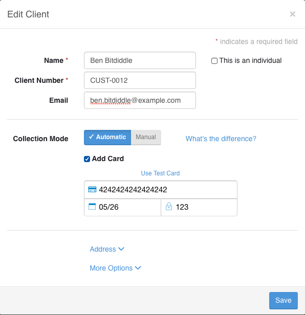
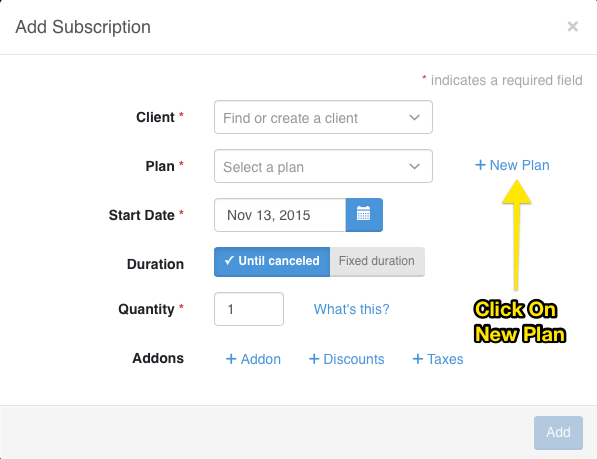
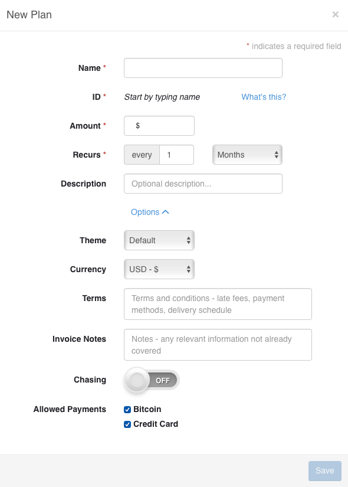
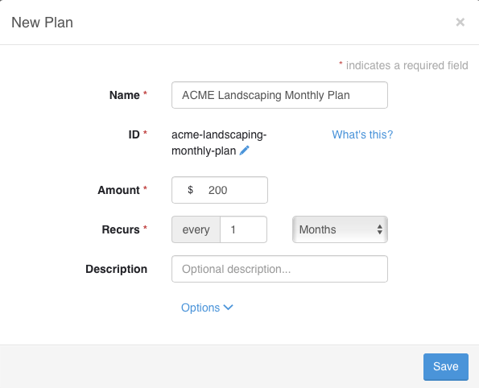
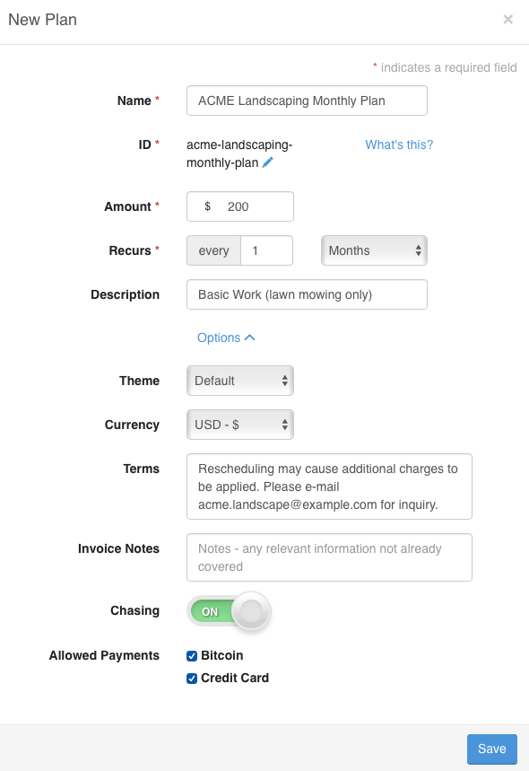

#Subscription Billing Guide

Subscriptions allow businesses to either automatically collect payment or automatically invoice the client on a recurring basis.

This is great if find yourself frequently invoicing your customer every month.  Using subscriptions allows you to automatically invoice & collect money from them, saving you and your client valuable time and offering convenience.

###Creating a Subscription

To create subscriptions, click on Subscriptions from the dashboard.  

From their click on `Add Subscription`

Now a the subscription modal will appear.

Every field with a `*`  is required to be filled out.

We first start off with adding or choosing a client in the `Client` field.

When populating the client field we must understand the collection mode for the client.

###Collection Mode

Collection is set per client.  Collection mode specifics whether the client is auto-charged (meaning they are charged automatically by Invoiced) or not. If the client is not auto-charged than the client is simply sent a invoice automatically and **the onus is on the client to pay**. 

The collection modes are called `Automatic` and `Manual`. The collection mode is set in the client profile.  When you are adding or editing a client.

*Note: You must have online payments in order to able to see and use `Automatic` mode.  Learn more in about online payments in our [Online Payments Guide](/docs/guides/online-payments)* 

Without On-line Payments Enabled

 

With On-line Payments Enabled

 

**Automatic vs Manual**

When choosing `Automatic`, you must check mark `Add Card`.  Checking this box, allows you to add your client's credit card *Note: You must have online payments enabled* .  The auto-charge will not work if this is not done. 

When choosing `Manual`, you should set the `Payment Terms` as well.  

`Payment Terms` are the terms that specify when the payment on the invoice is due.  `NET 7` means that payment should be due within 7 days of receipt. For `NET 14` means that payment should be due within 14 days of receipt. `NET 30` means that payment should be due within 30 days of receipt.  You can define any custom term by directly inputing it into the input box.  To learn more about optimizing payment terms and getting paid faster go [here](http://blog.invoiced.com/how-to-get-paid-faster-on-your-invoice-part-i/) 

We than add or choose a plan in `Plan` field.  Plans are a important concept to understand and we will discuss them in the next section.

###What is a plan

Plans are sort a template for creating a subscription.  They specify how often the client is invoiced or charged, how much they are invoiced for, the currency, description, terms, notes, allowed payments and whether the payment should be chased.

The advantages of using a plan are that it can save you time from having to re-enter the information mentioned above for every client.  

From the Subscription Modal you can create a new plan.

We will go over most of fields in a plan

If you click on `Options` you will gets a even more customization options for the plan.

You will want to add `Name`, `Amount`, `Recurs` at a minimum.  `ID` will be auto-generated based on `Name`.

Most of the fields are self-explanatory.  

`Recurs` field is where you specify how often and how many times the subscription will run for.

####Example: 

Suppose you have business called `ACME Landscaping Services` and want to setup a plan that invoices/charges the client $200 every month.

Let's set `Name` to `ACME Landscaping Monthly Plan`,
`Amount` to $200,
and `Recurs` to 'every 1 month'.

We may optionally want to add a `Description`, `Terms` and allow `Chasing`.
Read more about `Chasing` in the [Chasing Guide](/docs/guides/chasing)

After we filled out the plan modal we simply click on `Save`

###Back To Subscriptions

The subscription modal has few fields that you want to understand. 

`Duration` has 2 options `Until Canceled` and `Fixed duration`.  `Until Canceled` means the subscription will be executed until it is explicitly canceled.  `Fixed duration` specify how long the subscription can go on for.

Choosing `Until Canceled` means it can gone on forever potentially until you or the client explicitly cancels it.  The client will also be able to cancel the subscription in the billing portal

**Additional Items**

Additional items are line items, discounts, taxes that you add to subscription on top what the plan charges for.  It gives you the flexibility and power to customize the subscription to your client.

`Addons`, `Discounts`, `Taxes` let you add specific line items, taxes, and discounts to your subscription.

**Additional Items Example**

Suppose you have business called `ACME Landscaping Services` and you suppose you setup a monthly landscaping plan that costs $200 a month.  

Some of your clients might want additional services such has hedge trimming.  So you would add create a 'hedge trimming' add-on for those clients.

**Quantity**

`quantity` is an important field to understand.  The total amount your client is charged on the subscription is the `plan amount * quantity`. 

**Quantity Example**

Suppose our business called `ACME Landscaping Services` has a client with 2 homes that will get the same services.  We can subscribe them to our $200 a month plan and increase the `quantity` to 2; this saves us the trouble of having to create 2 separate subscriptions for them.

###Canceling Subscription

Cancel a subscription is pretty easy.  Simple go into the subscription and click on `More` than `Cancel Subscription`

