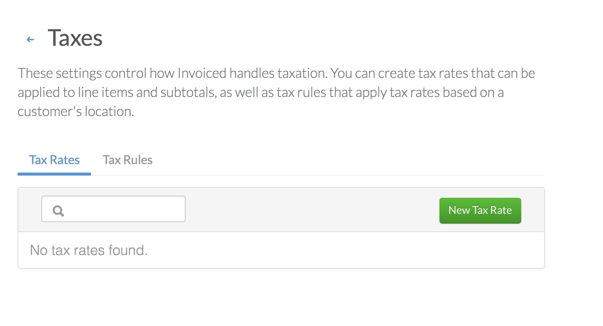
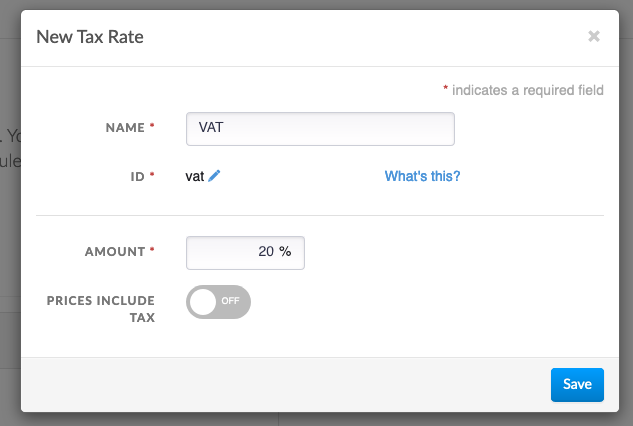
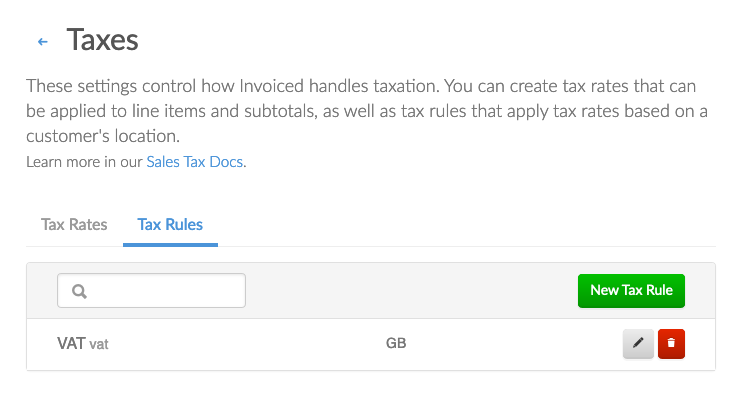
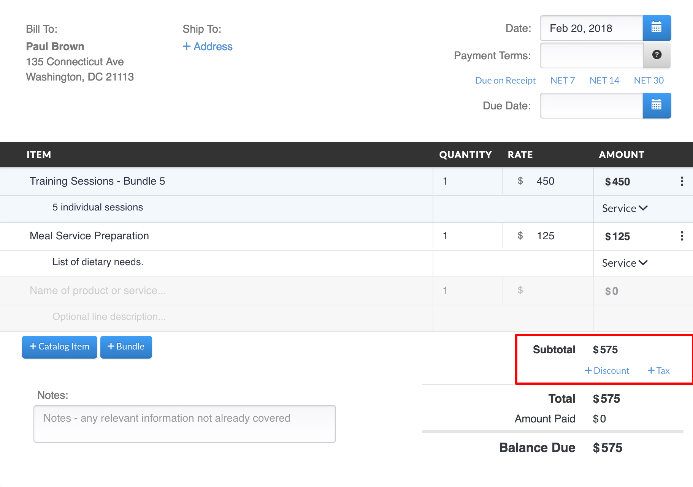

# Sales Tax

Collecting sales tax can be complex, which is why Invoiced includes a tax calculation tool. The tax settings allow you to control the taxes that are applied to customer invoices. With an easy to use tool, tax rates and rules can be created within minutes to get your business up and running faster. Let's get started.

## Concepts

### Tax

Sales tax can be applied to invoice subtotals and line items. You can apply either one-off tax amounts or a tax rate (described below). It is recommended that you setup the tax you collect as tax rates, unless the tax calculation happened elsewhere.

### Tax Rates

A tax rate describes a type of sales tax that you collect. Generally you will have a different tax rate for each tax agency that you collect sales tax on behalf of. Tax rates can be expressed as a percentage (%) or fixed currency amount.

#### Tax Inclusive vs Tax Exclusive

The default behavior for calculating tax is the tax exclusive mode. In tax exclusive mode, all prices are treated as not including tax and any tax assessed will be added to the subtotal.

On the other hand, tax inclusive pricing means that tax has already been priced into the amount billed to the customer. When tax inclusive pricing is used the subtotal will be adjusted down such that the subtotal + tax equal the original amount billed. When rounding happens with tax inclusive pricing, it will always be rounded in favor of the tax agency.

### Tax Rules

Tax rules will automatically apply tax rates to invoices based on your customer's location. We currently support tax rules that are based on the country and/or state. Tax rules will add tax rates based on the customer's shipping address, or if not available, based on the customer's billing address.

## Setup

### Creating a Tax Rate 

1. Go to **Settings** &rarr; **Taxes** in the Invoiced dashboard.

   

2. Click **New Tax Rate**.

   You can now enter in the details of your tax rate. The ID will auto-fill based off of the name, or you can supply your own.

   

### Creating a Tax Rule

If you want to automate when tax rates are applied based on where your customers is located you can then create a tax rule.

1. Go to **Settings** &rarr; **Taxes** &rarr; **Tax Rules** in the Invoiced dashboard.

   

2. Click **New Tax Rule**.

   You can now select a tax rate and the country and/or state to which it applies. You have these options:

       a. *Everyone* : This will apply the tax rate globally to all taxable customers.

       b. *Customers in Specific Country*: This will apply the tax rate to taxable customers in the specified country.

       c. *Customers in Specific State/Province*: This will apply the tax rate to taxable customers in a specific state or province.

   

## Usage

After creating the tax rates and tax rules, they are now ready to be used. If you have setup tax rules then tax will be added automatically to the applicable customers.

If you are setting up a customer, item, or invoice you can also add tax rates and amounts by pressing the **+ Tax** button.

Once selected, the rate will be added. If you are creating an invoice the tax will be added to the balance due.

### Adding Custom Tax Amounts

Invoiced also allows for custom tax amounts to be applied on an invoice. Simply press the **+ Tax** button on the invoice and select **Add Custom Tax**. This will add a field to the invoice to manually enter an arbitrary tax amount.

### Need a more complicated sales tax setup?

If you have more challenging sales tax requirements then you should consider our [Avalara integration](/docs/integrations/avalara). It was designed to automate sales tax compliance for companies with nexus in many places or handling more tricky tax scenarios (i.e. U.S. sales tax).
