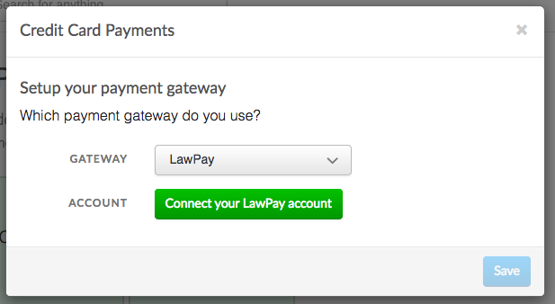
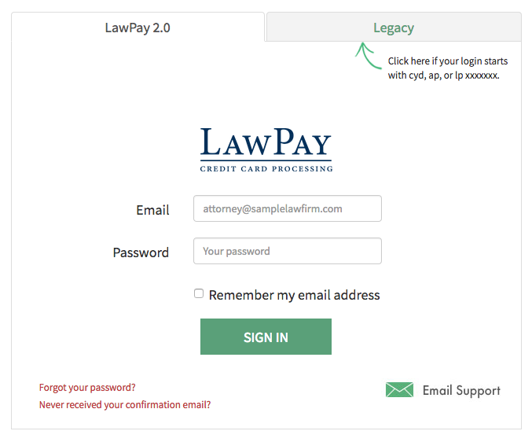
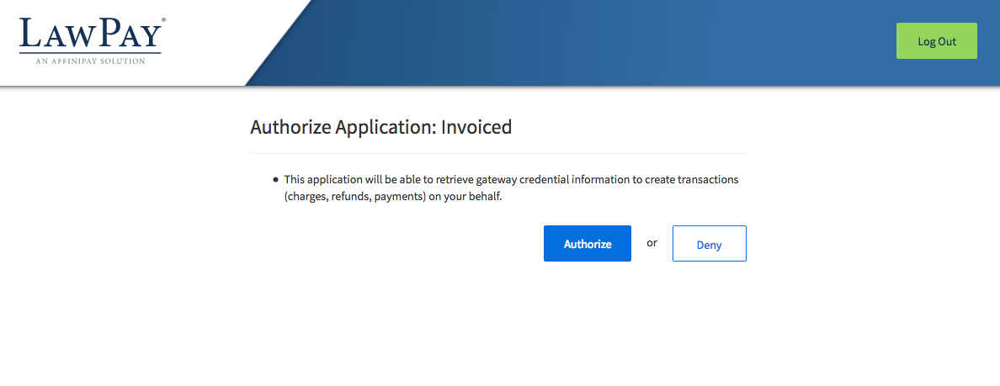
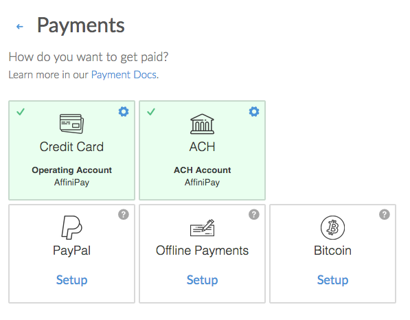
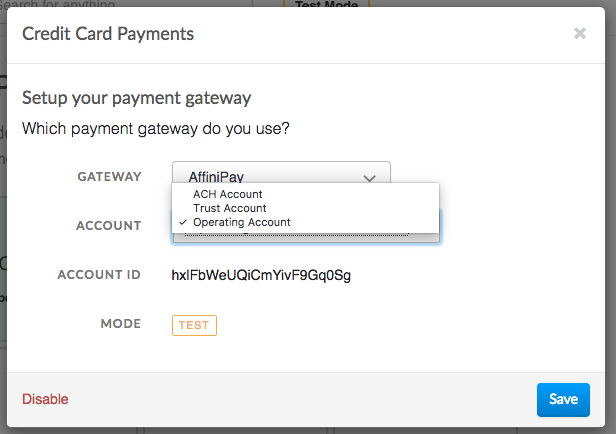

# AffiniPay Integration

This document details how to connect the [AffiniPay](https://affinipay.com) payment gateways (including CPACharge and LawPay) to accept payments and how our integration works.

## Capabilities

The AffiniPay payment gateway on Invoiced supports the following features:

- [Credit card payments](/docs/payments/card)
- [ACH payments](/docs/payments/ach) (U.S. only)
- Vaulting payment information (credit card and ACH)
- [AutoPay](/docs/guides/autopay)

## Supported Gateways

The AffiniPay integration works with each AffiniPay brand, including:

- [AffiniPay](https://affinipay.com)
- [CPACharge](https://cpacharge.com)
- [LawPay](https://lawpay.com)

## Setup

Connecting AffiniPay is a straightforward process. Follow these steps to start accepting payments through AffiniPay in minutes. These steps assume you already have a AffiniPay account.

1. From the Invoiced dashboard go to **Settings** > **Payments**.

   

2. Click **Setup** on the payment method you want to accept.

   

3. Select **AffiniPay**, **CPACharge**, or **LawPay** as the payment gateway. We will select LawPay in this example.

   

4. Click **Connect to LawPay**. You will be taken to a screen to sign into your LawPay account, if you are not already signed in. Enter in your LawPay username and password and click **Sign In**.

   

5. You then need to authorize the Invoiced application by clicking  **Authorize**.

   

6. Your LawPay account is now connected and the payment method is enabled.

   

7. You might need to change the default AffiniPay account that will be used to receive payments. We will select the operating account by default, however, you may wish to receive payments in a different account.

   

## Client Workflow

### Credit Cards

Paying with credit or debit card is fairly straightforward for customers. They simply enter in their cardholder information and click **Pay**. We give receipts to your customers after a successful payment.

### ACH

Customers can pay with ACH just as easily as with credit cards. The key difference is that ACH payments will take several business days to clear. When customers are on a payment form they will select ACH as the payment information and then enter in their bank account and routing number.

## Support

Need help with your AffiniPay account? You can get help through the [AffiniPay support center](https://affinipay.com/support/) or by calling 1-855-656-4685.