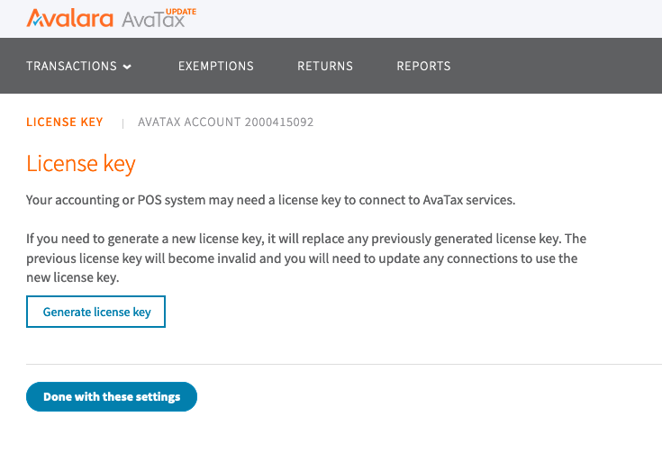
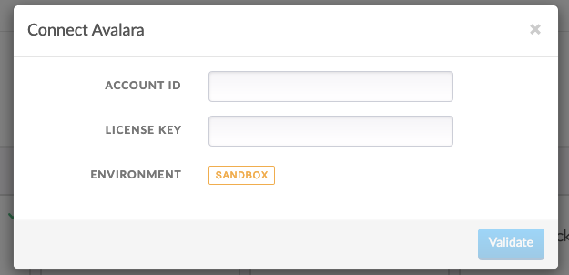
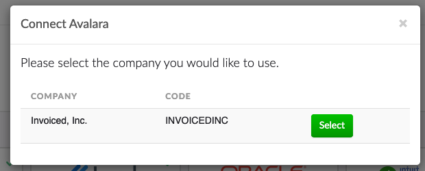

# Avalara Integration

We have teamed up with Avalara to automate sales tax compliance. Our integration with Avalara AvaTax handles tax calculation for you based on the products and services you sell. The integration will automatically calculate and add sales tax to invoices based on the specifics of the transaction.

## Setup

The setup process assumes that you have already established an Avalara account and already configured Avalara for the jurisdictions where your business has nexus.

1. Obtain your account ID and license key from the settings on Avalara.

   

2. Go to **Settings** > **Integrations** of the Invoiced application. Click **Connect** underneath the *Avalara* integration.

   

3. Enter in your Avalara account ID and license key. Click **Validate** to connect to Avalara.

   
   
4. Next, select the company code within Avalara that you would like to report sales tax into.

   
   
Once you've connected Avalara successfully there are additional settings that you can change to customize the behavior of the integration in **Settings** > **Integrations** > **Configure** (Avalara).

### Commit Mode

The **Commit Mode** setting controls how transactions are sent to Avalara. Here is an explanation of each commit mode:

- **Commit invoices and credit notes** - Sales invoices and return invoices are created and committed on Avalara automatically. Transactions will be included on your sales tax returns by default.

- **Don't commit invoices and credit notes** - Sales invoices and return invoices are created on Avalara, however, they will be created with an uncommitted status. In order to include these transactions on a sales tax return they must be committed through the Avalara application. 

- **Disable Avalara tax calculation** - When used this will prevent the integration from performing any tax calculation for all new and existing transactions.

## How It Works

Once the integration is configured, you can start to benefit from instant, accurate tax calculations. The integration will generate tax in the following scenarios:

### Invoices

Creating an invoice will produce a sales invoice on Avalara. Modifying or deleting an invoice will produce the corresponding adjustment on Avalara.

### Credit Notes

Creating a credit note will produce a return invoice on Avalara. The amounts on the return invoice will be negative to reverse the sales tax that was originally collected on the credited items.

### Estimates

Estimates will create tax as a sales order on Avalara in order to provide you and your customer with an accurate sales tax estimate. However, the sales tax on the estimate will not be filed on a tax return unless that estimate is converted into an invoice.

## Edge Cases

Below are a items to be aware of when using the Avalara integration.

- Draft invoices will have sales tax calculated just like an issued invoice. This means that sales tax from a draft invoice would show up on a tax return.
- If you are importing invoices from an accounting system then sales tax will not be calculated on those imported invoices. This is also the case if you pass in `calculate_taxes=false` through the API when creating invoices.