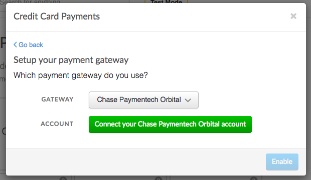
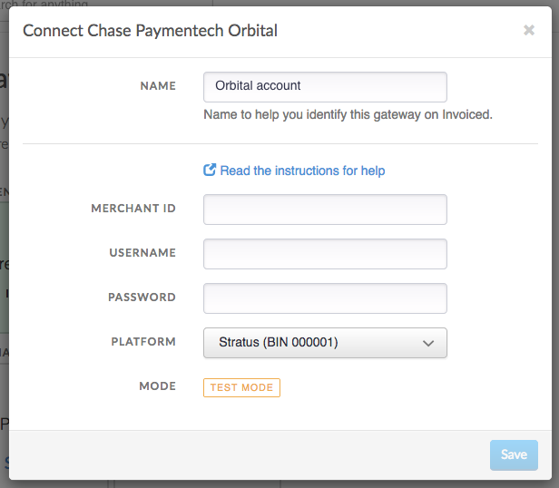
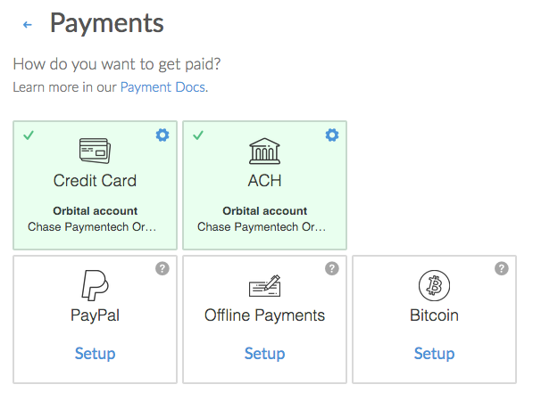

# Chase Paymentech Integration

This document details how to connect the [Chase Paymentech](https://www.chasepaymentech.com/) payment gateway to accept payments and how our integration works.

## Capabilities

The Chase Paymentech Orbital payment gateway on Invoiced supports the following features:

- [Credit card payments](/docs/payments/card)
- [ACH payments](/docs/payments/ach) (U.S. only, Stratus only)
- Vaulting payment information (credit card and ACH)
- [AutoPay](/docs/payments/autopay)

## Prerequisite

The Chase Paymentech integration uses the Orbital gateway. It supports two different platforms: Stratus (BIN 000001) and PNS / Tandem (BIN 000002). The Stratus platform supports more features than Tandem, like ACH debits. You need to make sure you know the correct host platform your gateway account is set up on before configuring Invoiced.

Generally if your merchant ID is 6 digits you will be on the Stratus platform. If your merchant ID is 12 digits then you are likely on the PNS / Tandem platform.

## Setup

Connecting Chase Paymentech Orbital is a straightforward process. Follow these steps to start accepting payments through Chase Paymentech Orbital in minutes. These steps assume you already have a Chase Paymentech account.

1. From the Invoiced dashboard go to **Settings** > **Payments**.

   

2. Click **Setup** on the payment method you want to accept.

   

3. Select **Chase Paymentech Orbital** as the payment gateway.

   

4. Click **Connect to Chase Paymentech Orbital**.

   

5. Enter in your Chase Paymentech Orbital **Merchant ID**, **Username**, **Password**, **Platform**, and **Terminal ID** (Tandem only). Next click **Save** and finally click **Enable**. The payment method you selected should be enabled.

   

## Client Workflow

### Credit Cards

Paying with credit or debit card is fairly straightforward for customers. They simply enter in their cardholder information and click **Pay**. We give receipts to your customers after a successful payment.

### ACH

Customers can pay with ACH just as easily as with credit cards. The key difference is that ACH payments will take several business days to clear. When customers are on a payment form they will select ACH as the payment information and then enter in their bank account and routing number.

## Support

Need help with your Chase Paymentech Orbital account? You can get help by contacting your Chase account representative.