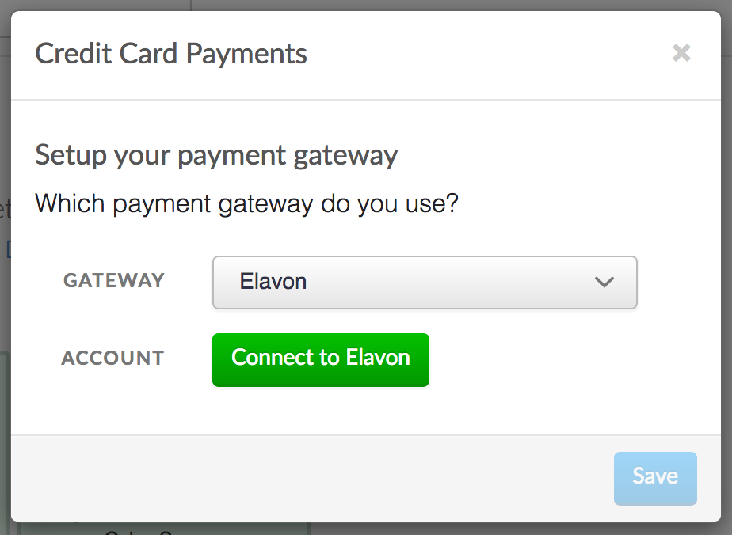
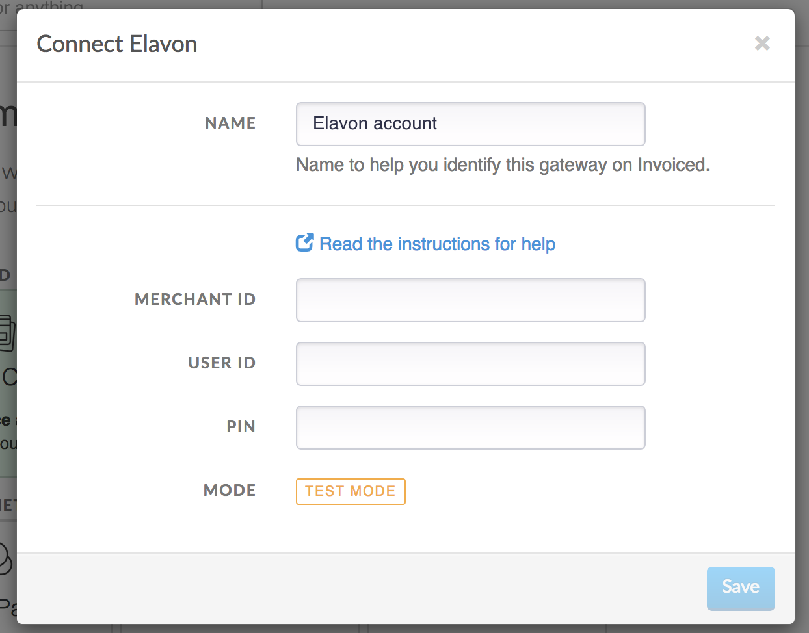
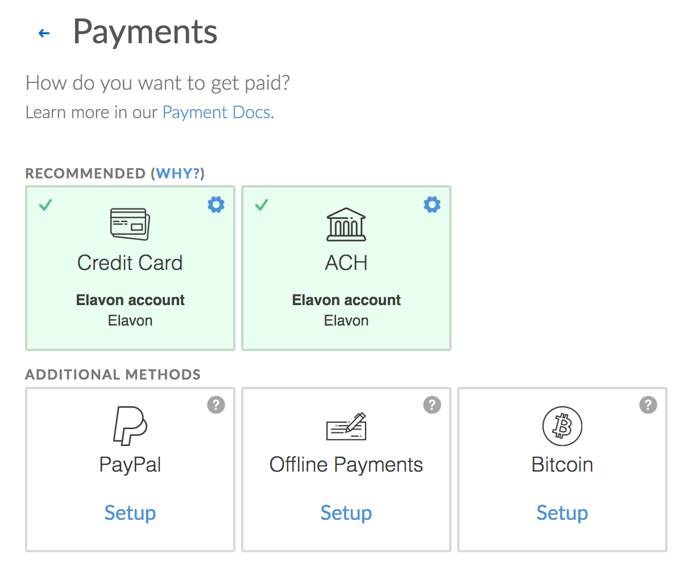

# Elavon Integration

This document details how to connect the [Elavon Converge](https://elavon.com) payment gateway to accept payments and how our integration works.

## Capabilities

The Elavon Converge payment gateway on Invoiced supports the following features:

- [Credit card payments](/docs/payments/card)
- [ACH payments](/docs/payments/ach) (U.S. only)
- Vaulting payment information (credit card and ACH)
- [AutoPay](/docs/payments/autopay)

## Setup

Connecting Elavon is a straightforward process. Follow these steps to start accepting payments through Elavon in minutes. As a prerequisite, it is recommended that you create a separate API user on Elavon for Invoiced rather than using your admin account These steps assume you already have a Elavon account.

1. From the Invoiced dashboard go to **Settings** > **Payments**.

   

2. Click **Setup** on the payment method you want to accept.

   

3. Select **Elavon** as the payment gateway.

   

4. Click **Connect to Elavon**.

   

5. Enter in your Elavon **Merchant ID**, **User ID**, and **PIN** and click **Save**. Then click **Enable** and the payment method you selected should be enabled.

   

## Client Workflow

### Credit Cards

Paying with credit or debit card is fairly straightforward for customers. They simply enter in their cardholder information and click **Pay**. We give receipts to your customers after a successful payment.

### ACH

Customers can pay with ACH just as easily as with credit cards. The key difference is that ACH payments will take several business days to clear. When customers are on a payment form they will select ACH as the payment information and then enter in their bank account and routing number.

## Support

Need help with your Elavon account? You can get help by contacting your Elavon account representative.