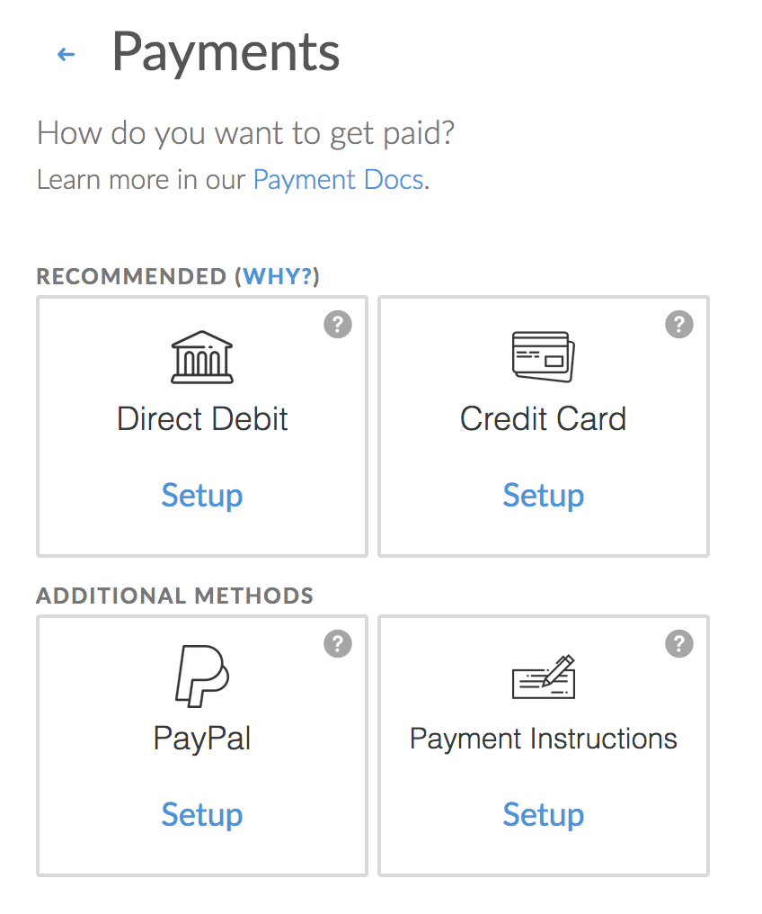
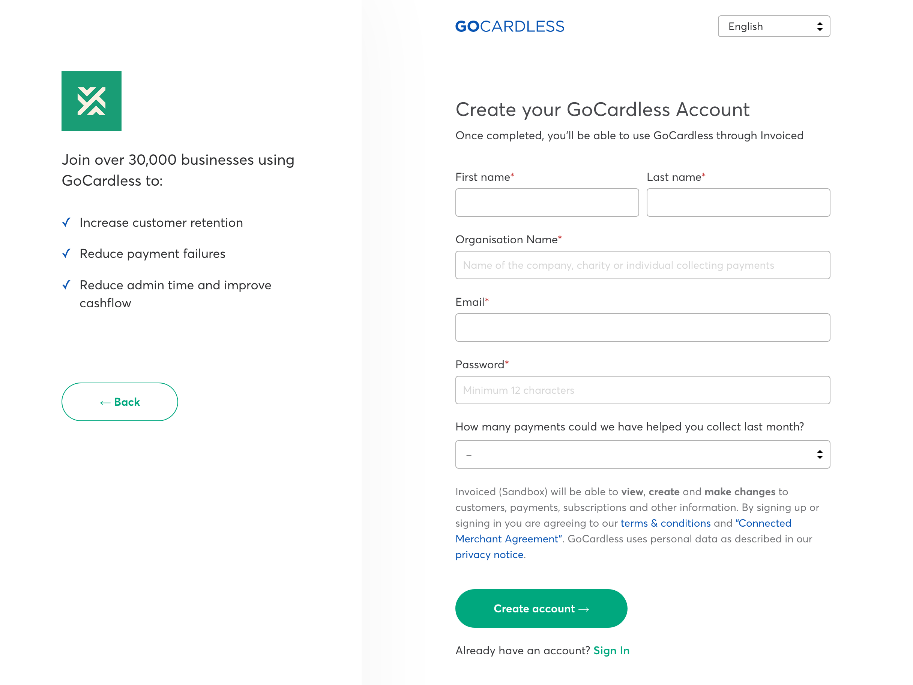
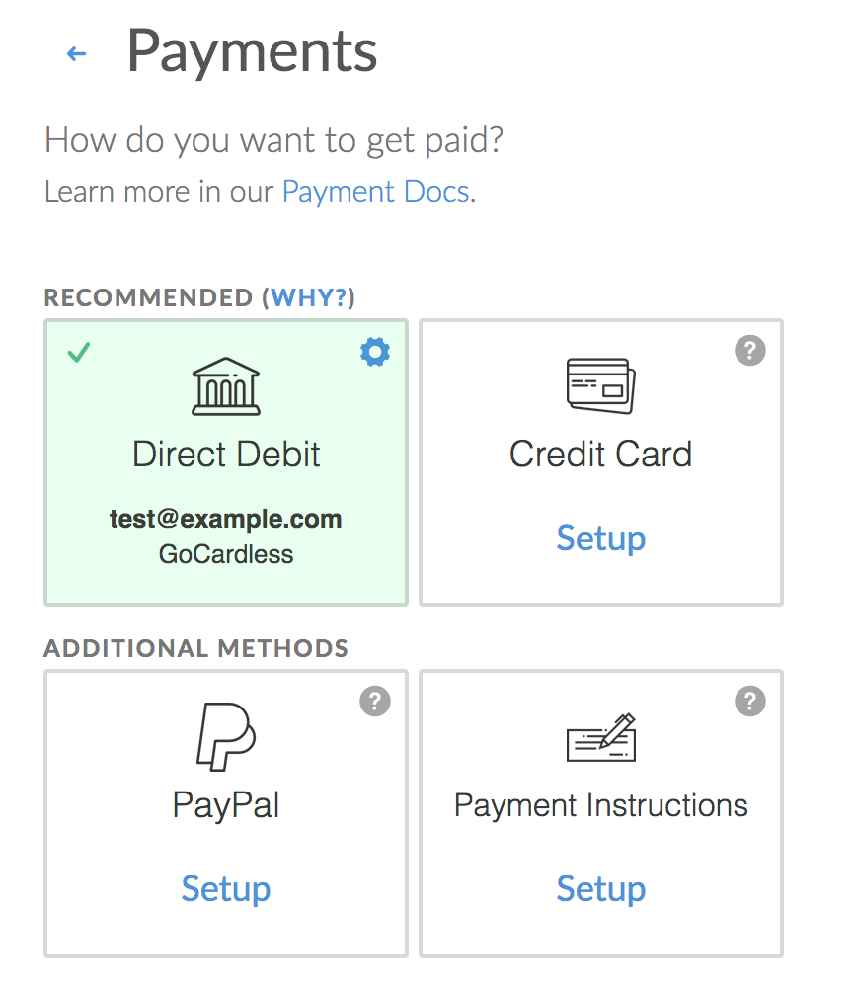
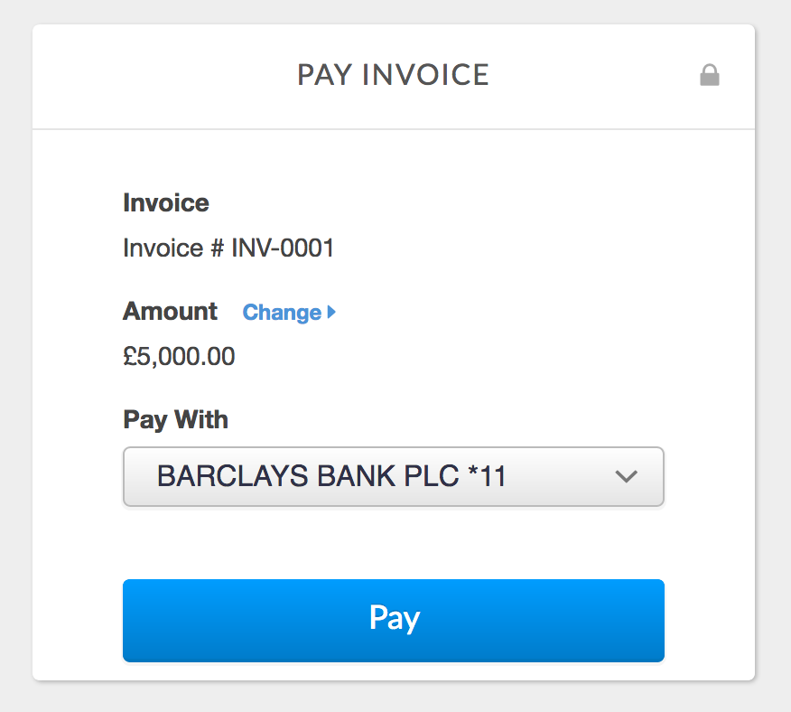

# GoCardless Integration

This document details how to connect [GoCardless](https://gocardless.com) to Invoiced for accepting direct debit payments and how our integration works.

## Capabilities

The GoCardless integration on Invoiced supports the following features:

- Bacs debits (UK)
- SEPA debits (EU)
- BECS debits (Australia and New Zealand)
- Autogiro debits (Sweden)
- PAD (Canada)
- Vaulting payment information
- [AutoPay](/docs/payments/autopay)

## Setup

Connecting GoCardless is a straightforward process. Follow these steps to start accepting payments through GoCardless in minutes. If you do not already have a GoCardless account then you will be able to create one during the setup process.

1. From the Invoiced dashboard go to **Settings** &rarr; **Payments**.

   

2. Click **Setup** on the *Direct Debit* payment method. Then click **Connect With GoCardless**. You will be taken to GoCardless' website where you can sign into your GoCardless account and grant Invoiced access.

   

5. If you are signing up for a GoCardless account for the first time then you will need to provide additional information about your business to activate your account. After you've connected and verified your GoCardless account then the direct debit payment method will be enabled. You are ready to begin accepting payments.

   

## Client Workflow

### Paying an invoice

Paying with direct debit has been made as straightforward as possible for customers. When a customer goes to make their first payment they must first accept the direct debit mandate. In order to kick off the process your customer will click **Setup Direct Debit**.

**NOTE: Your GoCardless account might have a dollar limit for individual direct debit transactions, i.e. customers cannot submit payments greater than £5k. You can see the [transaction limits here](https://support.gocardless.com/hc/en-gb/articles/115002831125#transaction_limits) by country and payment scheme.**

Once the direct debit mandate has been completed then your customer can now use their bank account to pay any invoice from you by returning to the invoice payment page and selecting their bank account as the payment method.

New direct debit payments will have a pending status. Direct debit payments generally take 4-5 business days to complete. Once the transaction succeeds or fails we will update the invoice and send the customer a receipt. In the event of a failure we will create an event in the dashboard.

Subsequent payments from the same customer will not require the customer to go complete another mandate.

## Withdrawing Money

You just received your first payment through GoCardless. Congrats! Now what?

GoCardless sweeps successful payments to your bank account automatically on each business day. Once you have received a payment with GoCardless the payout generally takes 2 business days after the customer's charge has completed.

### Payment Settlement

Direct debit payments are not instant like credit card payments. A direct debit payment will be marked as pending until the transaction has cleared. A direct debit payment is not considered paid until the transaction has cleared, which may take up to 4-5 business days. Once we have received acknowledgement of the status of the payment it will either be marked as successful or failed.

## Support

Need help with your GoCardless account? You can get help from [GoCardless' support website](https://support.gocardless.com/hc) or [contact GoCardless directly](https://support.gocardless.com/hc/en-au/requests/new).