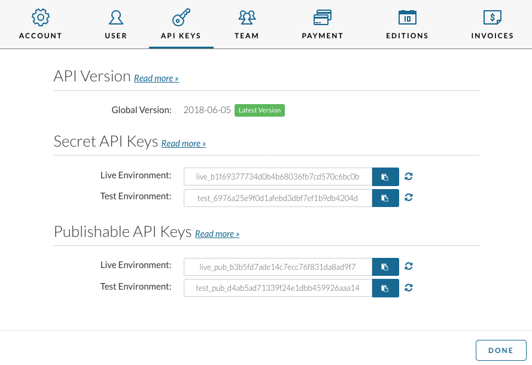
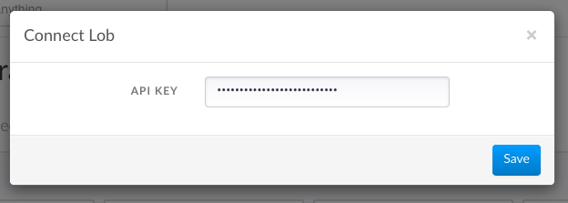
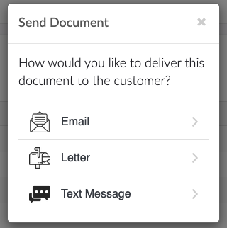
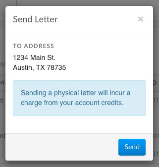

# Lob Integration

Our Lob integration enables you to send paper invoices and statements to customers via direct mail. The integration will physically deliver a letter to your client's doorstep. It will use the same invoice or statement template they would see if they downloaded the invoice. Letters are perfect for another way to get in front of your client.

## Setup

We are going to walk you through setting up the Lob integration. This assumes you have already signed up for a Lob account. If not, you may [sign up here](https://www.lob.com/).

1. Get your Lob API key from the Lob dashboard. This will be the *Secret API Key* for the *Live Environment*.

   

2. Go to **Settings** &rarr; **Integrations** of the Invoiced application. Click **Connect** underneath the *Lob* integration.

   

3. Enter in your Lob API key. Click **Save** to enable the integration. You are now ready to start sending letters!

   

## Sending a letter

You can send both account statements and individual invoices through a letter. In this tutorial we are going to walk you through it.

### Sending an invoice

1. Open up the invoice in the Invoiced application.

2. Click **Actions** &rarr; **Send Invoice**.

   

3. Select the *Letter* option. Make sure the recipient's address looks right and click **Send**.

   

### Sending an account statement

1. Open up the customer's account in the Invoiced application.

2. Click **Actions** &rarr; **Generate Statement**.

3. Enter in the parameters for the statement and click **Send**.

   

4. Select the *Letter* option. Make sure the recipient's address looks right and click **Send**.

   

## Limitations

Mailing letters have a few limitations that you should be aware of.

- Lob sends letters from the USPS (United States Postal Service). It's probably not a good fit for companies based outside of the U.S.
- Lob is not a free service (although it is very affordable). Any letters you mail will incur a charge. See [Lob's pricing](https://www.lob.com/pricing).
- Letters usually take 4 to 6 business days to be delivered. 