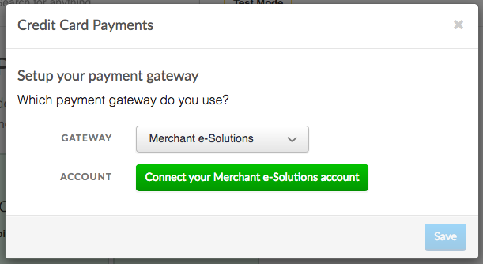
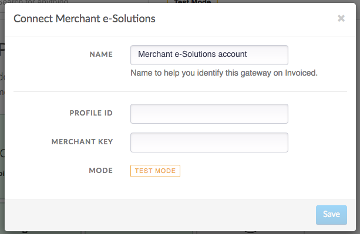
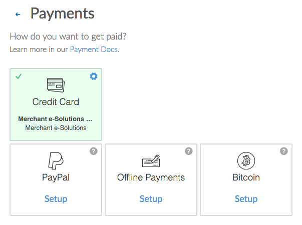

# Merchant e-Solutions Integration

This document details how to connect the [Merchant e-Solutions](https://merchante-solutions.com) payment gateway to accept payments and how our integration works.

## Capabilities

The Merchant e-Solutions payment gateway on Invoiced supports the following features:

- [Credit card payments](/docs/payments/card)
- Vaulting payment information
- [AutoPay](/docs/guides/autopay)

## Setup

Connecting Merchant e-Solutions is a straightforward process. Follow these steps to start accepting payments through Merchant e-Solutions in minutes. These steps assume you already have a Merchant e-Solutions account.

1. From the Invoiced dashboard go to **Settings** > **Payments**.

   

2. Click **Setup** on the *Credit Card* payment method.

   

3. Select **Merchant e-Solutions** as the payment gateway.

   

4. Click **Connect your Merchant e-Solutions account**.

   

5. Enter in your Merchant e-Solutions **Profile ID** / **Merchant Key** and click **Save**. Then click **Enable** and the credit card payments should be enabled.

   

## Client Workflow

Paying with credit or debit card is fairly straightforward for customers. They simply enter in their cardholder information and click **Pay**. We give receipts to your customers after a successful payment.

## Support

Need help with your Merchant e-Solutions account? You can get help by contacting your Merchant e-Solutions account representative.