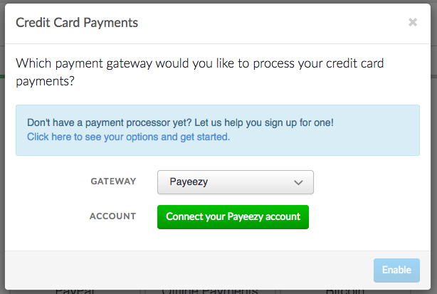
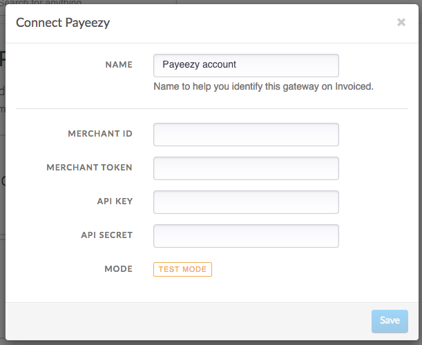
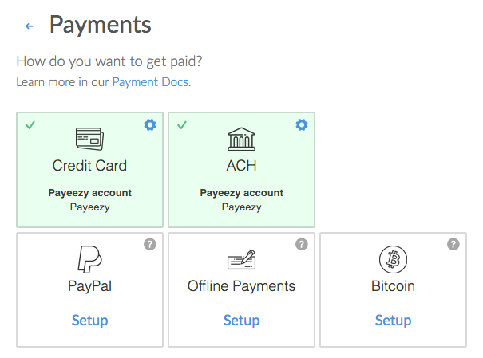

# Payeezy Integration

This document details how to connect the [First Data Payeezy](https://payeezy.com) payment gateway to accept payments and how our integration works.

## Capabilities

The Payeezy payment gateway on Invoiced supports the following features:

- [Credit card payments](/docs/payments/card)
- Vaulting payment information (credit card only)
- [AutoPay](/docs/guides/autopay) (credit card only)

## Setup

Connecting Payeezy is a straightforward process. Follow these steps to start accepting payments through Payeezy in minutes. These steps assume you already have a Payeezy account.

1. From the Invoiced dashboard go to **Settings** > **Payments**.

   

2. Click **Setup** on the *Credit Card* payment method.

   

3. Select **Payeezy** as the payment gateway.

   

4. Click **Connect to Payeezy**.

   

5. Enter in your Payeezy **Merchant ID**, **Merchant Token**, **API Key**, and **API Secret** and click **Save**. Then click **Enable** and the payment method you selected should be enabled.

   

## Client Workflow

Paying with credit or debit card is fairly straightforward for customers. They simply enter in their cardholder information and click **Pay**. We give receipts to your customers after a successful payment.

## Support

Need help with your Payeezy account? You can get help by contacting your First Data account representative.