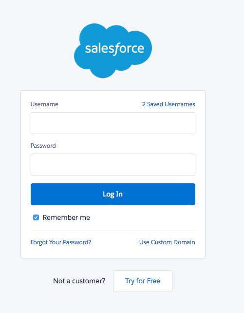
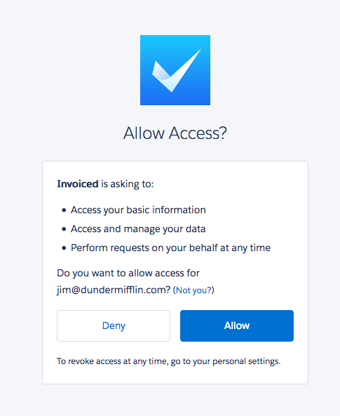
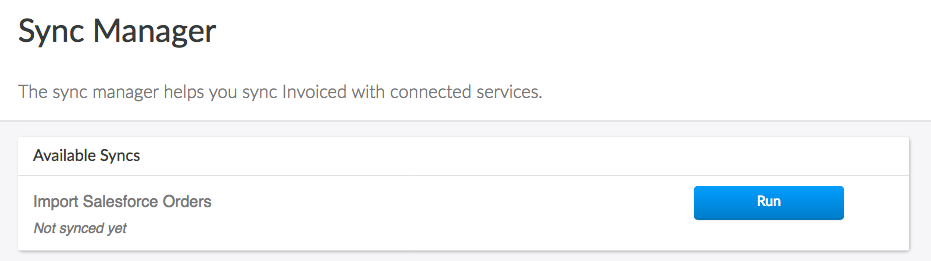
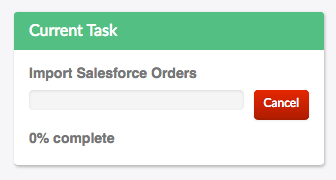
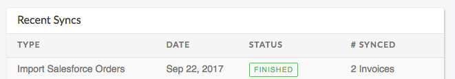
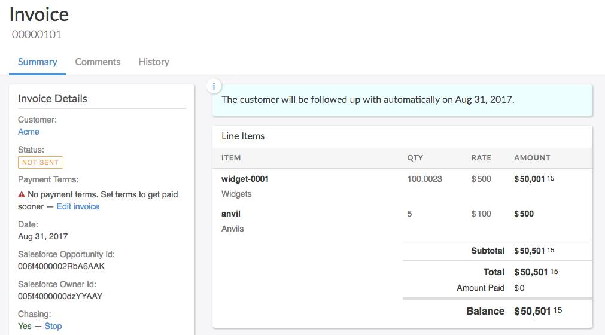

# Salesforce Integration

We have built an integration with the Salesforce CRM in order to provide a complete order-to-cash workflow.

## Setup

Below we will walk you through how to set up the Salesforce integration on Invoiced.

1. Go to **Settings** > **Integrations** in the Invoiced dashboard.

   

2. Click **Connect to Salesforce**. You should be taken to a Salesforce login screen.

   

3. Sign into Salesforce if you are not signed in already.

   

4. Next authorize the Invoiced application access to your Salesforce account by clicking **Allow**.

5. Salesforce is now connected! You will be redirected to the **Sync Manager** tab.

## Usage

The Salesforce integration works by importing non-draft orders from Salesforce and converting them into invoices.

1. Go to the **Sync Manager** tab in the Invoiced dashboard.

   

2. Click **Run** next to the **Salesforce Orders** section.

   

3. Wait for the import to finish.

   

4. Once the import is finished you can go to the **Invoices** tab to see the invoices for the imported orders.

   

## Help

Please contact [support@invoiced.com](mailto:support@invoiced.com) if you have any questions or feedback on the Salesforce integration.