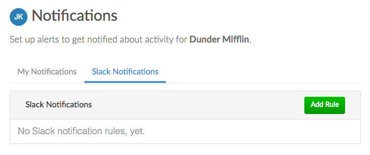
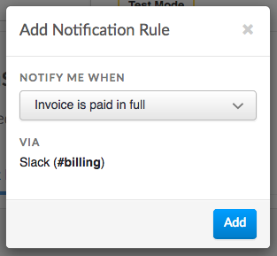
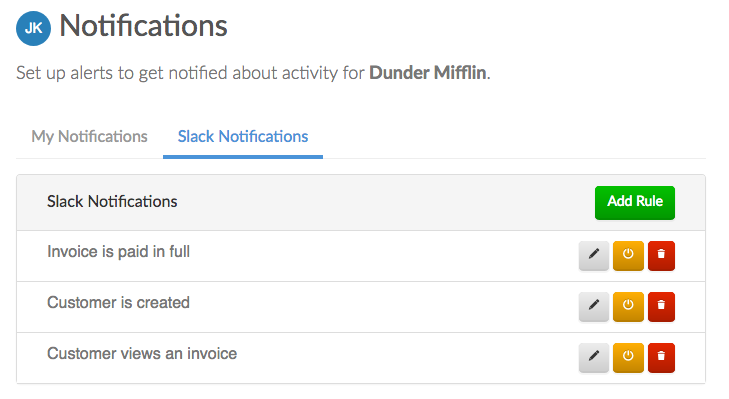
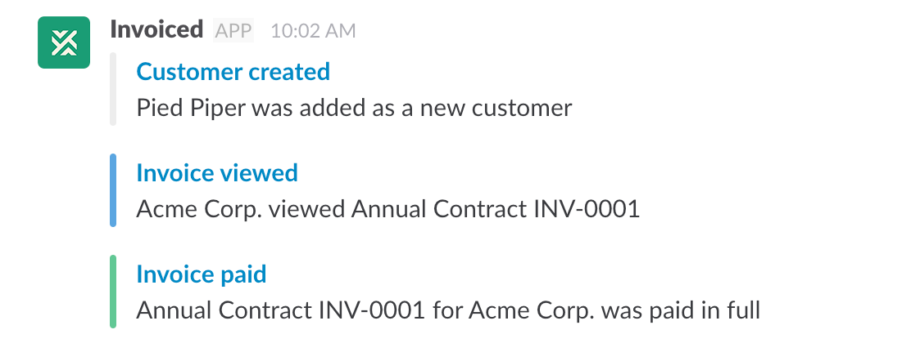

# Slack Integration

With our Slack integration you can receive real-time notifications when important billing events occur. The Slack integration can notify you when a new customer is added or an invoice is paid.

## Setup

You can follow these instructions in order to set up the Slack integration on Invoiced.

1. Go to **Settings** &rarr; **Integrations** in the Invoiced dashboard.

   

2. Click **Add to Slack** underneath the Slack integration. Slack will then ask you to select a channel where you would like to receive notifications from Invoiced.

   

3. Click **Authorize** in order to grant the Invoiced application access to your Slack team. You will be taken to the notification settings on Invoiced.

   

4. You can now set up notification rules for various Slack events by clicking **Add Rule**.

   

5. Select the event you wish to be notified about and click **Add**. In this example we want to be notified when an invoice is paid in full.

   

6. You are now set up to receive notifications on Slack. You can continue to add as many notification rules as needed. As events happen you will begin to see notifications in Slack.

   