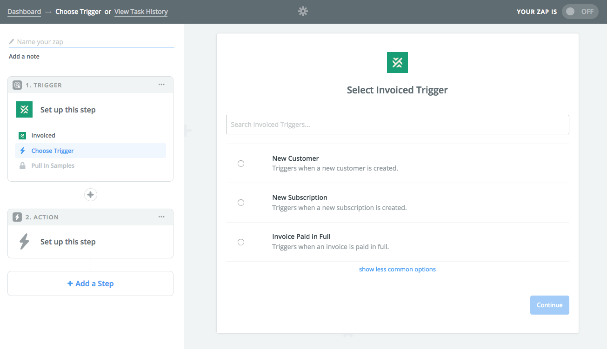

# Zapier Integration

Zapier allows you to easily build and automate workflows between Invoiced and more than 700 other cloud apps (at the time of this writing).

You can install the [Invoiced Zapier integration here](https://zapier.com/zapbook/invoiced).

## Triggers

You can be notified on Zapier when the following events happen on Invoiced:

- New Customer
- New Invoice
- New Subscription
- Invoice Paid in Full
- Subscription Canceled

## Actions

You can perform the following actions on Invoiced from Zapier:

- Create Customer
- Create Invoice

## Searches

You can search for the following records on Invoiced in your Zapier workflows:

- Find or Create Customer