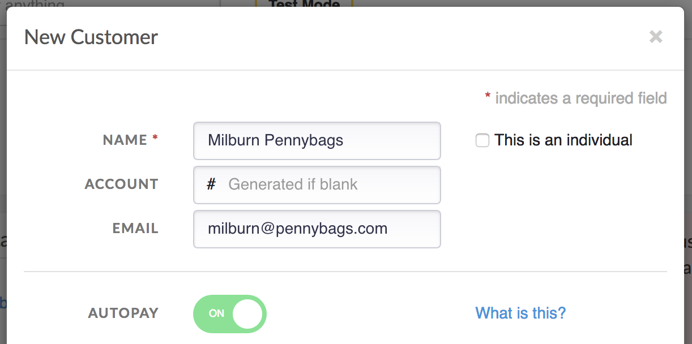
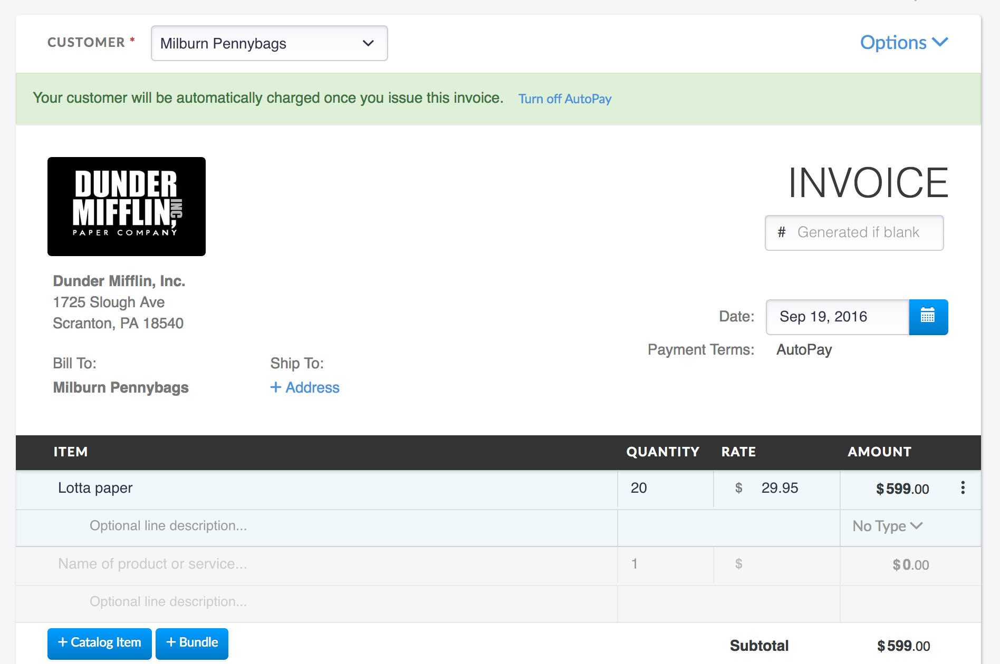
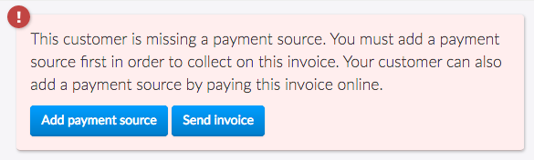
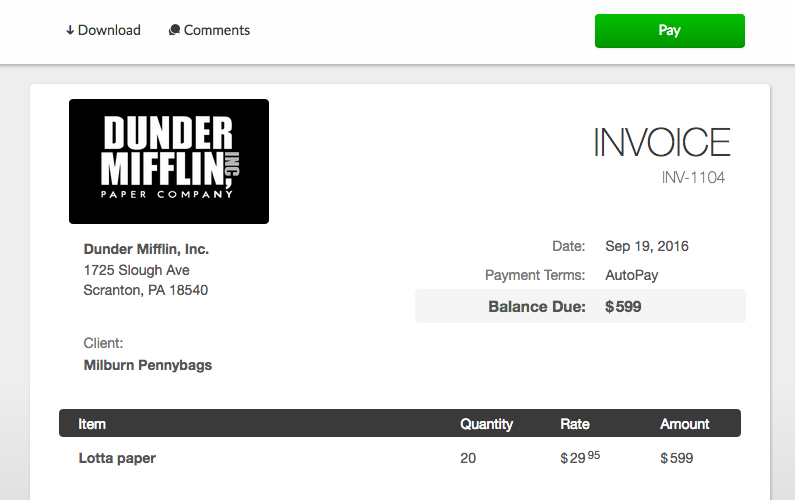
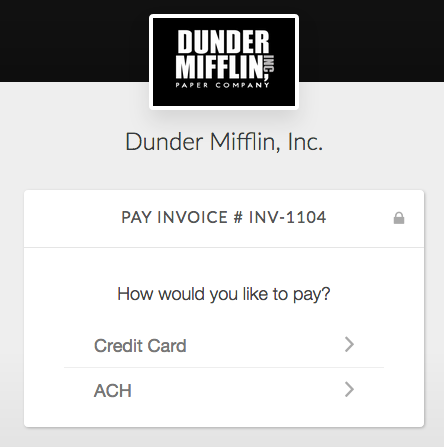
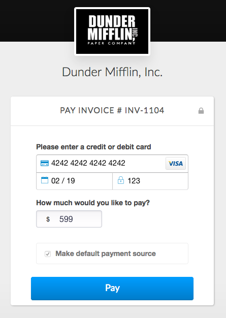
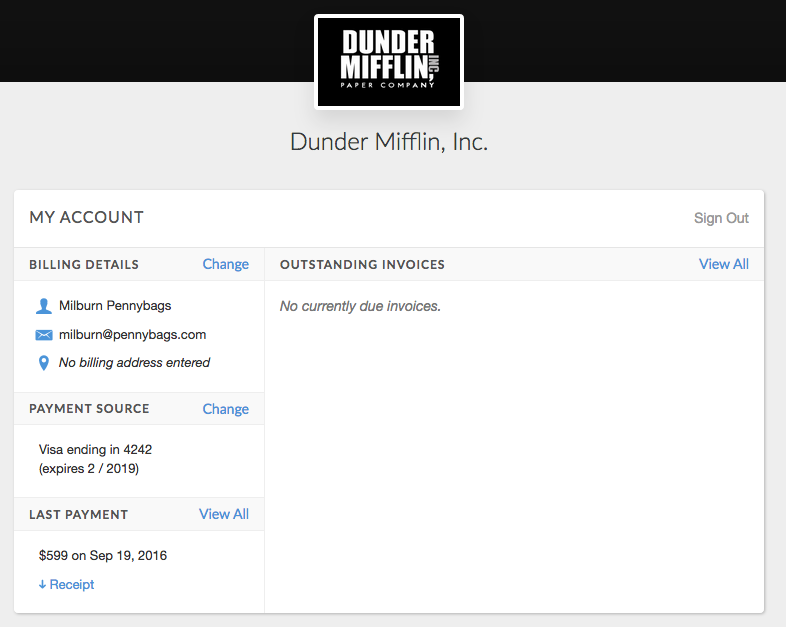

# AutoPay

With AutoPay you can automatically collect payment from customers when an invoice is issued. AutoPay draws payment from your customer's attached payment method.

## How it works

AutoPay allows you to securely collect and charge payment info for customers. In order to use AutoPay you must follow these simple requirements:

1. Subscribe to an Invoiced [plan that supports AutoPay](https://invoiced.com/pricing). There are no limits to the number of AutoPay customers or invoices you can create.

2. Have at least one payment method enabled that supports AutoPay. Currently AutoPay works with **ACH**, **direct debit**, and **credit card** payments.

3. Payment information on file for each AutoPay customer. When connecting bank accounts the customer must verify the account before it can be charged.

### Collecting payment information

There are multiple ways to securely add payment information to a customer's account.

1. [Sign Up Pages](/docs/guides/sign-up-pages)

   New customers that sign up for a subscription through sign up pages will have AutoPay enabled and a stored payment method.

2. [Billing Portal](/docs/guides/billing-portal)

   Existing customers can sign into your billing portal and click **Add Payment Method**.

3. Sending an AutoPay invoice to your customer

   This approach involves sending an AutoPay invoice to a customer that does not have payment information on file. Your customer will be able to pay the invoice online like normal, but we will also save the payment information used to pay for future AutoPay invoices.

4. Adding a credit card through the dashboard
   
   This is useful if you have a customer in person or are accepting orders over the phone.

5. [Payments API](/docs/dev/payment-info)
   
   With invoiced.js you can securely collect and store payment information from customers directly from your website using your own forms and interface.

### Failed Payments

AutoPay was designed to gracefully handle failed payments. We will automatically retry failed payments according to your retry schedule. If the payment succeeds at any point then the retry schedule will stop. Your customer will also be sent a [Failed AutoPay Attempt](/docs/guides/emails#payments) email. The email will include an **Update Payment Info** button in case the customer's payment information is out of date.

Failed payments will be retried according to the following schedule:

- 3 days after first payment attempt
- 5 days after second payment attempt
- 7 days after third payment attempt

After all of the retries have been exhausted then the invoice will be marked as past due. Additionally if this was for a subscription invoice you can control what happens to the subscription in **Settings** > **General** > **After Subscription Nonpayment**.

## Usage

### Setting up AutoPay

Let's walk through a basic scenario where we set up AutoPay for a customer by sending them an invoice.

1. Enable a payment method that supports AutoPay

   Go to **Settings** > **Payments** to enable **ACH**, **Direct Debit**, or **Credit Card** payments.

   

2. Turn on AutoPay for your customer

   Now we are going to create a new customer account. If you are creating a new customer then turn on the **AutoPay** switch.

   

   We are going to leave the *Payment Info* section empty because we are going to collect their payment information by sending an invoice.

   *If you want to convert an existing customer to AutoPay then you can open the customer's account and click **Edit** in the *Profile* section.*

3. Issue an invoice

   Let's create and issue an invoice against the customer's account.
   
   

   Next send the invoice to your customer.

   

4. Customer pays to store payment information

   The customer will be able to view the invoice like usual. They will then click **Pay**.

   

   When they click **Pay** the customer will be able to select one of the payment methods you have enabled that supports AutoPay.

   

   Then while paying the invoice we will store your customer's payment information for use on future AutoPay invoices.

   

### Updating payment information

Once a customer's added payment information they can update it at any time through the billing portal by clicking **Change** in the *Payment Method* section.

Invoices will also have a button to update payment information. Certain payment gateways that have Account Updater enabled will automatically update the customer's payment information if they are issued a new credit card.

## FAQ

### When is payment for AutoPay invoices collected?

Payment will be collected no earlier than 1 hour after the invoice is issued. Generally you can payment to be collected in 1-2 hours. The 1 hour minimum delay gives you time to recover from any potential mistakes.

However, if the invoice date is in the future then payment will not be collected until that date.

### Can I trigger payment for AutoPay invoices sooner?

Absolutely. If you open the invoice in the dashboard you can trigger payment sooner by clicking **Collect now** on the invoice. This will initiate a collection attempt immediately.

### Can I turn AutoPay off for one invoice?

Yes. When creating an invoice for a customer that has AutoPay enabled, the AutoPay feature can be turned off for this invoice at the top fo the invoice creation page. The system will alert you that the invoice will be automatically charged on issuing. You can press the Turn AutoPay off, which will turn the AutoPay feature off for that particular Invoice. 

### What automated emails does Invoiced send for AutoPay? 

Invoiced can send these emails with AutoPay:

- **Payment Receipt**
  
  Confirmation of payment that includes a PDF of the receipt.

- **Failed AutoPay Attempt**

   Notifies customer when an AutoPay payment attempt fails. Includes a button for the customer to update their payment information.

You can learn more about these emails in the [Emails Guide](/docs/guides/emails#payments).