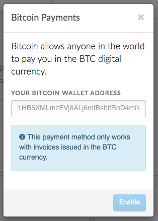
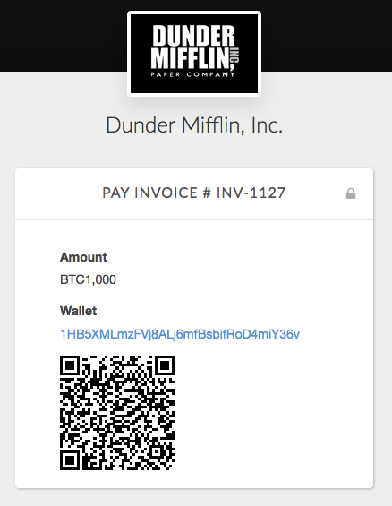

# Bitcoin Payments

[Bitcoin](https://bitcoin.org) is a decentralized virtual currency that lets you accept payments from anyone, anywhere. One of the advantages of bitcoin is that payments can be made by anyone holding bitcoins, and not just those with access to a credit card.

*We should note that although bitcoin shows a lot of promise, it is still in its infancy and has a ways to go before it reaches mass consumer adoption. It might not make sense to accept bitcoin right now unless there is demand from your customer base to pay with bitcoin.*

## Setup

Setting up bitcoin payments is easy! Follow these steps to start accepting bitcoin payments in minutes.

1. From the Invoiced dashboard go to **Settings** > **Payments**.

   

2. Click **Setup** on the *Bitcoin* payment method.

   

3. Enter in your Bitcoin wallet address and click **Enable**.

## Client Workflow

Bitcoin only works on invoices denominated in the BTC currency. When your client receives a BTC invoice the payment page will only have *Bitcoin* as a payment option. On the payment form they will see your wallet address, a link to pay, and a rendered QR code.

Once you receive a bitcoin payment from your client don't forget to record it through the dashboard. Currently we are unable to automatically reconcile incoming bitcoin payments.